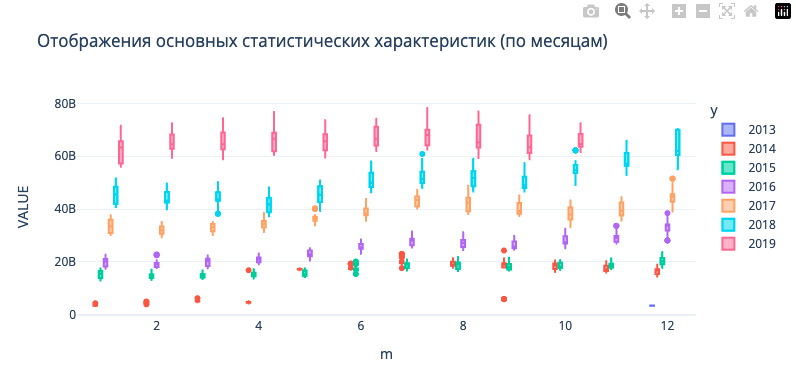
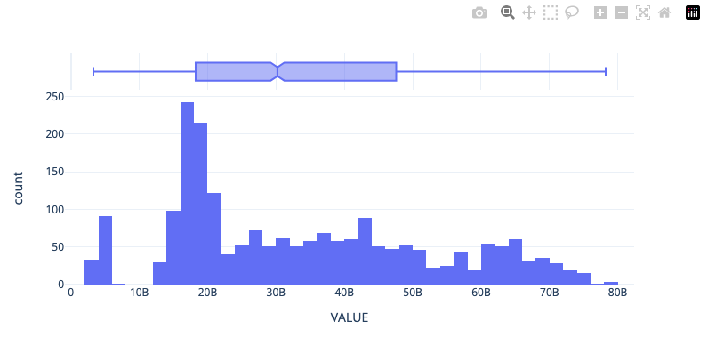
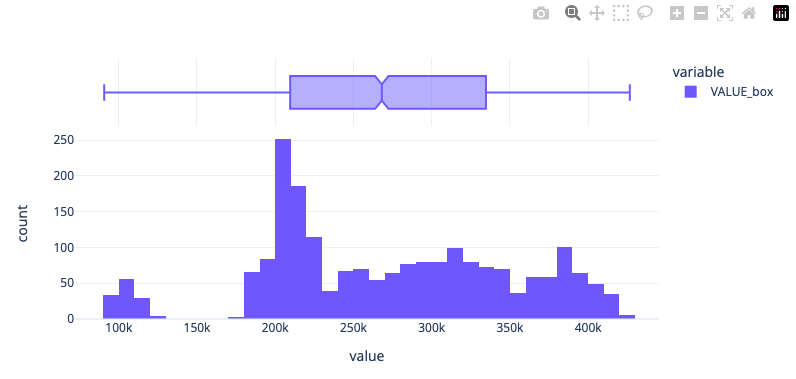
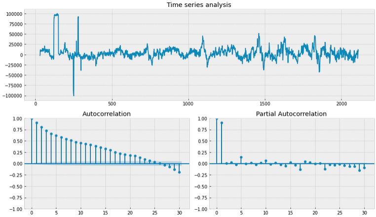
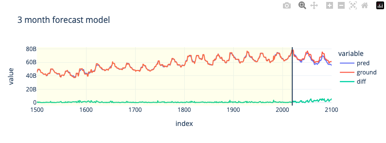
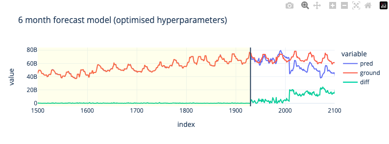
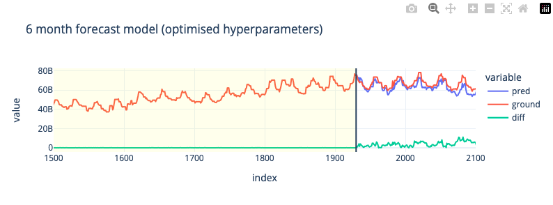

---
date: 2023-11-17
title: Prediction of customer stable funds volume
authors: [andrey]
categories:
     - internship
tags:
     - machine learning
     - financial analysis
     - catboost
     - optuna
     - time series
comments: true
--- 

# **Prediction of customer stable funds volume**

Твоей сегодняшней задачей как стажера нашего отдела будет научиться **прогнозировать объем стабильных средств клиентов** без сроков погашения, в данном конкретном случае это **расчетные счета клиентов**.

- Почему это важно? Номинально, все средства на расчетных счетах клиенты могут в любой момент забрать из Банка, а в ожидании этого Банк не может их использовать в долгосрочном / среднесрочном плане (например, для выдачи кредитов)
- Получается, что в такой ситуации Банк ничего не зарабатывает, но платит клиентам проценты по средствам на их счетах, пусть и не высокие, но в масштабах бизнеса Банка эти убытки могут быть значительны

<!-- more -->

<div class="grid cards" markdown>

  - :simple-google:{ .lg .middle }&nbsp; <b>[Open Colab Notebook](https://colab.research.google.com/drive/12NsWf3ePkrF7bhfTwEfJVVismvZmKXVb?usp=sharing)</b>
  - :simple-github:{ .lg .middle }&nbsp; <b>[GitHub Repository](https://github.com/shtrausslearning/Data-Science-Portfolio/tree/main/sbe_internship)</b>

</div>

## **Background**

Но в реальности поведение клиентов другое, оно зависит от многих факторов (поведенческих, макроэкономических, действий конкурентов и т.д.). Клиенты не забирают сразу все свои средства с расчетных счетов, а какое-то время их там хранят, поэтому суммарно по всем клиентам на их расчетных счетах всегда находится какой-то объем средств, который хоть и меняется со временем, но может быть расценен Банком как стабильный и использован для выдачи кредитов (а Банк на этом зарабатывает)

### Importance of model accuracy

Умение точно прогнозировать объем и динамику стабильного остатка средств на расчетных счетах позволяет Банку зарабатывать на кредитовании, но при этом держать в приемлемых рамках риск того, что клиенты могут в любой момент потребовать эти средства назад – это называется "управление риском ликвидности". Для этого строится ML модель прогнозирования стабильного остатка средств на расчетных счетах клиентов, связанная с моделями прогноза рынков, макроэкономики и поведения клиентов

> Масштабы бизнеса Банка поразительны: по ключевым банковским продуктам доля достигает 30-50%, а это десятки миллионов клиентов, триллионы рублей объемов. Повышение точности прогноза всего одной такой модели, к примеру на 5% или в пересчете на деньги на 50 млрд руб., позволит Банку дополнительно заработать 1 млрд руб. в год (в предположении 5% маржи банковского бизнеса)

## **Customer funds data**

В **[приложенном файле](https://raw.githubusercontent.com/shtrausslearning/Data-Science-Portfolio/main/sbe_internship/data.csv)** представлены подневные данные объема расчетных счетов физических лиц. В отличие от депозита, клиент может снять всю сумму с расчетного счета в любой момент времени без каких-либо «штрафов». Такой продукт называют Undefined Maturity Product – UMP). Однако маловероятно, что все клиенты разом закроют свои счета в Банке. Всегда кто-то снимает деньги, а кто-то пополняет счет – есть некоторый стабильный уровень, ниже которого не опустится суммарный объем расчетных счетов.

## **Study Aim**

Задача построить модель и определить объем этой стабильной части средств

> Доля сбербанка на разных рынков достигает 30+%, 10м клиетнов/триллион руб
Повышения точности прогноза на 5% позволяет банку зарабатывать 10м руб

Понимая важность точность моделей попытаемся повысить точность обобщаюшей способности моделей

## **Feature Engineering**

Давайте сразу отметим подходы которые будем пробовать в этом проекте. К задаче **feature engineering** для временных рядов можно подойти по разному, отметим несколько подхлдов:

!!! tip

    - Имея времменный ряд можно достаточно быстро начать с фич через `dt` в pandas, получив `день`, `месяц`, `год` и `день недели` и использовать это как базовое решение. 
    - Существуют и другие методы как метод с **понижением размерности** (eg. NMF декомпозиция), либо напрямую на временных рядах, либо через Фурье преобразование).
    - В данном слумае мы воспользуемя подходом где мы создаем в ручную **[технические индикаторы](https://www.kaggle.com/code/shtrausslearning/building-an-asset-trading-strategy)**, что тоже часто используется для задач временных рядов

### Time Series Features

Мы можем создать новы фичи с помощью pandas's `dt`

```python
data['dow'] = data['REPORTDATE'].dt.dayofweek
data['y']=data['REPORTDATE'].dt.year
data['d']=data['REPORTDATE'].dt.day
data['m']=data['REPORTDATE'].dt.month
data.head()
```

```
REPORTDATE  VALUE   dow     y   d   m
0   2013-12-30  3457625638  0   2013    30  12
1   2013-12-31  3417092149  1   2013    31  12
2   2014-01-01  3417092149  2   2014    1   1
3   2014-01-02  3417092149  3   2014    2   1
4   2014-01-03  3417092149  4   2014    3   1
```

### Technical Indicators

Часто встречающийся **техничесткие индикаторы** (eg. скользящеe среднеe, экспоненциальное скользящеe среднеe...) 

```python
#Calculation of moving average
def ma(df,column,n):
    return pd.Series(df[column].rolling(n, min_periods=n).mean(), name='MA_' + str(n))

# exponentially weighted moving average
def ema(df,column,n):
    return pd.Series(df[column].ewm(span=n,min_periods=n).mean(), name='EMA_' + str(n))

#Calculation of price momentum
def mom(df,column,n):
    return pd.Series(df[column].diff(n), name='Momentum_' + str(n))

# rate of change
def roc(df, column, n):
    M = df[column].diff(n - 1) ; N = df[column].shift(n - 1)
    return pd.Series(((M / N) * 100), name = 'ROC_' + str(n))

# relative strength index
def rsi(df, period):
    delta = df.diff().dropna()
    u = delta * 0; d = u.copy()
    u[delta > 0] = delta[delta > 0]; d[delta < 0] = -delta[delta < 0]
    u[u.index[period-1]] = np.mean( u[:period] ) #first value is sum of avg gains
    u = u.drop(u.index[:(period-1)])
    d[d.index[period-1]] = np.mean( d[:period] ) #first value is sum of avg losses
    d = d.drop(d.index[:(period-1)])
    rs = u.ewm(com=period-1, adjust=False).mean() / d.ewm(com=period-1, adjust=False).mean()
    return 100 - 100 / (1 + rs)

# stochastic oscillators slow & fast
def sto(close, low, high, n,id):
    stok = ((close - low.rolling(n).min()) / (high.rolling(n).max() - low.rolling(n).min())) * 100
    if(id is 0):
        return stok
    else:
        return stok.rolling(3).mean()

```

## **Exploratory Data Analysis**

### Statistical Boxplots of Target Variable

Прежде всего нужно думать о том какие фичи могут помочь модели делать более точные предсказания целевой перемены, построив график `boxplot`, мы можем увидить что данные достаточно хорошо разделяются по годам, благодоря ежегодном приростом денежных стредств клиентов. Одного такого граффика достаточно чтобы попробовать pandas's `dt` фцнкциональность, для того чтобы извлечь временные фичи.



### Univariate Distribution of Target Variable

Посмотрим на унитарное распределение целевой перемены




### Time Features Correlation to Target Variable

Посмотрим на корреляцию новых фич которые мы получили через pandas's `dt`

```python
# Plot Correlation to Target Variable only
def corrMat(df,target='demand',figsize=(4,0.5),ret_id=False):

    corr_mat = df.corr().round(2);shape = corr_mat.shape[0]
    corr_mat = corr_mat.transpose()
    corr = corr_mat.loc[:, df.columns == target].transpose().copy()
    return corr

# What are the correlations like
subset = data[['dow','y','d','m','VALUE']]
corrMat(subset,target='VALUE')
```

```
         dow       y        d     m   VALUE
VALUE   0.01    0.94    -0.05   0.1     1.0
```

В целом, мы только и подтвердили что было видно в графике boxplot, `y` является информативным признаком.

## **Stationarity Testing**

Тестирование временных рядов на статистические свойства важно для **определения стационарности данных**. Стационарность означает, **что статистические свойства временного ряда не меняются со временем**, такие как среднее значение, дисперсия и **автокорреляция**. Это важно для построения точных моделей прогнозирования, так как модели предполагают стационарность данных (Не все конечно). Таким образом, тестирование на стационарность помогает убедиться, что данные подходят для применения алгоритмов машинного обучения и прогнозирования.

Воспользуемя двумя показателями для ее оценки:

- Метрика **`автокорреляции`** измеряет степень корреляции между значениями временного ряда и его отстающими значениями. Она позволяет определить, есть ли зависимость между текущим значением ряда и его предыдущими значениями. Автокорреляция может быть положительной, если значения ряда изменяются вместе, или отрицательной, если они изменяются в противоположных направлениях. 

- Тест **`Дики-Фуллера`** (Dickey-Fuller test) - это **статистический тест**, который используется для проверки наличия единичных корней во временных рядах. Единичные корни могут указывать на нестационарность данных, что означает, что их статистические свойства меняются со временем. Тест **Дики-Фуллера позволяет определить, является ли временной ряд стационарным или нет**. Если нулевая гипотеза теста отвергается, то можно сделать вывод о стационарности ряда

### Helper function

Both metrics can be found in the `statsmodels` library (**`smt.graphics.plot_pacf`** and **`sm.tsa.stattools.adfuller`**)

```py
import statsmodels.tsa.api as smt
import statsmodels.api as sm

def tsplot(y, lags=None, figsize=(12, 7), style='bmh'):

    if not isinstance(y, pd.Series):
        y = pd.Series(y)

    with plt.style.context(style):

        fig = plt.figure(figsize=figsize)
        layout = (2, 2)
        ts_ax = plt.subplot2grid(layout, (0, 0), colspan=2)
        acf_ax = plt.subplot2grid(layout, (1, 0))
        pacf_ax = plt.subplot2grid(layout, (1, 1))

        y.plot(ax=ts_ax)
        ts_ax.set_title('Time series analysis')
        smt.graphics.plot_acf(y, lags=lags, ax=acf_ax, alpha=0.5)
        smt.graphics.plot_pacf(y, lags=lags, ax=pacf_ax, alpha=0.5)

        criterion = sm.tsa.stattools.adfuller(y)[1]
        print(f"Dickey-Fuller criterion: p={criterion}")
        plt.tight_layout()
        plt.show()
```

### :material-numeric-1-box-multiple-outline: Baseline Time-Series

Посмотрим на метрики исходного временного ряда

```python
tsplot(data['VALUE'])
# Dickey-Fuller criterion: p=0.934988760701965
```

Обе метрики говорят нам о том что в данных присудствует не стационарность данных


### :material-numeric-2-box-multiple-outline: Box-Сox transformation

Используем преобразование box-cox (**`scipy.stats.boxcox`**); преобразование данных, не имеющих нормальное распределение, в **нормальное распределение**, как мы вимим по boxplot, среднее значение сдвинуласть. 

```python
import scipy.stats as scs

data['VALUE_box'], lmbda = scs.boxcox(data['VALUE'])
px.histogram(data,x='VALUE_box',height=400,width=800,template='plotly_white',marginal='box')
```

```python
tsplot(data['VALUE_box'])
print("The optimal parameter of the Box-Cox transformation is: %f" % lmbda)
# The optimal parameter of the Box-Cox transformation is: 0.488251
# Dickey-Fuller criterion: p=0.33953657978375956
```




Существенное улучшение в метрике Dicker-Fuller есть, но пока нулевая гипотеза о стационарности отвергается

### :material-numeric-3-box-multiple-outline: Removing seasonality

Мы можем взять разницу VALUE из прошлого (ie. попробуем убрать элемент сезонности), возмем период 30 дней

```python
data['VALUE_box_season'] = data['VALUE_box'] - data['VALUE_box'].shift(30)
tsplot(data.VALUE_box_season[30:])
# Dickey-Fuller criterion: p=1.3329526107395548e-13
```



Нулевая гипотеза **Dicker-Fuller** теста о нестационарности данных не отвергается, но график автокорреляции говорит нам о том что что нам нужно сделать еще небольшой сдвиг 

### :material-numeric-4-box-multiple-outline: Removing seasonality (final tweak)

Добавим еще один день!

```python
data['VALUE_box_season_diff'] = data.VALUE_box_season - data['VALUE_box_season'].shift(1)
tsplot(data['VALUE_box_season_diff'][30+1:])
# Dickey-Fuller criterion: p=6.437091549657279e-20
```


Все отлично! Обе метрике говорят нам о том что временный ряд **является стационарным**. Воспользуемя этими фичами когда будем использовать подход **feature engineering II**

```
REPORTDATE  VALUE   dow     y   d   m   VALUE_box   VALUE_box_season    VALUE_box_season_diff
0   2013-12-30  3457625638  0   2013    30  12  93039.660413    NaN     NaN
1   2013-12-31  3417092149  1   2013    31  12  92505.507470    NaN     NaN
2   2014-01-01  3417092149  2   2014    1   1   92505.507470    NaN     NaN
3   2014-01-02  3417092149  3   2014    2   1   92505.507470    NaN     NaN
4   2014-01-03  3417092149  4   2014    3   1   92505.507470    NaN     NaN
```

## **Training Models**

Отлично, мы примеви данные к нужные нам формате, теперь приступим к моделированию. Будем предсказывать ==**3 месечный**== и ==**6 месечный**== период, используя два подхода feature engineering.

- В первом подходе мы воспользуемся фичами которые получили через `dt`,  
- Во втором подходе мы воспользуемся **техническими индикаторами**!

### Выбор модели и метрики оценки

Для этой задачи воспользуемя **градиентным бустингом catboost**, эту модель не редко используется для предсказания будуйщего, в том числе в соревнованиях kaggle. Для оцеки модели будем пользоватся стандартной метрикой **RMSE**

### Оптимизация гиперпараметров

**CatBoost** хоть и умеет умно адаптировать гиперпараметры под выборку (по умолчанию), нам все равно будет важно оптимизировать наши модели для разных сроков предсказании. Воспользуется модулем **Optuna**. Пользоватся им не очень сложно, нам нужно создать целевую функцию, которая будет возвращать метрику предсказания. В функции, мы указываем параметры которые будем использовать во время оптимизации, саму модель и предсказания.

Почему именно эти параметры?

- ==**learning_rate**== конечно одна из важнейших гиперпараметров в градиентном бустинге
- ==**depth**== возможность изучить какое влияние имеет глубина базовых моделей
- ==**l2_leaf_reg**== параметр отвечает за коэффициент регуляризации L2 для листовых узлов дерева, чем больше параметр, тем больше регуляризации, он нужет для того чтобы предотвращать переобучение путем штрафования больших весов признаков

```python
# Define objective function for Optuna
def objective(trial):

    # Define hyperparameters to optimize
    params = {
        'learning_rate': trial.suggest_float('learning_rate', 0.01, 0.5),
        'depth': trial.suggest_int('depth', 4, 10),
        'l2_leaf_reg': trial.suggest_float('l2_leaf_reg', 1, 10)
    }

    # Initialize CatBoostRegressor with the hyperparameters
    model = CatBoostRegressor(**params, verbose=0)
    model.fit(X_train, y_train, eval_set=(X_val, y_val))
    y_pred = model.predict(X_val)
    mse = mean_squared_error(y_val, y_pred)

    return mse
```

Создав целевую функцию, мы можем начать оптимизационый цикл

```python
study = optuna.create_study(direction='minimize',)
study.optimize(objective, n_trials=100,show_progress_bar=True)
```

### Helper Functions

**`prepare_output`** используется для оьъядинения данных обучающей и тестовой выборке, чтобы можно было использовать plotly express. **`get_split`** используется для того чтобы разбить выборку на две быборки

```python
from catboost import CatBoostRegressor
from sklearn.metrics import mean_squared_error

# helper function for plotting in plotly
def prepare_output(model,X_train,y_train,X_test,y_test):

    # predict & merge
    y_pred_tr = pd.Series(model.predict(X_train),y_train.index,name='pred').to_frame()
    y_pred_tr['ground'] = y_train['VALUE']
    y_pred_tr['subset'] = 'train'
    y_pred = model.predict(X_test)
    y_pred_te = pd.Series(y_pred,y_test.index,name='pred').to_frame()
    y_pred_te['ground'] = y_test['VALUE']
    y_pred_te['subset'] = 'test'
    print('test rmse:',f'{mean_squared_error(y_pred,y_test,squared=False):.4e}')

    all = pd.concat([y_pred_tr,y_pred_te],axis=0)
    all['diff'] = abs(all['pred'] - all['ground'])
    return all

# helper function to split the dataset by days
def get_split(n:int):
    X_train = X[:-30*n]
    y_train = y[:-30*n]
    X_test = X[-30*n:]
    y_test = y[-30*n:]
    max_tr = max(list(X_train.index))
    return X_train,y_train,X_test,y_test,max_tr
```

### :material-checkbox-multiple-marked-circle-outline: Feature Engineering I

Посмотрим как справляется базовые фичи для **краткосрочного предсказания** (3 месяца) и **дальносрочного предсказания** (6 месяца)


<h4>3-Month Forecast</h4>

Воспользуемя базовыми гиперпараметрами для короткого диапазона предсказания; 3 месяцев

```python
# 3 month split for test set
X_train,y_train,X_test,y_test,max_tr = get_split(3)

# train
model = CatBoostRegressor(silent=True)
model.fit(X_train,y_train)

all = prepare_output(model,X_train,y_train,X_test,y_test)
fig = px.line(all,all.index,y=['pred','ground','diff'],template='plotly_white',width=800,height=300,title='3 month forecast model')
fig.update_xaxes(range = [1500,2100])
fig.add_vrect(x0=0, x1=max_tr, line_width=0, fillcolor="yellow", opacity=0.1)
fig.add_vline(x=max_tr)
# test rmse: 5.1401e+09
```



<h4>6-Month Forecast</h4>

Оптимизируем модель для более длинного диапазона предсказания; 6 месяцев

```python
# 6 month split for test set
X_train,y_train,X_test,y_test,max_tr = get_split(6)

# train
model = CatBoostRegressor(silent=True)
model.fit(X_train,y_train)

all = prepare_output(model,X_train,y_train,X_test,y_test)
fig = px.line(all,all.index,y=['pred','ground','diff'],template='plotly_white',width=800,height=300,title='6 month forecast model')
fig.update_xaxes(range = [1500,2100])
fig.add_vrect(x0=0, x1=max_tr, line_width=0, fillcolor="yellow", opacity=0.1)
fig.add_vline(x=max_tr)
# test rmse: 1.6883e+10
```


<h4>3-Month Forecast (Hyperparameter Tuning)</h4>

Воспользуемя базовыми гиперпараметрами для короткого диапазона предсказания; 3 месяцев

```python
X_train,y_train,X_val,y_val,max_tr = get_split(3)

# Create study object and optimize the objective function
study = optuna.create_study(direction='minimize',)
study.optimize(objective, n_trials=100,show_progress_bar=True)

# Get the best hyperparameters found by Optuna
best_params = study.best_params
print("Best hyperparameters:", best_params)
# Best hyperparameters: {'learning_rate': 0.2688362880517153, 'depth': 4, 'l2_leaf_reg': 9.45603461263423}
```

```python
best_model = CatBoostRegressor(**best_params, verbose=0)
best_model.fit(X_train,y_train)
y_pred = best_model.predict(X_val)

all = prepare_output(best_model,X_train,y_train,X_val,y_val)
fig = px.line(all,all.index,y=['pred','ground','diff'],template='plotly_white',width=800,height=300,title='3 month forecast model (optimised hyperparameters)')
fig.update_xaxes(range = [1500,2100])
fig.add_vrect(x0=0, x1=max_tr, line_width=0, fillcolor="yellow", opacity=0.1)
fig.add_vline(x=max_tr)
# test rmse: 1.6375e+09
```


<h4>6-Month Forecast (Hyperparameter Tuning)</h4>

Оптимизируем модель для более длинного диапазона предсказания; 6 месяцев

```python
X_train,y_train,X_val,y_val,max_tr = get_split(6)

# Create study object and optimize the objective function
study = optuna.create_study(direction='minimize')
study.optimize(objective, n_trials=100,show_progress_bar=True)

# Get the best hyperparameters found by Optuna
best_params = study.best_params
print("Best hyperparameters:", best_params)
# Best hyperparameters: {'learning_rate': 0.09317938390639577, 'depth': 4, 'l2_leaf_reg': 1.4161107817520655}
```

```python
best_model = CatBoostRegressor(**best_params, verbose=0)
best_model.fit(X_train,y_train)
y_pred = best_model.predict(X_val)

all = prepare_output(best_model,X_train,y_train,X_val,y_val)
fig = px.line(all,all.index,y=['pred','ground','diff'],template='plotly_white',width=800,height=300,title='6 month forecast model (optimised hyperparameters)')
fig.update_xaxes(range = [1500,2100])
fig.add_vrect(x0=0, x1=max_tr, line_width=0, fillcolor="yellow", opacity=0.1)
fig.add_vline(x=max_tr)
# test rmse: 1.2348e+10
```



### :material-checkbox-multiple-marked-circle-outline: Feature Engineering II

В целов мы увидили что для краткосрочного предсказания, **feature engineering I** фичи не плохо сравняются, но для 6 месячных предсказании не работает, соответсвенно для этого мы будем пробовать второй подход с **feature engineering II** фичами, посмотрим как они справятся

Воспользкемя двумя метриками **momentum** и **rate of change**. Это обосновается тем что оба **`ma`**, **`ema`** создают фичи которе слишком сильно коррелируются с целевой переменной (0.9-0.98). Мультикоррелиарность для задач временных рядов не очень желательно.

<h4>Selecting the subset of data</h4>

Воспользуемя интервалами 100,200 и 300 дней

```python
data['MOM100'] = mom(data,'VALUE',100)
data['MOM200'] = mom(data,'VALUE',200)
data['MOM300'] = mom(data,'VALUE',300)

data['ROC100'] = roc(data,'VALUE',100)
data['ROC200'] = roc(data,'VALUE',200)
data['ROC300'] = roc(data,'VALUE',300)
```

```python
subset = data[['dow','y','d','m','VALUE','MOM100','MOM200','MOM300','VALUE_box_season_diff','VALUE_box_season','ROC100','ROC200','ROC300']]
print(subset.shape)
subset = subset.dropna()
print(subset.shape)
corrMat(subset,target='VALUE')

# (2111, 13)
# (1811, 13)
```

<h4>6-Month Forecast</h4>

Воспользуемя базовыми гиперпараметрами для более длинного диапазона предсказания; 6 месяцев

```python
# 6 month split for test set
X_train,y_train,X_test,y_test,max_tr = get_split(6)

# train
model = CatBoostRegressor(silent=True)
model.fit(X_train,y_train)

all = prepare_output(model,X_train,y_train,X_test,y_test)
fig = px.line(all,all.index,y=['pred','ground','diff'],template='plotly_white',width=800,height=300,title='6 month forecast model')
fig.update_xaxes(range = [1500,2100])
fig.add_vrect(x0=0, x1=max_tr, line_width=0, fillcolor="yellow", opacity=0.1)
fig.add_vline(x=max_tr)
# test rmse: 1.0816e+10
```


<h4>6-Month Forecast (Hyperparameter Tuning)</h4>

Оптимизируем модель для более длинного диапазона предсказания; 6 месяцев

```python
X_train,y_train,X_val,y_val,max_tr = get_split(6)

# Create study object and optimize the objective function
study = optuna.create_study(direction='minimize',)
study.optimize(objective, n_trials=100,show_progress_bar=True)

# Get the best hyperparameters found by Optuna
best_params = study.best_params
print("Best hyperparameters:", best_params)
# Best hyperparameters: {'learning_rate': 0.4956253048007977, 'depth': 4, 'l2_leaf_reg': 1.3139821695288907}
```

```python
best_model = CatBoostRegressor(**best_params, verbose=0)
best_model.fit(X_train,y_train)
y_pred = best_model.predict(X_val)

all = prepare_output(best_model,X_train,y_train,X_val,y_val)
fig = px.line(all,all.index,y=['pred','ground','diff'],template='plotly_white',width=800,height=300,title='6 month forecast model (optimised hyperparameters)')
fig.update_xaxes(range = [1500,2100])
fig.add_vrect(x0=0, x1=max_tr, line_width=0, fillcolor="yellow", opacity=0.1)
fig.add_vline(x=max_tr)
# test rmse: 5.1134e+09
```



Приемущество **catboost** (да и в целов метод на основе деревьев) конечно в том что мы можем получать обратную связь о важности признаков, в данном случаем мы видим что технические фичи намного важнее `VALUE_box_season_diff`, `VALUE_box_season`, `ROC` тоже не особо влияет на результат. Это говорит о том что большого смысла в стационаризации исходных данных небыло при использования технических фич. 

```python
importances = best_model.get_feature_importance(type='PredictionValuesChange')
feature_importances = pd.Series(importances, index=X.columns,name='fi').sort_values()
px.bar(feature_importances,template='plotly_white',height=300,width=800,title='Feature importance')
```


### :material-checkbox-multiple-marked-circle-outline: Model Testing Result

Подведем итоги результатов всех обученных моделей, улучшение относительно базовой модели (**baseline**)

| **Feature Engineering**   |   **Time Interval**          | **RMSE**     | **Improvement** |
|---------------------------|------------------------------|--------------|-----------------|
| **Approach I**            | **3 Months** (baseline)      | 5.1401e+09   |        -        |
| **Approach I**            | **6 Months** (baseline)      | 1.6883e+10   |        -        |
| **Approach I**            | **3 Months** (optuna)        | 1.6375e+09   |       68%       |
| **Approach I**            | **6 Months** (optuna)        | 1.2348e+10   |       26%       |
| **Approach II**           | **6 Months**                 | 1.0816e+10   |       35%       |
| **Approach II**           | **6 Months** (optuna)        | 5.1134e+09   |       67%       |

    
## **Concluding Remarks**

Подведем итоги, цель нашего проекта была в создании модели которая бы дала нам возможность **прогнозировать объем стабильных средств клиентов**. 

- Для модели градиентного бустинга к этому значению можно отнести само предсказание регрессионной модели. 
- Мы определили два срока предсказания которые могут быть полезным (3 и 6 месяцев) и создали все групп фич которые могут достаточно хорошо предсказывать на этом интервалом. Использовали фичи которые можно получить из самого временного ряда, а так же воспользовались техническими метриками. 
- Мы так же преобразовали исходный временный ряд в стациорарную форму, используя метрики **autocorrelation** и **dicker-fuller**, но в итоже когда мы добавили их к другим фичам, особого влияния они не оказали. 
- В этой задачи, модель больше опиралась на технические метрики **momentum**. С помошью **Optuna** мы успешно оптимизировали гиперпараметры **catboost** и смогли снизить ошибку **RMSE** на 68% и 67%. 
- Эти модели можно далее использовать для принятия решении о том какой объем стабильных средств клиентов можно откладывать для выдачи кредитов. 

### Как улучшить метрики

Модели нужно постоянно обновлять для того чтобы они не теряли актуальность, идельно было бы обучить модель для еще более длительного диапазона предсказания (1 год). 

- Так же нужно найти более подходящие фичи для дополнительного снижения **RMSE**. 
- Градиентные бустинговые модели удобыне тем что мы можем проверять какие фичи действительно влияют на предсказание. 
- В будуйшем можно даже пробовать такие модели как **LSTM** и **GRU** или даже трансформерные модели.

### Что узнали нового

Важно было вспомнить какие пребразования можно применять для того чтобы привести временный ряд стационарную форму, это можно делать с помошью статистических метрик **autocorrelation** и **dicker-fuller** критериями. Интуитивно я обычно просто сразу приступаю у созданию фич и оцениваю модель на качество предсказания. В данной задачи эти преобразование не внесли вклада но все равно это важно делать в рамках испледования влияния стационарности.


