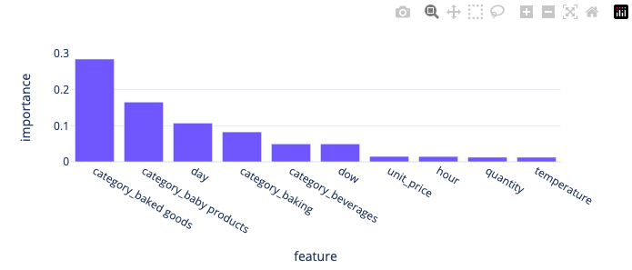
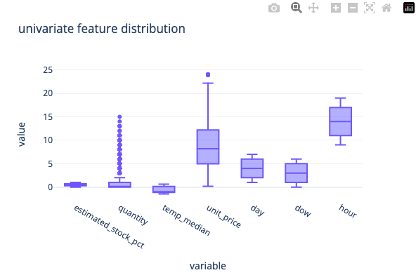
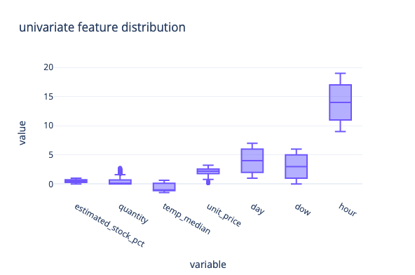
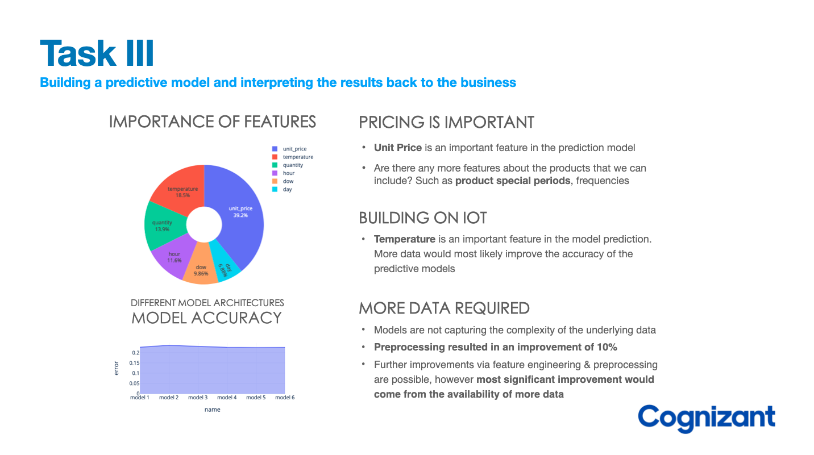

## :material-book-multiple: :octicons-git-compare-16: **Baseline Model**

Modeling is an **iterative process**, let's begin with a **general baseline**, upon which we will try to improve, by considering a much larger range of preprocessing & model options. As defined in the **strategic plan**, we will go through most of the steps, however we'll keep things a little more simple at first, and do more testing in subsequent iterations. 

- **Preprocessing**: Filling NaN, Adding Date Features, Adding one-hot-encoding of **category**
- **Modeling**: **RandomForest** with default hyperparameters, we test **10 random splits** and average **the MAE**

### Datasets

Samples from the **three datasets** are defined above can be visualised below:

```markdown
+--------------------+-------------------+--------------------+--------+-------------+----------+--------+-----+------------+
|      transaction_id|          timestamp|          product_id|category|customer_type|unit_price|quantity|total|payment_type|
+--------------------+-------------------+--------------------+--------+-------------+----------+--------+-----+------------+
|a1c82654-c52c-45b...|2022-03-02 09:51:38|3bc6c1ea-0198-46d...|   fruit|         gold|      3.99|       2| 7.98|    e-wallet|
|931ad550-09e8-4da...|2022-03-06 10:33:59|ad81b46c-bf38-41c...|   fruit|     standard|      3.99|       1| 3.99|    e-wallet|
|ae133534-6f61-4cd...|2022-03-04 17:20:21|7c55cbd4-f306-4c0...|   fruit|      premium|      0.19|       2| 0.38|    e-wallet|
|157cebd9-aaf0-475...|2022-03-02 17:23:58|80da8348-1707-403...|   fruit|         gold|      0.19|       4| 0.76|    e-wallet|
|a81a6cd3-5e0c-44a...|2022-03-05 14:32:43|7f5e86e6-f06f-45f...|   fruit|        basic|      4.49|       2| 8.98|  debit card|
+--------------------+-------------------+--------------------+--------+-------------+----------+--------+-----+------------+
```

```
+--------------------+-------------------+--------------------+-------------------+
|                  id|          timestamp|          product_id|estimated_stock_pct|
+--------------------+-------------------+--------------------+-------------------+
|4220e505-c247-478...|2022-03-07 12:13:02|f658605e-75f3-4fe...|               0.75|
|f2612b26-fc82-49e...|2022-03-07 16:39:46|de06083a-f5c0-451...|               0.48|
|989a287f-67e6-447...|2022-03-01 18:17:43|ce8f3a04-d1a4-43b...|               0.58|
|af8e5683-d247-46a...|2022-03-02 14:29:09|c21e3ba9-92a3-474...|               0.79|
|08a32247-3f44-400...|2022-03-02 13:46:18|7f478817-aa5b-44e...|               0.22|
+--------------------+-------------------+--------------------+-------------------+
```

```
+--------------------+-------------------+-----------+
|                  id|          timestamp|temperature|
+--------------------+-------------------+-----------+
|d1ca1ef8-0eac-42f...|2022-03-07 15:55:20|       2.96|
|4b8a66c4-0f3a-4f1...|2022-03-01 09:18:22|       1.88|
|3d47a0c7-1e72-451...|2022-03-04 15:12:26|       1.78|
|9500357b-ce15-424...|2022-03-02 12:30:42|       2.18|
|c4b61fec-99c2-4c6...|2022-03-05 09:09:33|       1.38|
+--------------------+-------------------+-----------+
```

### Preprocessing

#### Converting to datetime

We first need to convert the **str** format columns into **datetime** columns

```python
def convert_to_datetime(data: pd.DataFrame = None, column: str = None):

  dummy = data.copy()
  dummy[column] = pd.to_datetime(dummy[column], format='%Y-%m-%d %H:%M:%S')
  return dummy

sales_df = convert_to_datetime(sales_df, 'timestamp')
stock_df = convert_to_datetime(stock_df, 'timestamp')
temp_df = convert_to_datetime(temp_df, 'timestamp')
```

#### :octicons-star-16: Converting to datetime

If we revisit the problem statement: 

```
“Can we accurately predict the stock levels of products, based on sales data and sensor data, 
on an hourly basis in order to more intelligently procure products from our suppliers.”
```

- The client indicates that they want the model to **predict on an hourly basis**. 
- Looking at the data model, we can see that only column that we can use to merge the 3 datasets together is **timestamp**
- So, we must first transform the **timestamp** column in all 3 datasets to be based on the **hour of the day**, then we can merge the datasets together

```python
from datetime import datetime

# helper function to convert datetime to desired format
def convert_timestamp_to_hourly(data: pd.DataFrame = None, column: str = None):
  dummy = data.copy()
  new_ts = dummy[column].tolist() # timestamp list [Timestamp(),Timestamp(),...]
  new_ts = [i.strftime('%Y-%m-%d %H:00:00') for i in new_ts] # change the value of timestamp
  new_ts = [datetime.strptime(i, '%Y-%m-%d %H:00:00') for i in new_ts] # change to datetime
  dummy[column] = new_ts # replace
  return dummy

sales_df = convert_timestamp_to_hourly(sales_df, 'timestamp')
stock_df = convert_timestamp_to_hourly(stock_df, 'timestamp')
temp_df = convert_timestamp_to_hourly(temp_df, 'timestamp')
```

#### Aggregations

For the **sales** data, we want to group the data by **timestamp** but also by **product_id**. When we aggregate, since the client is interested in **hourly product estimates**. We must choose which columns to aggregate by the grouping. For now, let's aggregate quantity and get the total sum.

```python
sales_agg = sales_df.groupby(['timestamp', 'product_id'],as_index=False).agg({'quantity': 'sum'})

# +-------------------+--------------------+--------+
# |          timestamp|          product_id|quantity|
# +-------------------+--------------------+--------+
# |2022-03-01 09:00:00|00e120bb-89d6-4df...|       3|
# |2022-03-01 09:00:00|01f3cdd9-8e9e-4df...|       3|
# |2022-03-01 09:00:00|03a2557a-aa12-4ad...|       3|
# |2022-03-01 09:00:00|049b2171-0eeb-4a3...|       7|
# |2022-03-01 09:00:00|04da844d-8dba-447...|      11|
# +-------------------+--------------------+--------+

stock_agg = stock_df.groupby(['timestamp', 'product_id'],as_index=False).agg({'estimated_stock_pct': 'mean'})

# +-------------------+--------------------+-------------------+
# |          timestamp|          product_id|estimated_stock_pct|
# +-------------------+--------------------+-------------------+
# |2022-03-01 09:00:00|00e120bb-89d6-4df...|               0.89|
# |2022-03-01 09:00:00|01f3cdd9-8e9e-4df...|               0.14|
# |2022-03-01 09:00:00|01ff0803-ae73-423...|               0.67|
# |2022-03-01 09:00:00|0363eb21-8c74-47e...|               0.82|
# |2022-03-01 09:00:00|03f0b20e-3b5b-444...|               0.05|
# +-------------------+--------------------+-------------------+

temp_agg = temp_df.groupby(['timestamp'],as_index=False).agg({'temperature': 'mean'})

# +-------------------+--------------------+
# |          timestamp|         temperature|
# +-------------------+--------------------+
# |2022-03-01 09:00:00|-0.02884984025559...|
# |2022-03-01 10:00:00|  1.2843137254901962|
# |2022-03-01 11:00:00|               -0.56|
# |2022-03-01 12:00:00| -0.5377210884353741|
# |2022-03-01 13:00:00|-0.18873417721518987|
# +-------------------+--------------------+
```

**`sales_agg`** : We now have an aggregated sales data where each row represents a unique combination of hour during which the sales took place from that weeks worth of data and the product_id. We summed the quantity and we took the mean average of the unit_price

**`stock_agg`** : This shows us the average stock percentage of each product at unique hours within the week of sample data

**`temp_agg`** : This gives us the average temperature of the storage facility where the produce is stored in the warehouse by unique hours during the week

#### Merging Data

Currently we have 3 datasets. In order to include all of this data within a predictive model, we need to merge them together into 1 dataframe. 

```python
# merge sales & stock 
merged_df = stock_agg.merge(sales_agg, on=['timestamp', 'product_id'], how='left')
merged_df = merged_df.merge(temp_agg, on='timestamp', how='left')
merged_df.info()
```

```
<class 'pandas.core.frame.DataFrame'>
Int64Index: 10845 entries, 0 to 10844
Data columns (total 5 columns):
 #   Column               Non-Null Count  Dtype         
---  ------               --------------  -----         
 0   timestamp            10845 non-null  datetime64[ns]
 1   product_id           10845 non-null  object        
 2   estimated_stock_pct  10845 non-null  float64       
 3   quantity             3067 non-null   float64       
 4   temperature          10845 non-null  float64       
dtypes: datetime64[ns](1), float64(3), object(1)
memory usage: 508.4+ KB
```

We can see from the `.info()` method that we have some null values. These need to be treated before we can build a predictive model. The column that features some null values is quantity. We can assume that if there is a null value for this column, it represents that there were 0 sales of this product within this hour. So, lets fill this columns null values with 0

```python
merged_df['quantity'] = merged_df['quantity'].fillna(0)
```

#### Adding Additional Features

Next, we can add the **category** & **unit_price** to each of the rows by creating unique `product_id` tables

```python
product_categories = sales_df[['product_id', 'category']]
product_categories = product_categories.drop_duplicates()
product_price = sales_df[['product_id', 'unit_price']]
product_price = product_price.drop_duplicates()
```

```python
merged_df = merged_df.merge(product_categories, on="product_id", how="left")
merged_df = merged_df.merge(product_price, on="product_id", how="left")
merged_df.head()
```

```
+-------------------+--------------------+-------------------+--------+--------------------+-------------+------------+------------+----------+
|          timestamp|          product_id|estimated_stock_pct|quantity|         temperature|     category|unit_price_x|unit_price_y|unit_price|
+-------------------+--------------------+-------------------+--------+--------------------+-------------+------------+------------+----------+
|2022-03-01 09:00:00|00e120bb-89d6-4df...|               0.89|     3.0|-0.02884984025559...|      kitchen|       11.19|       11.19|     11.19|
|2022-03-01 09:00:00|01f3cdd9-8e9e-4df...|               0.14|     3.0|-0.02884984025559...|   vegetables|        1.49|        1.49|      1.49|
|2022-03-01 09:00:00|01ff0803-ae73-423...|               0.67|     0.0|-0.02884984025559...|baby products|       14.19|       14.19|     14.19|
|2022-03-01 09:00:00|0363eb21-8c74-47e...|               0.82|     0.0|-0.02884984025559...|    beverages|       20.19|       20.19|     20.19|
|2022-03-01 09:00:00|03f0b20e-3b5b-444...|               0.05|     0.0|-0.02884984025559...|         pets|        8.19|        8.19|      8.19|
+-------------------+--------------------+-------------------+--------+--------------------+-------------+------------+------------+----------+
```

### Feature Engineering

#### :material-numeric-1-box-multiple-outline: Time based features

Intuitively, time based features often have has significant relevance

```python
merged_df['day'] = merged_df['timestamp'].dt.day
merged_df['dow'] = merged_df['timestamp'].dt.dayofweek
merged_df['hour'] = merged_df['timestamp'].dt.hour
merged_df.drop(columns=['timestamp'], inplace=True)
```

```
+--------------------+-------------------+--------+--------------------+-------------+----------+---+---+----+
|          product_id|estimated_stock_pct|quantity|         temperature|     category|unit_price|day|dow|hour|
+--------------------+-------------------+--------+--------------------+-------------+----------+---+---+----+
|00e120bb-89d6-4df...|               0.89|     3.0|-0.02884984025559...|      kitchen|     11.19|  1|  1|   9|
|01f3cdd9-8e9e-4df...|               0.14|     3.0|-0.02884984025559...|   vegetables|      1.49|  1|  1|   9|
|01ff0803-ae73-423...|               0.67|     0.0|-0.02884984025559...|baby products|     14.19|  1|  1|   9|
|0363eb21-8c74-47e...|               0.82|     0.0|-0.02884984025559...|    beverages|     20.19|  1|  1|   9|
|03f0b20e-3b5b-444...|               0.05|     0.0|-0.02884984025559...|         pets|      8.19|  1|  1|   9|
+--------------------+-------------------+--------+--------------------+-------------+----------+---+---+----+
```

#### :material-numeric-2-box-multiple-outline: One-Hot Encoding

We have a few categorical features, which we need to preprocess if they are to be used in our model, lets start with **one hot encoding** of `category`

```python
merged_df = pd.get_dummies(merged_df, columns=['category'])
merged_df.info()
```

```
<class 'pandas.core.frame.DataFrame'>
Int64Index: 10845 entries, 0 to 10844
Data columns (total 31 columns):
 #   Column                          Non-Null Count  Dtype         
---  ------                          --------------  -----         
 0   timestamp                       10845 non-null  datetime64[ns]
 1   product_id                      10845 non-null  object        
 2   estimated_stock_pct             10845 non-null  float64       
 3   quantity                        10845 non-null  float64       
 4   temperature                     10845 non-null  float64       
 5   unit_price                      10845 non-null  float64       
 6   day                             10845 non-null  int64         
 7   dow                             10845 non-null  int64         
 8   hour                            10845 non-null  int64         
 9   category_baby products          10845 non-null  uint8         
 10  category_baked goods            10845 non-null  uint8         
 11  category_baking                 10845 non-null  uint8         
 12  category_beverages              10845 non-null  uint8         
 13  category_canned foods           10845 non-null  uint8         
 14  category_cheese                 10845 non-null  uint8         
 15  category_cleaning products      10845 non-null  uint8         
 16  category_condiments and sauces  10845 non-null  uint8         
 17  category_dairy                  10845 non-null  uint8         
 18  category_frozen                 10845 non-null  uint8         
 19  category_fruit                  10845 non-null  uint8         
 20  category_kitchen                10845 non-null  uint8         
 21  category_meat                   10845 non-null  uint8         
 22  category_medicine               10845 non-null  uint8         
 23  category_packaged foods         10845 non-null  uint8         
 24  category_personal care          10845 non-null  uint8         
 25  category_pets                   10845 non-null  uint8         
 26  category_refrigerated items     10845 non-null  uint8         
 27  category_seafood                10845 non-null  uint8         
 28  category_snacks                 10845 non-null  uint8         
 29  category_spices and herbs       10845 non-null  uint8         
 30  category_vegetables             10845 non-null  uint8         
dtypes: datetime64[ns](1), float64(4), int64(3), object(1), uint8(22)
memory usage: 1.1+ MB
```

Okay, now that we have assembled our dataset, lets understand what we are actually modeling; our aim is to train a model that will be able to predict the **`estimated_stock_pct`**
	
		

###  Modeling

Time to do some modeling! **`estimated_stock_pct`** is our target variable.

```python
X = merged_df.drop(columns=['estimated_stock_pct'])
y = merged_df['estimated_stock_pct']
print(X.shape)
print(y.shape)
# (10845, 29)
# (10845,)
```

This shows that we have **29 predictor variables** that we will train our machine learning model on and 10845 rows of data. Now let's define how many folds we want to complete during training, and how much of the dataset to assign to training, leaving the rest for test. Let's create a loop to train K models with a **75/25% random split** of the data each time between training and test samples.

We repeat the training process **10 times** and average the **MAE** across the different test subsets

```python
from sklearn.ensemble import RandomForestRegressor
from sklearn.model_selection import train_test_split as tts
from sklearn.metrics import mean_absolute_error

K = 10
split = 0.75

accuracy = []

for fold in range(0, K):

  model = RandomForestRegressor()

  X_train, X_test, y_train, y_test = tts(X, y, 
                                         train_size=0.75,
                                         random_state=42)

  trained_model = model.fit(X_train, y_train)
  y_pred = trained_model.predict(X_test)

  mae = mean_absolute_error(y_test,y_pred)
  accuracy.append(mae)
  print(f"Fold {fold + 1}: MAE = {mae:.3f}")

print(f"Average MAE: {(sum(accuracy) / len(accuracy)):.2f}")
```

```
Fold 1: MAE = 0.236
Fold 2: MAE = 0.236
Fold 3: MAE = 0.237
Fold 4: MAE = 0.237
Fold 5: MAE = 0.236
Fold 6: MAE = 0.237
Fold 7: MAE = 0.236
Fold 8: MAE = 0.236
Fold 9: MAE = 0.236
Fold 10: MAE = 0.236
Average MAE: 0.24
```

We can see that the mean absolute error (**MAE**) is almost exactly the same each time, averaged to **0.24**. This is a good sign, it shows that the **performance of the model is consistent across different random samples** of the data, which is what we want. In other words, it shows a robust nature.

**MAE** was chosen as a performance metric because it describes how closely the machine learning model was able to predict the exact value of **estimated_stock_pct**

Even though the model is predicting robustly, this value for MAE is not so good, since the **average value of the target variable is around 0.51**, meaning that the accuracy as a percentage was around 50%. In an ideal world, we would want the MAE to be as low as possible.

```python
import plotly.express as px

features = [i.split("__")[0] for i in X.columns]
feat_map = dict(zip([i for i in range(0,len(features))],features))

importances = model.feature_importances_[:10]
indices = np.argsort(importances)[:10]
feature = list(map(feat_map.get,indices))

ldf = pd.DataFrame({'feature':feature,
                   'importance':importances})
ldf = ldf.sort_values(by='importance',ascending=False)

px.bar(ldf,x='feature',y='importance',template='plotly_white',height=300,width=700)
```



Despite not having an optimised model, we can still visualise the features that impact the model predictions. We can see that **baked goods** and **baby products** categories are important, however we should first optimise the model.

---


## **:octicons-git-compare-16: Model Optimisation**

Having a **baseline**, lets focus some attention to **feature transformations** as they can impact model accuracy. We'll also pay more attention to variations of machine learning models and utilise our knowledge of hyperaparameters and gridsearch optimisation to find the most optimal hyperparameters

- **Preprocessing**: Filling NaN, Adding Date Features, Logarithmic Feature Transformation, Normalisation of features, **label encoding** with and without **numerical column normalisation**
- **Modeling**: For modeling we investigate how different models perform using a gridsearch optimisation cycle for different models


### Recap Preprocessing

Not a bad start start, however the client won't be satisfied with a model that performs this poorly, we need to make at least explore how well this model performs compared to other models for a start. We also need to spend more time on **data preparation**


```python
# read datasets
sales_df = pd.read_csv(f"sales.csv")
sales_df.drop(columns=["Unnamed: 0"], inplace=True, errors='ignore')
stock_df = pd.read_csv(f"sensor_stock_levels.csv")
stock_df.drop(columns=["Unnamed: 0"], inplace=True, errors='ignore')
temp_df = pd.read_csv(f"sensor_storage_temperature.csv")
temp_df.drop(columns=["Unnamed: 0"], inplace=True, errors='ignore')

def convert_to_datetime(data: pd.DataFrame = None, column: str = None):
  dummy = data.copy()
  dummy[column] = pd.to_datetime(dummy[column], format='%Y-%m-%d %H:%M:%S')
  return dummy

# convert str to datetime
sales_df = convert_to_datetime(sales_df, 'timestamp')
stock_df = convert_to_datetime(stock_df, 'timestamp')
temp_df = convert_to_datetime(temp_df, 'timestamp')

from datetime import datetime

# helper function to convert datetime to desired format
def convert_timestamp_to_hourly(data: pd.DataFrame = None, column: str = None):
  dummy = data.copy()
  new_ts = dummy[column].tolist() # timestamp list [Timestamp(),Timestamp(),...]
  new_ts = [i.strftime('%Y-%m-%d %H:00:00') for i in new_ts] # change the value of timestamp
  new_ts = [datetime.strptime(i, '%Y-%m-%d %H:00:00') for i in new_ts] # change to datetime
  dummy[column] = new_ts # replace
  return dummy

# convert datetime to hour approximation
sales_df = convert_timestamp_to_hourly(sales_df, 'timestamp')
stock_df = convert_timestamp_to_hourly(stock_df, 'timestamp')
temp_df = convert_timestamp_to_hourly(temp_df, 'timestamp')

# aggregate data based on time & product ID
# total sales & mean estimated stock percentage
# add temperature aggregations for timestamp
sales_agg = sales_df.groupby(['timestamp', 'product_id'],as_index=False).agg({'quantity': 'sum'})
stock_agg = stock_df.groupby(['timestamp', 'product_id'],as_index=False).agg({'estimated_stock_pct': 'mean'})
temp_agg = temp_df.groupby(['timestamp'],as_index=False).agg(temp_max=('temperature',"mean"),
                                                             temp_min=('temperature','min'),
                                                             temp_median=('temperature','median'),
                                                             temp_mean=('temperature','mean'))

merged_df = stock_agg.merge(sales_agg, on=['timestamp', 'product_id'], how='left')
merged_df = merged_df.merge(temp_agg, on='timestamp', how='left')
merged_df['quantity'] = merged_df['quantity'].fillna(0)

# add features to aggregated dataframe 
product_categories = sales_df[['product_id', 'category']]
product_categories = product_categories.drop_duplicates()
product_price = sales_df[['product_id', 'unit_price']]
product_price = product_price.drop_duplicates()
merged_df = merged_df.merge(product_categories, on="product_id", how="left")
merged_df = merged_df.merge(product_price, on="product_id", how="left")

# add time based features
merged_df['day'] = merged_df['timestamp'].dt.day
merged_df['dow'] = merged_df['timestamp'].dt.dayofweek
merged_df['hour'] = merged_df['timestamp'].dt.hour
spark.createDataFrame(merged_df.tail()).show()
```

```
+-------------------+--------------------+-------------------+--------+--------------------+--------+-----------+--------------------+--------------+----------+---+---+----+
|          timestamp|          product_id|estimated_stock_pct|quantity|            temp_max|temp_min|temp_median|           temp_mean|      category|unit_price|day|dow|hour|
+-------------------+--------------------+-------------------+--------+--------------------+--------+-----------+--------------------+--------------+----------+---+---+----+
|2022-03-07 19:00:00|ecac012c-1dec-41d...|                0.5|     4.0|-0.16507739938080493|  -30.58|       0.18|-0.16507739938080493|         fruit|      4.99|  7|  0|  19|
|2022-03-07 19:00:00|ed7f6b14-67c9-42a...|               0.26|     0.0|-0.16507739938080493|  -30.58|       0.18|-0.16507739938080493|          meat|     19.99|  7|  0|  19|
|2022-03-07 19:00:00|edf4ac93-4e14-4a3...|               0.78|     3.0|-0.16507739938080493|  -30.58|       0.18|-0.16507739938080493|packaged foods|      6.99|  7|  0|  19|
|2022-03-07 19:00:00|f01b189c-6345-463...|               0.92|     3.0|-0.16507739938080493|  -30.58|       0.18|-0.16507739938080493|          meat|     14.99|  7|  0|  19|
|2022-03-07 19:00:00|f3bec808-bee0-459...|               0.01|     2.0|-0.16507739938080493|  -30.58|       0.18|-0.16507739938080493|     beverages|      5.19|  7|  0|  19|
+-------------------+--------------------+-------------------+--------+--------------------+--------+-----------+--------------------+--------------+----------+---+---+----+
```

### Feature Transformations

One of the important things to notice is whether the distribution itself is having an influence on the model evaluation metrics, so let's look into two forms for preprocessing; **column transformation** & **normalisation** & **label encoding**

In the following section, we'll be creating different dataframe variations of **`merged_df`**:
- **`merged_df_tr`** : Which will contain only **column transformations** & **label encoding**
- **`merged_df_tr_minmax`** : The same transformations as **`merged_df_tr`** but with the **addition of normalisation**

#### :material-numeric-1-box-multiple-outline: Column Transformations

Let us now check the skewness values for each of the columns

```python
from scipy.stats import skew,kurtosis

skew_data = merged_df[c].apply(lambda x: skew(x),axis=0)

# estimated_stock_pct    0.006773
# quantity               2.384249
# temp_median            0.068542
# unit_price             0.507440
# day                   -0.002082
# dow                    0.002152
# hour                  -0.001072
# dtype: float64
```

Our **skewness** value for **quantity** is rather high, lets use logarithmic transformation to modify the univariate distribution & compare the boxplot distributions for the numeric columns

```python
# column transformations
def log_column(df,columns):
    df[columns] = df[columns].apply(lambda x: np.log(x + 1))
    return df

merged_df_tr = log_column(merged_df,'quantity')

px.box(merged_df_tr[c],
       y=merged_df[c].columns,
       template='plotly_white',
       width=600,height=400,
       title='univariate feature distribution')
```

<center>
{width="300"} {width="300"}
</center>

Looks much better now, lets also check the **skewness metric** once again to confirm we have a numeric improvement

```python
skew_data = merged_df[c].apply(lambda x: skew(x),axis=0)

# estimated_stock_pct    0.006773
# quantity               1.357097
# temp_median            0.068542
# unit_price             0.507440
# day                   -0.002082
# dow                    0.002152
# hour                  -0.001072
# dtype: float64
```

#### :material-numeric-2-box-multiple-outline: Normalisation of columns

Another often important column transformation is **normalisation**, let's utilise **MinMax** normalisation for numerical columns

```python
from sklearn.preprocessing import MaxAbsScaler,Normalizer

# column normalisation
def normalise_columns(df,columns,norm_id):
    normaliser = Normalizer(norm=norm_id)
    df[columns] = normaliser.fit_transform(df[columns])
    return df

# transformation & minmax
merged_df_tr_minmax = normalise_columns(merged_df_tr,numerical,'max')
```

```python
from sklearn.preprocessing import LabelEncoder,OneHotEncoder
import seaborn as sns

# encoding transformations
le=LabelEncoder()
merged_df_tr['category']=le.fit_transform(merged_df_tr['category'])
merged_df_tr_minmax['category']=le.fit_transform(merged_df_tr_minmax['category'])
```

### Helper Functions

Its good practice to start grouping things that will allow us to automate the machine learning training loop

- `split_data` will be used to remove irrelovant columns (this will be standard for all incoming dataframes) & do a train/test split of the dataset, so we can do both **evaluation** & **test** metric accessments (via GridSearch + Test set)
- `p` & `pt` functions are used for **cross validation** & **train/test split** metric assessment using **MAE**
- We'll try a variety of models:
    - **HistGradientBoostingRegressor** (More efficient Gradient Boosting)
    - **AdaBoostRegressor** (Simple Gradient Boosting)
    - **RandomForestRegressor** (Decision Tree Ensemble)
    - **SGDRegressor** (Optimisable LR w/ regularisation options in gradient boosting etc)
    - **ARDRegression** (LR that automatically determines the relevance of each feature in making predictions)

And we'll conclude which performs best

```python
from sklearn.model_selection import train_test_split as tts

def split_data(df):

    # remove product_id, category
    df = df[df.columns.difference(['product_id','category'])]
    y=df.estimated_stock_pct
    x=df.drop(columns='estimated_stock_pct')

    xtrain , xtest, ytrain, ytest = tts(x,y,shuffle=True,train_size=.75)
    print(f"xtrain: {xtrain.shape} and xtest: {xtest.shape}")
    print(f"ytrain: {ytrain.shape} and ytest: {ytest.shape}")
    return xtrain,xtest,ytrain,ytest
```

```python
# randomised gridsearch cross validation (7 kfolds)
def p(g,model,name):
    pt=RandomizedSearchCV(estimator=model,cv=7,
                          param_distributions=g,
                          n_jobs=-1,
                          random_state=344)

    pt.fit(xtrain,ytrain)
    best = pt.best_estimator_
    best.fit(xtrain,ytrain)
    ypred = best.predict(xtest)

    pk.dump(best, open(f'"{name}.pkl"', 'wb'))
    return name,mean_absolute_error(ytest,ypred)

# Standard Train/Test evaluation
def pt(model,name):
    model.fit(xtrain,ytrain)
    ypred = model.predict(xtest)
    pk.dump(model, open(f'"{name}.pkl"', 'wb'))
    return name,mean_absolute_error(ytest,ypred)
```

```python
def check_models():

    results = {'name':[],'mae':[]}

    # Histogram Gradient Boosting
    h=HistGradientBoostingRegressor(random_state=34563,
                                    max_bins=244,
                                    max_depth=30)

    g={'learning_rate':[0.1,0.01],
    'max_iter':[100,200,500,600,800,900],
    'max_leaf_nodes':[20,30],
    'l2_regularization':[1,0.01],
    'tol':[1e-7,1e-8]}

    name,mae = p(g,h,'histgrdbstreg')
    results['name'].append(name); results['mae'].append(mae)

    # Adaboost Gradient Boosting
    ada=AdaBoostRegressor(estimator=DecisionTreeRegressor(max_depth=16))

    grid={'n_estimators':[7,8,10],
        'learning_rate':[1.2,1.6,2],
        'loss':['linear', 'square', 'exponential']}

    name,mae = p(grid,ada,'adabstreg')
    results['name'].append(name); results['mae'].append(mae)

    # Bagging Regressor
    bag=BaggingRegressor(estimator=DecisionTreeRegressor(max_depth=17),
                        oob_score=False,
                        n_jobs=-1)

    bgrid={'n_estimators':[10,13,16]}
    name, mae = p(bgrid,bag,'bagreg')
    results['name'].append(name); results['mae'].append(mae)

    # Random Forest
    r=RandomForestRegressor(n_jobs=-1,oob_score=True)

    rgrid={'max_depth':[170,190,200,210],
        'max_features':['sqrt', 'log2'],
        'max_samples':[30,100,150,200],
        'max_leaf_nodes':[20,40,60,100]}

    name,mae = p(rgrid,r,'randfrstreg')
    results['name'].append(name); results['mae'].append(mae)

    # Stochastic Gradient Regressor
    sgd=SGDRegressor()
    sgdg={'penalty':['l2', 'l1', 'elasticnet', None],
        'max_iter':[100,400,800],
        'tol':[1e-3,1e-5,1e-8],
        'alpha':[0.1,.001,0.0001,1],
        'learning_rate':['constant','optimal','invscaling','adaptive']
        }
    name, mae = p(sgdg,sgd,'sgdreg')
    results['name'].append(name); results['mae'].append(mae)

    # Bayesian ARD regression.
    a=ARDRegression()
    gg={'alpha_1':[1e-3,1e-5,1e-7,1e-9],
    'alpha_2':[1e-3,1e-5,1e-7],
    'lambda_1':[1e-1,1e-3,1e-5,1e-7],
    'n_iter':[100,200,300],
    'lambda_2':[1e-3,1e-5,1e-7,1e-9],
    'tol':[1e-3,1e-5,1e-7,1e-9]}

    name, mae = p(gg,a,'ardreg')
    results['name'].append(name); results['mae'].append(mae)

    return results
```

### Training Models

Having defined all the helper functions above, the actual training code is very minimal, we'll store the **MAE** metrics of all tested models for both datasets that we're testing in **results_tr** and **merged_df_tr_minmax**

First of all, our **baseline with gridsearchcv**:

```python
xtrain,xtest,ytrain,ytest = split_data(merged_df)
pt(RandomForestRegressor(),'randomforest')
# ('randomforest', 0.25014228782291775)
```

Our feature engineering modifications:

```python
# column transformation
xtrain,xtest,ytrain,ytest = split_data(merged_df_tr)
results_tr = check_models()
np.mean(results_tr_minmax['mae']) # 0.2253

# column transformation + normalisation
xtrain,xtest,ytrain,ytest = split_data(merged_df_tr_minmax)
results_tr_minmax = check_models()
np.mean(results_tr_minmax['mae'])  # 0.2268
```


## :material-book-multiple: **Contact with Client**

> Most importantly, once the modeling process is complete, we need you to communicate your work and analysis in the form of a single PowerPoint slide, so that we can present the results back to the business. The key here is to use business-friendly language and to explain your results in a way that the business will understand. For example, ensure that when you’re summarizing the performance of the results you don’t use technical metrics, but rather convert it into numbers that they’ll understand. 

To summarise the results of the modeling phase, it is suggested to utilise two figures:

- Feature importance using tuned tree based model

	- importance will allow us to convey the importance of different factors that affect the results 
	
- Relative metric results of all models

	- The data used for training the models may not be diverse enough or may not contain enough relevant features to effectively differentiate between different models. It could also indicate that the models are not capturing the complexity of the underlying data, or that the models are not being trained with enough variability in the input data. In such cases, it may be necessary to re-evaluate the feature selection process, gather more diverse and relevant data,



In response to the presentation:

> **Gala Groceries** saw the results of the machine learning model as promising and believe that with more data and time, it can add real value to the business.

## :material-book-multiple: **Concluding Remarks**

This was a rather interesting project focusing on how a client tries to improve their business by utilising artificial intelligence

- The client had a general idea of what they wanted, and in the process of completing the project a specific project goal was created
- Based on the sales and sensor data that the client has integrated into their business, we were able to create a production ready model which the **DevOps** team has implemented. 
- The early feedback implied that the model was rather underperforming because it was most likely underfitting the data, we simply haven't gathered enough data for the model to start performing optimally.
- Nevertheless, we went through the entire data scientist cycle and obtained optimised models that with the help of data preprocessing were able to score **MAE** in the region of 0.22, which is about 10% less that the initial baseline that we tried.

