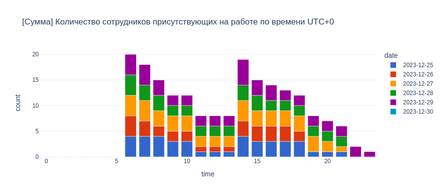

# **SQL Analytics Problem**

An interview question related to SQL knowledge from a financial bank which I thought was interesting so decided to share

- The first part consists of standard SQL knowledge questions 
- The second part consists of a problem in which we will need to create some code for monitoring the number of hours an employee has worked, which we will be doing with **`python`** and **`posgres`**

<!-- more -->

<div class="grid cards" markdown>

  - :simple-github:{ .lg .middle }&nbsp; <b>[GitHub Repository](https://github.com/shtrausslearning/postgreSQL/blob/main/testing_problem.ipynb)</b>

</div>

## **Questions**

### **Elementary Questions**

These are quite standard simple questions about general understanding of SQL

- 1) Вывести список сотрудников, получающих зароботную плату больше чем у руководителя
- 2) Вывести список сотрудников, получающих максимальную зароботную плату в своем отделе
- 3) Вывести список ID отделов, количество сотрудников в которых не превышает 3 человека
- 4) Вывести список сотрудников, не имеющих назначенного руководителя, работующего в том же отделе
- 5) Найти список ID отделов с максимальной суммарной зарплатой сотрудников


### **Main Problem**

Необходимо дополнить структуру новыми данными в связи с задачей фиксации отработанного
времени. Условия:

- Каждый сотрудник работает в своем часовом поясе, который явно прописан и не
меняется. Стандартный график 8 часов с 9 утра по его часовому поясу (Обед пропускаем в
рамках данной задачи)
- Работник к концу недели должен заполнить количество отработанных часов для каждого
дня. Отсутствие часов означает отсутствие сотрудника на рабочем месте.
Необходимо разработать скрипты для обновления базы данных и разработать аналитический
отчет, который позволит отследить количество сотрудников для каждого часа рабочей недели.
Допускается выводить 0 сотрудников.

Результат необходимо представить в виде:

- Дата 
- Время
- Количество сотрудников

So we know that a company has employees working in different time zones, and doesn't change in the context of the problem. The standard working hours are 8 hours from 9 am. 

Each employee must fill in the hours spent working for each day. This data will be used to determine how many people are working at the same period in time, taking into consideration this shift in timezones.

## **Available Data**

We are given two tables, which contain information about the department for employees, containing their name and identifier, and another table containing employee information, as shown below: 

DEPARTMENT

- **ID** NUMBER <PK>
- **NAME** VARCHAR2(100) 

EMPLOYEE 

- **ID** NUMBER <PK>
- **DEPARTMENT_ID** NUMBER 
- **CHIEF_ID** NUMBER <FK1>
- **NAME** VARCHAR2(100) <FK2>
- **SALARY** NUMBER 

## **Tools & Data**

We'll need some sample data, I'll be using **posgres**, pyspark is mainly for presentation purposes. I've created only two Departments (Business and Analytics) and 7 employees work across both of these departments as shown below:

```python

from pyspark.sql import SparkSession
from pyspark.sql.types import StructType, StructField, IntegerType, StringType, FloatType, DateType

'''

Создадим пример данных для таблиц EMPLOYEE, DEPARTAMENT

'''

# Create a Spark session
spark = SparkSession.builder.getOrCreate()

'''

Create Departament Table

'''

# Sample data for the Department table
data = [
        (1, "Business"),
        (2, "Analytics")]

# Define the schema for the Department table
schema = StructType([
    StructField("ID", IntegerType(), True),
    StructField("NAME", StringType(), True),
])

# Create a DataFrame for the Department table
departament = spark.createDataFrame(data, schema)
departament.createOrReplaceTempView("DEPARTAMENT")

'''

Create Employee Table

'''

# Sample data for the Department table
data = [
        (1,1,None,"Тамара",100000.0),
        (2,2,3,"Наташа",150000.0),
        (3,2,None,"Давид",110000.0),
        (4,1,1, "Александр",70000.0),
        (5,2,3,"Павел",200000.0),
        (6,1,1,"Михаил",50000.0),
         (7,1,1,"Екатерина",90000.0)]

# chief 1 : Tamara, chief 2 : David

# Define the schema for the Department table
schema = StructType([
    StructField("ID", IntegerType(), True),
    StructField("DEPARTAMENT_ID", IntegerType(), True),
    StructField("CHIEF_ID", IntegerType(), True),
    StructField("NAME", StringType(), True),
    StructField("SALARY", FloatType(), True)
])

# Create a DataFrame for the Department table
employee = spark.createDataFrame(data, schema)
employee.createOrReplaceTempView("EMPLOYEE")
```     

## **Elementary Questions**
Some basic concepts in SQL, joining, subqueries and CTE. Some of the more interesting things that one might not come across in SQL problems often is a WHERE condition format such as:

```sql
WHERE
    (DEPARTAMENT_ID, SALARY) IN (SELECT 
                                    DEPARTAMENT_ID,
                                    MAX(SALARY)
                                 FROM EMPLOYEE
                                 GROUP BY DEPARTAMENT_ID)
```

The format allows us to select users with maximum salaries in each department


```python
# 1) Вывести список сотрудников, получающих зароботную плату больше чем у руководителя

# Ход мышления:
# - Нам нужно сравнить данные внутри таблицы; создадим дубликат и соеденим с JOIN
# - Добавим условие которое говорит о том что salary должно быть меньше чем у руководителя

query1 = """
SELECT e2.NAME
FROM EMPLOYEE e1
INNER JOIN EMPLOYEE e2 ON e1.ID = e2.CHIEF_ID
WHERE e1.SALARY < e2.SALARY
"""

# Now you can use SQL to query the table
spark.sql(query1).show()
```

```
+------+
|  NAME|
+------+
|Наташа|
| Павел|
+------+
```

```python
# 2) Вывести список сотрудников, получающих максимальную зароботную плату в своем отделе

# Ход мышления:
# - Надо найти максимальное значение для всех отделов, можно воспользоватся
#   WHERE с условие двух атрибут чтобы было точное совпадение с DEPARTAMENT и MAX SALARY

query2 = """
SELECT
       EMPLOYEE.NAME,
       EMPLOYEE.DEPARTAMENT_ID,
       EMPLOYEE.SALARY
FROM EMPLOYEE
WHERE
    (DEPARTAMENT_ID, SALARY) IN (SELECT DEPARTAMENT_ID,MAX(SALARY)
                                  FROM EMPLOYEE
                                  GROUP BY DEPARTAMENT_ID)
"""

spark.sql(query2).show()
```

```
+------+--------------+--------+
|  NAME|DEPARTAMENT_ID|  SALARY|
+------+--------------+--------+
|Тамара|             1|100000.0|
| Павел|             2|200000.0|
+------+--------------+--------+
```

```python
# 3) Вывести список ID отделов, количество сотрудников в которых не превышает 3 человека

# Ход мышления:
# - В этот раз нам нужно обратится к DEPARTAMENT и привязать условие для выбора ID используя WHERE
#   для условия мы обратимся с EMPLOYEE и посчитаем количество сотрудников с SUM
#   добавив условие для GROUP BY с HAVING при группированаия по отделам

query3 = """
SELECT NAME
FROM DEPARTAMENT
WHERE ID IN (SELECT DEPARTAMENT_ID
             FROM EMPLOYEE
             GROUP BY DEPARTAMENT_ID
             HAVING COUNT(*) > 2)
"""

spark.sql(query3).show()
```

```
+---------+
|     NAME|
+---------+
| Business|
|Analytics|
+---------+
```

```python

# 4) Вывести список сотрудников, не имеющих назначенного руководителя, работующего в том же отделе

query4 = """
WITH COMBINED AS (
                    SELECT
                        e.NAME AS WORKER,
                        e2.NAME AS CHIEF,
                        d.NAME AS DEPARTAMENT
                    FROM EMPLOYEE e
                    JOIN EMPLOYEE e2 ON e.chief_id = e2.ID
                    JOIN DEPARTAMENT d ON e.DEPARTAMENT_ID = d.ID
                  )

SELECT *
FROM COMBINED
WHERE CHIEF IS NULL
"""

spark.sql(query4).show()
```

```
+------+-----+-----------+
|WORKER|CHIEF|DEPARTAMENT|
+------+-----+-----------+
+------+-----+-----------+
```

```python
# 5) Найти список ID отделов с максимальной суммарной зарплатой сотрудников

# Ход мышления:
# - Найти список ID отделов с максимальной суммарной зарплатой сотрудников

tquery = """
-- максимальное salary в department_id
WITH DEP_MAX AS (SELECT DEPARTAMENT_ID,
                        SUM(SALARY) AS SALARY
                    FROM EMPLOYEE
                    GROUP BY DEPARTAMENT_ID)

-- Выводим ID department где salary равно max(SALARY)
SELECT DEPARTAMENT_ID
FROM DEP_MAX
WHERE DEP_MAX.SALARY = (SELECT max(SALARY)
                        FROM DEP_MAX);
"""

spark.sql(tquery).show()
```

```
+--------------+
|DEPARTAMENT_ID|
+--------------+
|             2|
+--------------+
```

## **Main Problem**

Now lets move onto the main problem of the interview questions. We need to have a **posgres** session started. I'll be using **psycopg2** to connect to the database.gs The two main tables EMPLOYEE and DEPARTMENT which we'll need have been described above. We need to add new data to our database which describes the number of hours a an employee has worked.

Our goal is to write a code that will allow employees to **update the database** with employee working hours data & **create a simple analysis** based on the data that each employee provides us. 

```python
'''

Необходимо дополнить структуру новыми данными в связи с задачей фиксации отработанного времени.

Условия:
- Каждый сотрудник работает в своем часовом поясе, который явно прописан и не меняется.
  Стандартный график 8 часов с 9 утра по его часовому поясу (Обед пропускаем в рамках данной задачи)
- Работник к концу недели должен заполнить количество отработанных часов для каждого дня.
  Отсутствие часов означает отсутствие сотрудника на рабочем месте.

Необходимо разработать скрипты для обновления базы данных и разработать аналитический отчет,
который позволит отследить количество сотрудников для каждого часа рабочей недели.
Допускается выводить 0 сотрудников.

'''

# Ход мышления:
# - Для этой задачи воспользуемся postgres и для автоматизации будем использовать python
#   вместе с библиотекой psycopg2 для работы с СУБД
# - БД создается локально поэтом при необходимости данные из выгрузки испортируется в colab

import psycopg2
from datetime import date, datetime, timedelta
```

Create two new tables and add the data which has already been shown above into tables **DEPARTMENT** and **EMPLOYEE**

```python
# создаем пример данных, как и для spark

conn = psycopg2.connect(database = "postgres",
                        user = "postgres",
                        port = 5433)

'''

CREATE TABLE

'''

# Open a cursor to perform database operations
cur = conn.cursor()
# Execute a command: create datacamp_courses table
cur.execute("""
                CREATE TABLE DEPARTMENT (
                                            ID INT,
                                            NAME VARCHAR(100)
                                         );

                CREATE TABLE EMPLOYEE (
                                        ID INT PRIMARY KEY,
                                        DEPARTMENT_ID INT,
                                        CHIEF_ID INT,
                                        NAME VARCHAR(100),
                                        SALARY INT
                                        );
            """)

conn.commit()
cur.close()
```

```python
'''

ADD DATA TO TABLES

'''

cur = conn.cursor()
cur.execute("""
    INSERT INTO EMPLOYEE (ID,DEPARTMENT_ID,CHIEF_ID,NAME,SALARY) VALUES (1,1,NULL,'Тамара',100000),
                                                                        (2,2,3,'Наташа',150000),
                                                                        (3,2,NULL,'Давид',110000),
                                                                        (4,1,1, 'Александр',70000),
                                                                        (5,2,3,'Павел',200000),
                                                                        (6,1,1,'Михаил',50000),
                                                                        (7,1,1,'Екатерина',90000)
            """)

cur.execute("""
                    INSERT INTO DEPARTMENT (ID,NAME) VALUES (1,'Business'),
                                                             (2,'Analytics')
                                                             """)

cur.close()
conn.commit()
```

Employees can be located in **different timezones** as stated in the problem, so lets add a new column to address this data in table EMPLOYEE and create a simple script to iteratively INSERT data from a python list

```python
# тепер имея информацию о том что нужно добавить еще данные о пользовате
# добавим его через ALTER TABLE

'''

[step 1] : ADD employee_id timezones

'''

# add new column to account for timezones
cur = conn.cursor()
cur.execute("""
              ALTER TABLE EMPLOYEE ADD TIMEZONE VARCHAR(50)
             """)
cur.close()
conn.commit()
```

```python

'''

[step 2] : ADD employee_id timezones

'''

# Добавляем собранную информацию в таблицу EMPLOYEE

conn = psycopg2.connect(database = "postgres",
                        user = "postgres",
                        port = 5433)

# say we store data in dictionaries (lists are just used for convenience)
timezone =  ["UTC+3","UTC-5","UTC+3","UTC+3","UTC+3","UTC-5","UTC-5"]
ids = [i for i in range(1,8)]
new_data = dict(zip(ids,timezone))

# update each row in the
cur = conn.cursor()
for ii,i in enumerate(new_data.items()):
    cur.execute(f"UPDATE EMPLOYEE SET TIMEZONE = '{timezone[ii]}' WHERE ID = {ids[ii]}")

cur.close()
conn.commit()
```

Having added information about the timezones for each employee. Now lets create a table in which each employee from EMPLOYEE will be able to fill out their daily working hours information. One condition that needs to be mentioned is that our table will need to contain a constraint condition in order to prevent users from inputting working hours information multiple times for a particular date, hence the condition **`CONSTRAINT pk_employee_date PRIMARY KEY (employee_id, date)`**

```python
'''

CREATE NEW TABLE FOR WORKING HOURS

    add constraint to table to prevent user from adding duplicate entries
    for a particular combination of (employee_id,date)

'''

# теперь нам нудно добавить новую таблицу в которую сотрудники будут
# добавлять количество проработанных часов
# эдинственный важный момент это добавления CONTRAINT для того чтобы
# сотрудник дважды не вводил ту же информацию

conn = psycopg2.connect(database = "postgres",
                        user = "postgres",
                        port = 5433)

cur = conn.cursor()
cur.execute("""
                    CREATE TABLE WORKED_HOURS (
                        EMPLOYEE_ID INT,
                        DATE DATE,
                        HOURS_WORKED INT,
                        START_TIME TIMESTAMP,
                        END_TIME TIMESTAMP,
                        CONSTRAINT pk_employee_date PRIMARY KEY (employee_id, date)
                        )
             """)
cur.close()
conn.commit()
```

Now lets go into the main functionality class which each employee is ought be be using, lets assume all of them know how to use python. Class **store_working_hours** contains the following methods:

- **weekly_info** gives the employee information about the current week's working days (mon-fri) returning a dictionary format which the user can fill out using simple dictionary notation for the 5 keys corresponding to each day of the current week.
- **store_hours** allows the user to add data to the database table **WORKED_HOURS**, taking as an argument a dictionary returned in **weekly_info**
- **reset_weeklyhours** allows us to reset the weekly working hours for the employee stored in **WORKED_HOURS** 
- **extract_weekly_data** is a simple method that will allow us to extract the number of working hours for all employees in all departments for a specified time period (start_date,end_date)

    - To do this on a code level, we first need to create a **datetime** range, lets call it calendar which will define 120 hours of data
    - Convert the local time for each user to a specific time zone (I decided to use **UTC**), an example of this **`(wh.START_TIME AT TIME ZONE 'UTC') AT TIME ZONE e.TIMEZONE AS START_TIME`**
    - Add the data available from WORKED_HOURS into our calendar and do a head count for the number of employees working at one time for each calendar hour using **`count(distinct) with group by date`**


```python
'''

Теперь главный класс для фунционала работы с WORKED_HOURS

[weekly_info] : дает пользователю dict с датами этой недели, которую он заполняет
                это на случае если сотрудник только один раз заполняет табель в конце недели

                Пример return:
                {'2023-12-25': None, '2023-12-26': None, '2023-12-27': None, '2023-12-28': None, '2023-12-29': None}

[store_hours] : дает пользователю возможность загрузить данные dict в WORKED_HOURS

                Пример:

                        # Пользователь вводит в бд количество рабочих часов

                        weekly_data['2023-12-25'] = 8
                        weekly_data['2023-12-26'] = 8
                        weekly_data['2023-12-27'] = 8
                        weekly_data['2023-12-28'] = 8
                        weekly_data['2023-12-29'] = 8

                        store_data.store_hours(1,weekly_data)  # store weekly data

                При необходимости пользователь может коректировать вводную dict и опять
                обновлять бд

[reset_weeklyhours] : удаляет информацию для работника (на этой недели)!

[store_today] : При необходимость пользователь может отчитоватся каждый день

[extract_weekly_data] : Для отчетности для

    ""
    разработать аналитический отчет
    который позволит отследить количество сотрудников для каждого часа рабочей недели.
    Допускается выводить 0 сотрудников.
    ""

Постановка задачи немного не ясная, но интерпретируется так: используя слово "отследить"
и добавление иформации о временном поясе намикает на то что нужно совместить все пояса
в один пояс для того чтобы один пользователь мог понять сколько работниуов присутствовали
на работе в эго временном поясе (предположим что это UTC+0)

        пример из выгрузки:

        [
        (datetime.datetime(2023, 12, 25, 0, 0), 0)
        (datetime.datetime(2023, 12, 25, 1, 0), 0)
        (datetime.datetime(2023, 12, 25, 2, 0), 0)
        (datetime.datetime(2023, 12, 25, 3, 0), 0)
        (datetime.datetime(2023, 12, 25, 4, 0), 0)
        (datetime.datetime(2023, 12, 25, 5, 0), 0)
        (datetime.datetime(2023, 12, 25, 6, 0), 4)
        (datetime.datetime(2023, 12, 25, 7, 0), 4)
        (datetime.datetime(2023, 12, 25, 8, 0), 4)
        (datetime.datetime(2023, 12, 25, 9, 0), 3)
        (datetime.datetime(2023, 12, 25, 10, 0), 3)
        (datetime.datetime(2023, 12, 25, 11, 0), 1)
        ...]

Комментарии следуют в самом методе

'''

conn = psycopg2.connect(database = "postgres",
                        user = "postgres",
                        port = 5433)

class store_working_hours:

    def __init__(self):
        pass

    '''

    Show weekly dictionary

        generates and returns weekly dictionary, which users fill out and return
        into store_hours

    '''

    def weekly_info(self):
        current_date = datetime.today() # # Get current date
        start_date = current_date - timedelta(days=current_date.weekday()) # monday
        end_date = start_date + timedelta(days=4) # friday

        # Print the dates from Monday to Friday
        lst = ['monday','tuesday','wednesday','thursday','friday']; counter = 0
        lst_dates = []; print('')
        while start_date <= end_date:
            lst_dates.append(start_date.strftime("%Y-%m-%d"))
            start_date += timedelta(days=1)
            counter += 1

        return {key: None for key in lst_dates}

    '''

    Store Weekly Hours

        requires employee_id : [int]
           "     weekly_hours : [dict]


    '''

    def store_hours(self,employee_id:int,weekly_hours:dict):

        try:
            ints_cond = all(isinstance(value, int) for value in weekly_hours.values())
        except:
            print('all values need to be integers')
            ints_cond = False

        # store the date into the database if all entries have been filled out & are integers

        if(ints_cond):

            try:

                conn = psycopg2.connect(database = "postgres",
                                        user = "postgres",
                                        port = 5433)
                cur = conn.cursor()

                # add new entry or modify current entry
                for date,hours in weekly_hours.items():

                    # define start and final time
                    current_date = datetime.now().date(); start_time = '9:00 AM'
                    start_datetime_str = str(date) + ' ' + start_time
                    start_datetime = datetime.strptime(start_datetime_str, '%Y-%m-%d %I:%M %p')
                    final_datetime = start_datetime + timedelta(hours=hours)

                    query = f"""INSERT INTO WORKED_HOURS (EMPLOYEE_ID,DATE,HOURS_WORKED,START_TIME,END_TIME) VALUES ({employee_id}, '{date}', {hours}, '{start_datetime}', '{final_datetime}')"""
                    cur.execute(query)
                    cur.close()
                    conn.commit()

            except:

                # reset user's weekly hours
                self.reset_weeklyhours(employee_id)

                conn = psycopg2.connect(database = "postgres",
                                        user = "postgres",
                                        port = 5433)
                cur = conn.cursor()

                # add new entry or modify current entry
                for date,hours in weekly_hours.items():

                    # define start and final time
                    current_date = datetime.now().date(); start_time = '9:00 AM'
                    start_datetime_str = str(date) + ' ' + start_time
                    start_datetime = datetime.strptime(start_datetime_str, '%Y-%m-%d %I:%M %p')
                    final_datetime = start_datetime + timedelta(hours=hours)

                    query = f"""INSERT INTO WORKED_HOURS (EMPLOYEE_ID,DATE,HOURS_WORKED,START_TIME,END_TIME) VALUES ({employee_id}, '{date}', {hours}, '{start_datetime}', '{final_datetime}')"""
                    cur.execute(query)

                cur.close()
                conn.commit()

    '''

    Delete all entries from Database for employee_id

        requires employee_id : [int]

    '''

    def reset_weeklyhours(self,employee_id:int):

        conn = psycopg2.connect(database = "postgres",
                                user = "postgres",
                                port = 5433)
        cur = conn.cursor()

        # generate weekly
        current_date = datetime.today() # # Get current date
        start_date = current_date - timedelta(days=current_date.weekday()) # monday
        end_date = start_date + timedelta(days=4) # friday

        # Print the dates from Monday to Friday for this week
        lst = ['monday','tuesday','wednesday','thursday','friday']; counter = 0
        lst_dates = [];
        while start_date <= end_date:
            lst_dates.append(start_date.strftime("%Y-%m-%d"))
            start_date += timedelta(days=1)

        # delete from database all the relevant entries
        for date in lst_dates:
            query = f"DELETE FROM WORKED_HOURS WHERE EMPLOYEE_ID = {employee_id} AND DATE = '{str(date)}'"
            cur.execute(query)
            conn.commit()

    '''

    Stores the number of hours a user has worked today

        requires employee_id : [int]
                  hours      : [int]

    '''

    def store_today(self,employee_id:int,hours:int):

        conn = psycopg2.connect(database = "postgres",
                                user = "postgres",
                                port = 5433)
        cur = conn.cursor()

        # define start and final time
        current_date = datetime.now().date()
        start_time = '9:00 AM'

        start_datetime_str = str(current_date) + ' ' + start_time
        start_datetime = datetime.strptime(start_datetime_str, '%Y-%m-%d %I:%M %p')
        final_datetime = start_datetime + timedelta(hours=hours)

        query = f"SELECT COUNT(*) FROM WORKED_HOURS WHERE EMPLOYEE_ID = {employee_id} AND DATE = '{str(current_date)}'"
        cur.execute(query)
        data = cur.fetchall()[0][0]

        if(data == 0):
            # add new entry or modify current entry
            query = f"""INSERT INTO WORKED_HOURS (EMPLOYEE_ID,DATE,HOURS_WORKED,START_TIME,END_TIME) VALUES ({employee_id}, '{str(current_date)}', {hours}, '{start_datetime}', '{final_datetime}')"""
            cur.execute(query)
            cur.close()
            conn.commit()
        else:
            # modify existing entry
            print('already in database, updating information!')
            query = f"UPDATE WORKED_HOURS SET END_TIME = '{final_datetime}', HOURS_WORKED = {hours} WHERE EMPLOYEE_ID = {employee_id} AND DATE = '{str(current_date)}'"
            cur.execute(query)
            conn.commit()

    '''

    Extracts the employees present for a given period

        requires start_date : [str]
                  end_date  : [str]

        returns list of rows data : [list]

    '''

    def extract_weekly_data(self,start_date:str,end_date:str):

        conn = psycopg2.connect(database = "postgres",
                                user = "postgres",
                                port = 5433)
        cur = conn.cursor()

        query = f"""
                    -- Создадим календарь для start_date + 120 часов (mon-fri)
                    WITH calendar AS (
                        SELECT '{start_date} 00:00:00'::timestamp + value * interval '1 hour' AS cal_date
                        FROM generate_series(0, 120, 1) AS value
                    ),

                    -- Добавим TIMEZONE, и конвертируем локальное время на относительное время, например для
                    -- работника находящийся в поясе UTC
                    combined AS (
                    SELECT
                      wh.EMPLOYEE_ID,
                      e.NAME,
                      wh.DATE,
                      (wh.START_TIME AT TIME ZONE 'UTC') AT TIME ZONE e.TIMEZONE AS START_TIME,
                      (wh.END_TIME AT TIME ZONE 'UTC') AT TIME ZONE e.TIMEZONE AS END_TIME
                    FROM
                      WORKED_HOURS wh
                    JOIN EMPLOYEE e ON e.ID = wh.EMPLOYEE_ID
                    WHERE DATE BETWEEN '{start_date}' AND '{end_date}'
                    )

                    -- найдем пересечение календаря с рабочим временем используя BETWEEN и AND и сгруппируем уникальные значения
                    SELECT cal_date, COUNT(DISTINCT EMPLOYEE_ID) AS headcount
                    FROM      calendar
                    LEFT JOIN combined c
                           ON calendar.cal_date BETWEEN c.start_time AND c.end_time
                    GROUP BY cal_date
                """

        cur.execute(query)
        data = cur.fetchall()
        return data   # can be converted straight into dataframe
```

Now lets assume our employees have created some entries for the working period ('2023-12-25','2023-12-29') using the method **store_hours**, which takes in the employee identifier and hours worked in a dictionary forat. I'll just load the data which is exported from **extract_weekly_data** from a presaved dataframe **df**

From this data we can plot and visualise the number of working employees at any given time in a specific timezone.

```python
'''

For Analysis for working hours

'''

import plotly.express as px
import pandas as pd

# instantiate class
# store_data = store_working_hours()
# lst_date = store_data.extract_weekly_data('2023-12-25','2023-12-29')
# df = pd.DataFrame(lst_date,columns=['datetime','count'])
# df['date'] = df['datetime'].dt.date
# df['time'] = df['datetime'].dt.hour
df = pd.read_csv('temp.csv')
# df.to_csv('temp.csv',index=False)

# Количество сотрудников присутствующих на работе по времени UTC+0
fig = px.line(df,x='datetime',y='count',template='plotly_white',width=900,height=400,
       title='Количество сотрудников присутствующих на работе по времени UTC+0')
fig.show("png")

# + Сумма присутствующих за неделю
fig = px.bar(df,x='time',y='count',template='plotly_white',width=900,height=400,color='date',
       color_discrete_sequence=px.colors.qualitative.G10,
       title='[Сумма] Количество сотрудников присутствующих на работе по времени UTC+0')
fig.show("png")
```




## **Concluding Remarks**

So there we go, we have made a simple script that will allow us to count the number of employees present at work at any given period in a company which operates in different timezone based on the data that the users working hour data reported by each employee. This would allow the company to monitor working load, and note periods at which there are too few employees working to keep the business operating effectively. There are probably ways to improve the code, but this is what I managed in a 24 hour timeframe.


***

**Thank you for reading!**

Any questions or comments about the above post can be addressed on the :fontawesome-brands-telegram:{ .telegram } **[mldsai-info channel](https://t.me/mldsai_info)** or to me directly :fontawesome-brands-telegram:{ .telegram } **[shtrauss2](https://t.me/shtrauss2)**, on :fontawesome-brands-github:{ .github } **[shtrausslearning](https://github.com/shtrausslearning)** or :fontawesome-brands-kaggle:{ .kaggle} **[shtrausslearning](https://kaggle.com/shtrausslearning)** or simply below!