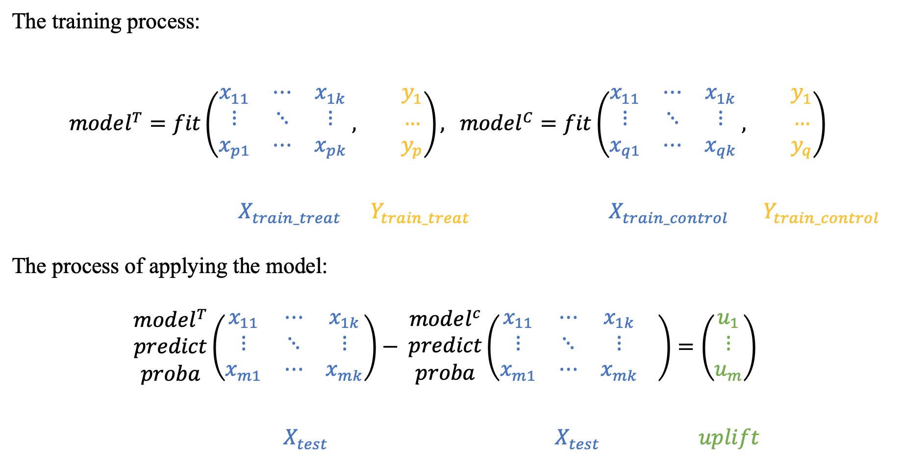
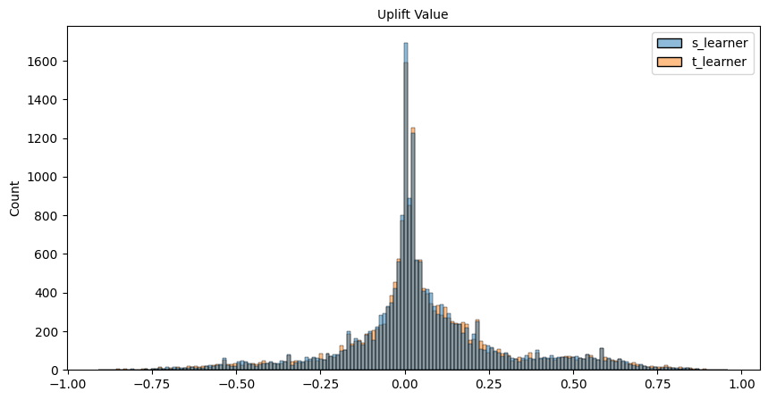

# **Uplift Modeling Basics**

**Uplift modeling** is a predictive modeling technique that aims to identify the individuals who are most likely to respond positively to a specific treatment or intervention. This technique is particularly useful in marketing and customer relationship management, where the goal is to target customers who are likely to be influenced by a marketing campaign or offer. By distinguishing between those who are positively influenced by the treatment and those who are not, uplift modeling helps organizations optimize their targeting strategies and maximize the return on investment of their marketing efforts.

<!-- more -->

<div class="grid cards" markdown>

  - :simple-kaggle:{ .lg .middle }&nbsp; <b>[Open Kaggle Notebook](https://www.kaggle.com/shtrausslearning/uplift-model-approaches)</b>
  - :simple-github:{ .lg .middle }&nbsp; <b>[GitHub Repository](https://github.com/shtrausslearning/Data-Science-Portfolio)</b>

</div>

## **Introduction**

### Uplift Modeling

What is the main issue at hand:

- We cannot do an action & not do an action at the same time to the same person

So what it this modeling approach about:

**Uplift modeling** is a technique that allows us to identify the subset of objects 

- who upon being influenced by an event/action will do some action
- and if not influenced will not do the action

### Uplift Modeling Example

Imagine we are selling a product and need to decide to whom we will be advertising, we have some constraints and cannot show it to all target audiences, 

- **we would like to find clients who will buy the product** if they see our advertisement 
- and **will and not buy it if they don't see it**

### Uplift Modeling Components

In **uplift modeling** we need three components:

 Have two arrays we will be working with; ==Treatment Array==, ==Target Array== and standard customer related ==feature matrix==

 - The ==Treatment Array== is a binary vector, where we have no influence (0) and influenced (1)
 - The ==Target Array== is also a binary vector, where we have no action (0) and action is made (1)
 - The standard ==feature matrix== (like other machine learning problems) is a matrix that contains features


### What to remember

So some important things to note in the context of uplift modeling:

- To model which users will do an action when influenced & users which will not do an action when not influences we need to have aside from a standard feature matrix two additional vectors; ==Treatment Array== (users were identified and interacted with) & the result of our interaction with them, stored in the ==Target Array==
- Having a trained model will enable us to identify on unseen data (without a treatment or target vector) the uplift value for a group for which we have a set of features used in training
- Our aim is to target **influencible clients** (those who upon being interacted with will commit a target action) and **those who can be positively influenced** (when not interacted with will not conduct a target action).


## **Loading Data**

### Kevin Hillstrom Dataset

Our dataset is available in the sklift library, called **Kevin Hillstrom Dataset**. You can also try other sample problems shown below:

```python
# Kevin Hillstrom Dataset
from sklift.datasets import fetch_x5, fetch_lenta, clear_data_dir, fetch_megafon, fetch_hillstrom

data = fetch_hillstrom()
```

Lets introduce ourselves to the dataset we will be using in our notebook, by looking at the description provided with the dataset

> This dataset contains 64,000 customers who last purchased within twelve months.
> The customers were involved in an e-mail test.
>
> * 1/3 were randomly chosen to receive an e-mail campaign featuring Mens merchandise.
> * 1/3 were randomly chosen to receive an e-mail campaign featuring Womens merchandise.
> * 1/3 were randomly chosen to not receive an e-mail campaign.
>
> During a period of two weeks following the e-mail campaign, results were tracked.
> Your job is to tell the world if the Mens or Womens e-mail campaign was successful.

Having read the above, lets **summarise the important** bits:

- We have 64000 customers who recently made a purchase, for these customers we have a matrix of features relevant to each of these customers
- We randomly send emails to these customers (**treatment array**); we have an array containing a marketing campaign defined subset groupings
- Finally we have a target containing post marketing campaign monitored results (confirmations of whether the email campaign worked or not)


## **Data Insight**

### Feature Matrix

Let's also look at the feature matrix available to us:


```
+-------+---------------+-------+----+------+---------+------+-------+
|recency|history_segment|history|mens|womens| zip_code|newbie|channel|
+-------+---------------+-------+----+------+---------+------+-------+
|     10| 2) $100 - $200| 142.44|   1|     0|Surburban|     0|  Phone|
|      6| 3) $200 - $350| 329.08|   1|     1|    Rural|     1|    Web|
|      7| 2) $100 - $200| 180.65|   0|     1|Surburban|     1|    Web|
|      9| 5) $500 - $750| 675.83|   1|     0|    Rural|     1|    Web|
|      2|   1) $0 - $100|  45.34|   1|     0|    Urban|     0|    Web|
+-------+---------------+-------+----+------+---------+------+-------+
```

### Treatment Array

The treatment array contains text data which we will need to convert into numerical data, we have information about the marketing campaign, in which we roughtly speaking to do one of two things; send an email about the marketing campaign or don't send anything

```
t.sample(5)

3947       Mens E-Mail
48105      Mens E-Mail
15614      Mens E-Mail
58595        No E-Mail
21571    Womens E-Mail
```

### Target Array

The target contains the **result of the email marketing campaign** influence and is already in numerical format, it reflects whether the campaign was successful or not

```
y.sample(5)

19624    0
38660    0
49813    0
23809    0
45957    1
```

## **Preprocessing**

### Problem Simplification

Lets do a little bit of preprocessing and problem simplification. As we saw in the above data, we have three categories in our treatment vector. Lets simplify it to just a binary case and not differentiate the male and female target cases, ie. marketing email has been sent or not sent. 

```python
t = t.map({'Womens E-Mail':1, 'Mens E-Mail':1, 'No E-Mail':0})
t.head()
```

### Train Test Splitting

Lets also split the data into training & test subsets, we will need some unseen data to validate our models.

```python
X_train, X_test, y_train, y_test, t_train, t_test = train_test_split(X, y, t, test_size=0.3, random_state=42)
```

### Categorical Feature Treatment

We have to also pay attention to categorical features which are present in our feature matrix, a common and most straightforward approach is to use **One Hot Encoding**, which will be applied to three columns. 

We will fit the one hot encoder on our training dataset, and only apply it to the test dataset

```python
cat_columns = ['history_segment', 'zip_code', 'channel']
enc = OneHotEncoder(sparse=False)

X_train_cat = enc.fit_transform(X_train[cat_columns])
X_train_cat = pd.DataFrame(X_train_cat, 
                           index=X_train.index,
                           columns=enc.get_feature_names_out(cat_columns))

X_test_cat = enc.transform(X_test[cat_columns])
X_test_cat = pd.DataFrame(X_test_cat, 
                          index=X_test.index,
                          columns=enc.get_feature_names_out(cat_columns))

X_train = pd.concat([X_train_cat, X_train.drop(cat_columns, axis=1)], axis=1)
X_test = pd.concat([X_test_cat, X_test.drop(cat_columns, axis=1)], axis=1)
```

## **Modeling Approaches**

Now that we have our data ready, lets talk libraries and approaches. There is a commonly used uplift modeling library called **scikit-uplift**, its based on scikit-learn machine learning models, but modified for uplift modeling. Lets remind ourselves of what the modeling actually wants to achieve:

!!! abstract

    Uplift modeling focuses on predicting the impact of a treatment or intervention on an individual's behavior

scikit-uplift has a number of different approaches for uplift modeling, you can find the models in the [following link](https://www.uplift-modeling.com/en/latest/), we'll look at two of the three approaches used in the library

### One Model Approach

Starting with **`s-learner`** approach, we train two separate models

- We train a base model with all base features and the treatment vector (w), taking the target vector (y) as our independent variable
- Apply the model (predict) assuming we have **interacted with all customers**, ie. (t=1 for all customers), and ask to return the probability of a successful outcome (y=1) for this group
- Apply the model (predict) again but assuming that these has been **no interaction** with any customer (t=0 for all customers)

<figure markdown="span">
  { .base-border-radius }
  <figcaption>s-model approach</figcaption>
</figure>


The difference between these two vectors will be taken as our uplift, to be more specific:

> model generates **uplift scores** that represent the **estimated impact of a treatment** on each individual's behavior

The **s-learner** model can be used by importing **SoloModel** from `from sklift.models import SoloModel`, we just need to specify the base model we will be using in the two models and wrap it with **SoloModel**. Like other sklearn models, we use **fit,predict** methods, but with an additional input `t_train`


```python
name = 'slearner'

base_model = RandomForestClassifier(random_state=42)
uplift_model = SoloModel(base_model)
uplift_model = uplift_model.fit(X_train, y_train, t_train)

# store the uplift values
model_predictions[name] = uplift_model.predict(X_test)
```

We obtain our uplift values:

```python
uplift_model.predict(X_test)
# array([-0.03, -0.31, -0.01, ...,  0.03,  0.56,  0.14])
```

!!! abstract "<b>Interpretation of Results</b>"

    - If the results are positive for a particular entry, it indicates that the treatment (email marketing campaign) has a positive effect on this individual and visa versa.
    - In terms of magnitude, a larger positive (or negative) uplift score implies a more significant impact of the treatment on the individual's likelihood of a positive outcome.


### Two Independent Model Approach

The two model approach, **t-learner** is similar to a one model approach, however instead of training a single model on **all the data**, we train two models, on two different subsets of data:

- One for the **control group** (no interaction, t=0)
- Another for the **test group** (there was interaction, t=1)

<figure markdown="span">
  { .base-border-radius }
  <figcaption>t-model approach (independent models)</figcaption>
</figure>

In order to obtain the uplift, we apply the model on the test set like in the **s-learner**, with the exception that we dont add the additional treatment feature, instead we are using two independent models. The difference in predict_proba between these two models will be our uplift value.

```python
from sklift.models import TwoModels

name = 'tlearner'

# control group
basic_model_control = RandomForestClassifier(random_state=42)

# test group
basic_model_test = RandomForestClassifier(random_state=42)

uplift_model = TwoModels(basic_model_test, basic_model_control, method='vanilla')
uplift_model = uplift_model.fit(X_train, y_train, t_train)

# store the uplift values
model_predictions[name] = uplift_model.predict(X_test)
```

We obtain our uplift values:

```python
uplift_model.predict(X_test)
# array([ 0.        , -0.41      , -0.01      , ...,  0.08142857,
#        0.59      ,  0.22      ])
```

We can also plot the uplift values predicted by both modeling approaches:

<figure markdown="span">
  { .base-border-radius }
  <figcaption>Comparing uplift values for s-learner & t-learner</figcaption>
</figure>

We can notice a very minor binomial tendency in the figure, a large portion of users having a low uplift values around 0-0.25 & a secondary group around 0.3-0.75, in terms of model variation, we can clearly note that **t-learner** is less concentrated with values at 0 and instead has more values in the region 0-0.25, which would indicate that the model predicts on average that the user is more confident that the user is positively influenced than the **s-model**

## **Conclusion**

### Metric Evaluation

So now that we have obtained our **uplift values**, we ought to evaluate how well our modeling is. When it comes to uplift modeling problems, we can turn to a metric called **uplift@k**. 

The metric ranges from -1 to 1, where **1 is the best** and **-1 represents a model that doesnt work**. A value of **0 is equivalent to a random model**. Values in the range 0.05 to 1 can be considered as working models.

The evaluation methodology is as follows:

- We take k objects with the highest uplift values
- Divide the subset into a **contol** (t=0) and **test** (t=1) group
- Evaluate the average target y for each individually
- Find the difference:

    $$ uplift@k = \bar{y}_{k \space test} - \bar{y}_{k \space control} $$

    $$ \bar{y}_k = \frac{1}{n} \sum_{i=1}^{k}{uplift_i,}  $$


There are some [other metrics](https://www.uplift-modeling.com/en/latest/) you can look into as well:

- Area Under Uplift Curve
- Area Under Qini Curve
- Weighted average uplift


```python

results = dict()
for model_name, preds in model_predictions.items():
    
    up_k_best = uplift_at_k(y_true=y_test, 
                            uplift=preds, 
                            treatment=t_test, 
                            strategy='overall', 
                            k=0.2)
    
    results[model_name] = round(up_k_best,4)
```

```
results
{'s_learner': 0.0526, 't_learner': 0.0584}
```

What we can conclude is that the **t-learner** method has a slightly higher metric values compared to **s-learer**, which indicates that it is a slightly better modeling approach.


### Remarks

In this post we looked into a brief introduction into **uplift modeling**, which is a practical business task for which we can utilise machine learning & use modeling for the prediction/identification of the subset of objects/dataset **who upon being influenced by an event/action will do some action** and **if not influenced will not do the action**

We looked at two approaches **s-learner** & **t-learner** modeling approaches and tried a sample problem **Kevin Hillstrom Dataset**

The modeling approaches allow us to predict the lift value, and gives us to understanding how well the particular client is influenced based on historical data, the models can then be used on new unseen data.

We can repeat the process similar to above using some other datasets such as: [fetch_x5](https://www.uplift-modeling.com/en/latest/api/datasets/fetch_x5.html), [fetch_lenta](https://www.uplift-modeling.com/en/latest/api/datasets/fetch_lenta.html#lenta-uplift-modeling-dataset), [fetch_megafon](https://www.uplift-modeling.com/en/latest/api/datasets/fetch_megafon.html).


***

**Thank you for reading!**

Any questions or comments about the above post can be addressed on the :fontawesome-brands-telegram:{ .telegram } **[mldsai-info channel](https://t.me/mldsai_info)** or to me directly :fontawesome-brands-telegram:{ .telegram } **[shtrauss2](https://t.me/shtrauss2)**, on :fontawesome-brands-github:{ .github } **[shtrausslearning](https://github.com/shtrausslearning)** or :fontawesome-brands-kaggle:{ .kaggle} **[shtrausslearning](https://kaggle.com/shtrausslearning)** or simply below!