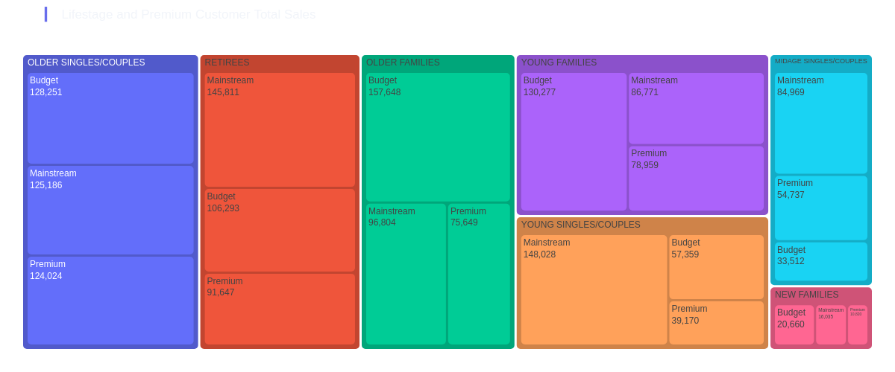

<div class="grid cards" markdown>

- [:simple-kaggle:{ .lg .middle }&nbsp; Kaggle Dataset](https://www.kaggle.com/datasets/shtrausslearning/forage-internship-data)

- :fontawesome-regular-rectangle-list:{ .lg .middle }&nbsp; <b>[Quantium Internship](https://www.theforage.com/simulations/quantium/data-analytics-rqkb)</b>

</div>

<!-- more -->

## <b>1 | <span style='color:#678DFF'>Background</span></b>

***

### <span style='color:#5075dc'>|</span> Internship Parts

The internship is split into a few segments:

- [==**Task 1: Data preparation and customer analytics**==](#2-data-preparation-and-customer-analytics)
- ==**Task 2**== : Experimentation and uplift testing
- ==**Task 3**== : Analytics and commercial application

If you are interested in doing the internship, you can **[@Data Analytics](https://www.theforage.com/simulations/quantium/data-analytics-rqkb)**

### <span style='color:#5075dc'>|</span> About Internship

As part of the internship we will focus on the following things for the `first task`:

- Conduct analysis on your client's transaction dataset and identify customer purchasing behaviours to generate insights and provide commercial recommendations.

And for the `second task` we will:

- Extend your analysis from Task 1 to help you identify benchmark stores that allow you to test the impact of the trial store layouts on customer sales.

### <span style='color:#5075dc'>|</span> Dataset Preview

Lets explore our dataset to understand the dataset that we are going to be working with and figure out if there are any preprocessing steps we need to take in order to get the data into a usable for us format. The data is provided to us in two different tables:

- ==QVI_transaction_data== : client transactional data


|   DATE |   STORE_NBR |   LYLTY_CARD_NBR |   TXN_ID |   PROD_NBR | PROD_NAME                                |   PROD_QTY |   TOT_SALES |
|-------:|------------:|-----------------:|---------:|-----------:|:-----------------------------------------|-----------:|------------:|
|  43390 |           1 |             1000 |        1 |          5 | Natural Chip        Compny SeaSalt175g   |          2 |         6   |
|  43599 |           1 |             1307 |      348 |         66 | CCs Nacho Cheese    175g                 |          3 |         6.3 |
|  43605 |           1 |             1343 |      383 |         61 | Smiths Crinkle Cut  Chips Chicken 170g   |          2 |         2.9 |
|  43329 |           2 |             2373 |      974 |         69 | Smiths Chip Thinly  S/Cream&Onion 175g   |          5 |        15   |
|  43330 |           2 |             2426 |     1038 |        108 | Kettle Tortilla ChpsHny&Jlpno Chili 150g |          3 |        13.8 |


- ==QVI_purchase_behaviour== : client segmentation features


|   LYLTY_CARD_NBR | LIFESTAGE              | PREMIUM_CUSTOMER   |
|-----------------:|:-----------------------|:-------------------|
|             1000 | YOUNG SINGLES/COUPLES  | Premium            |
|             1002 | YOUNG SINGLES/COUPLES  | Mainstream         |
|             1003 | YOUNG FAMILIES         | Budget             |
|             1004 | OLDER SINGLES/COUPLES  | Mainstream         |
|             1005 | MIDAGE SINGLES/COUPLES | Mainstream         |


We can see that `QVI_purchase_behaviour` provides us with customer information and `QVI_transaction_data` contains their purchases. The unique customer identifier is `LYLTY_CARD_NBR`


### <span style='color:#5075dc'>|</span> Dataset features

Lets take some quick notes about the data that we have:

!!! note

	 - **`DATE`** : Date since 1899-12-30
     - **`STORE_NBR`** : The store identifier
     - **`LYLTY_CARD_NBR`** : Customer's loyalty identifier
     - **`PROD_NAME`** : Name of the product purchased
     - **`PROD_QTY`** : Products of type purchased
     - **`TOT_SALES`** : Sum of purchase
     -  **`LIFESTAGE`**: Customer attribute that identifies whether a customer has a family or not and what point in life they are at e.g. are their children in pre-school/primary/secondary school.
     - **`PREMIUM_CUSTOMER`** : Customer segmentation used to differentiate shoppers by the price point of products they buy and the types of products they buy. It is used to identify whether customers may spend more for quality or brand or whether they will purchase the cheapest options


### <span style='color:#5075dc'>|</span> Loading dataset

Time to load our dataset, having given a glimpse of the data, we can define our data types, similar to how you would do in SQL. Well load both of the files and merge them together on column **LYLTY_CARD_NBR**, we'll also make some minor adjustments before we start exploring the dataset.


```python
import pandas as pd

dtypes = {'DATE': int,
          'STORE_NBR':int,
          'LYLTY_CARD_NBR':int,
          'TXN_ID':int,
          'PROD_NBR':int,
          'PROD_NAME':str,
          'PROD_QTY':int,
          'TOT_SALES':float
          }

df_transaction = pd.read_csv(path,dtype=dtypes)
df_behaviour = pd.read_csv(path2)
df = df_transaction.merge(df_behaviour,on='LYLTY_CARD_NBR')
```

As we can see in the data below, we have a customer identifier column **LYLTY_CARD_NBR**, which we will need to do group by operations and determine aggregations for each unique customer that has made a purchase in our transactions dataset.

Our date column is in a rather odd format, what it represents is the number of days since "1899-12-30", so lets convert it to something we are more familiar with (datetime). However since it is a difference, we need it to be in the **time delta** format & not **datetime**, so lets use `pd.to_timedelta` setting the unit to days:

```python
# Convert days since "1899-12-30" to datetime
start_date = pd.to_datetime("1899-12-30")
df['DATETIME'] = start_date + pd.to_timedelta(df['DATE'], unit='d')
```

Lets also determine the first and last transaction date

```python
df['DATETIME'].min(),df['DATETIME'].max()
```

Looks like we have about a years worth of transactional data, the latest date being "2019-06-30", which is a little out of date for an RFM analysis. Let's assume that we received this data on "2019-07-01", and were asked to conduct the analysis

```
(Timestamp('2018-07-01 00:00:00'), Timestamp('2019-06-30 00:00:00'))
```

We can also note if we have any missing dates, which we do have:

```python 
pd.date_range(start = '2018-07-01', end = '2019-06-30').difference(df['DATETIME'])
```

```
DatetimeIndex(['2018-12-25'], dtype='datetime64[ns]', freq='D')
```


## <b>2 | <span style='color:#678DFF'>Data preparation and customer analytics</span></b>

***

### <span style='color:#5075dc'>|</span> Problem Statement

- You are part of Quantium’s retail analytics team and have been approached by your client, the Category Manager for Chips, who 
	- (1) Wants to better understand the ==types of customers== who purchase Chips 
	- (2) Wants to better understand their ==purchasing behaviour== within the region

The insights from your analysis will feed into the supermarket’s strategic plan for the chip category in the next half year.

- You have received the following email from your manager, Zilinka.

!!! note ""

    'Hi, 

    Welcome again to the team, we love having new graduates join us! 

    I just wanted to send a quick follow up from our conversation earlier with a few pointers around the key areas of this task to make sure we set you up for success. 

    Below I have outlined your main tasks along with what we should be looking for in the data for each. 

    Examine transaction data – look for inconsistencies, missing data across the data set, outliers, correctly identified category items, numeric data across all tables. If you determine any anomalies make the necessary changes in the dataset and save it. Having clean data will help when it comes to your analysis. 

    Examine customer data – check for similar issues in the customer data, look for nulls and when you are happy merge the transaction and customer data together so it’s ready for the analysis ensuring you save your files along the way.

    Data analysis and customer segments – in your analysis make sure you define the metrics – look at total sales, drivers of sales, where the highest sales are coming from etc. Explore the data, create charts and graphs as well as noting any interesting trends and/or insights you find. These will all form part of our report to Julia. 

    Deep dive into customer segments – define your recommendation from your insights, determine which segments we should be targeting, if packet sizes are relative and form an overall conclusion based on your analysis. 

    Make sure you save your analysis in the CSV files and your visualisations – we will need them for our report. If you could work on this analysis and send me your initial findings by end of next week that would be great.  

    Looking forward to reviewing your work. 

    Thanks, 

    Zilinka'

- We need to present a strategic recommendation to Julia that is supported by data which she can then use for the upcoming category review. 
- However, to do so, we need to analyse the data to understand the current purchasing trends and behaviours. 
- The client is particularly interested in customer segments and their chip purchasing behaviour. 
- Consider what metrics would help describe the customers’ purchasing behaviour.  


### <span style='color:#5075dc'>|</span> Problem Workflow

What well do is conduct an analysis on our client's transaction dataset and identify customer purchasing behaviours to generate insights and provide commercial recommendations.

What well learn along the way:

<div class="grid cards" markdown>

- Understand how to examine and clean transaction and customer data.
- Learn to identify customer segments based on purchasing behaviour
- Gain experience in creating charts and graphs to present data insight
- Learn how to derive commercial recommendations from data analysis

</div>

And we'll be doing the following:

<div class="grid cards" markdown>

- Analyse transaction and customer data to identify trends and inconsistencies. 
- Develop metrics and examine sales drivers to gain insights into overall sales performance. 
- Create visualizations and prepare findings to formulate a clear recommendation for the client's strategy.

</div>

### <span style='color:#5075dc'>|</span> Cleaning Product Name Column

I would start by exploring the **`PROD_NAME`** column, it contains a several key information parts that we can extract and use in our customer segmentation task. We can also notice some text input abnormalities that we ought to fix along the way.


```python
def remove_mass(x):

    """

    Tokenise & Clean Product Name

    """
    
    string = x['PROD_NAME']
    replaced = re.sub(r'\s*\d+g$', '', string)
    lst_tokens = replaced.split(' ')
    
    lst_data = []
    for i in lst_tokens:
        if(i != ''):
            lst_data.append(i)
        
    return lst_data
    
df['TOKENS'] = df.apply(remove_mass,axis=1)  # cleaned tokenised 
df['TOKENS_STR'] = df['TOKENS'].apply(lambda x: " ".join(x))  # cleaned string name
```

An interest trick you may not have come across when working with python lists; the default library contains the module **`cmd`**, we can use it to neatly and more cleanly display the contents of a python list:

```python
import cmd
cli = cmd.Cmd()
cli.columnize(chips['TOKENS_STR'].unique().tolist(), displaywidth=120)
```

```
Natural Chip Compny SeaSalt           Smiths Crinkle Cut Tomato Salsa      Smiths Chip Thinly CutSalt/Vinegr  
CCs Nacho Cheese                      Kettle Mozzarella Basil & Pesto      Cheezels Cheese                    
Smiths Crinkle Cut Chips Chicken      Infuzions Thai SweetChili PotatoMix  Tostitos Lightly Salted            
Smiths Chip Thinly S/Cream&Onion      Kettle Sensations Camembert & Fig    Thins Chips Salt & Vinegar         
Kettle Tortilla ChpsHny&Jlpno Chili   Smith Crinkle Cut Mac N Cheese       Smiths Crinkle Cut Chips Barbecue  
Old El Paso Salsa Dip Tomato Mild     Kettle Honey Soy Chicken             Cheetos Puffs                      
Smiths Crinkle Chips Salt & Vinegar   Thins Chips Seasonedchicken          RRD Sweet Chilli & Sour Cream      
Grain Waves Sweet Chilli              Smiths Crinkle Cut Salt & Vinegar    WW Crinkle Cut Original            
Doritos Corn Chip Mexican Jalapeno    Infuzions BBQ Rib Prawn Crackers     Tostitos Splash Of Lime            
Grain Waves Sour Cream&Chives 210G    GrnWves Plus Btroot & Chilli Jam     Woolworths Medium Salsa            
Kettle Sensations Siracha Lime        Tyrrells Crisps Lightly Salted       Kettle Tortilla ChpsBtroot&Ricotta 
Twisties Cheese                       Kettle Sweet Chilli And Sour Cream   CCs Tasty Cheese                   
WW Crinkle Cut Chicken                Doritos Salsa Medium                 Woolworths Cheese Rings            
Thins Chips Light& Tangy              Kettle 135g Swt Pot Sea Salt         Tostitos Smoked Chipotle           
CCs Original                          Pringles SourCream Onion             Pringles Barbeque                  
Burger Rings                          Doritos Corn Chips Original          WW Supreme Cheese Corn Chips       
NCC Sour Cream & Garden Chives        Twisties Cheese Burger               Pringles Mystery Flavour           
Doritos Corn Chip Southern Chicken    Old El Paso Salsa Dip Chnky Tom Ht   Tyrrells Crisps Ched & Chives      
Cheezels Cheese Box                   Cobs Popd Swt/Chlli &Sr/Cream Chips  Snbts Whlgrn Crisps Cheddr&Mstrd   
Smiths Crinkle Original               Woolworths Mild Salsa                Cheetos Chs & Bacon Balls          
Infzns Crn Crnchers Tangy Gcamole     Natural Chip Co Tmato Hrb&Spce       Pringles Slt Vingar                
Kettle Sea Salt And Vinegar           Smiths Crinkle Cut Chips Original    Infuzions SourCream&Herbs Veg Strws
Smiths Chip Thinly Cut Original       Cobs Popd Sea Salt Chips             Kettle Tortilla ChpsFeta&Garlic    
Kettle Original                       Smiths Crinkle Cut Chips Chs&Onion   Infuzions Mango Chutny Papadums    
Red Rock Deli Thai Chilli&Lime        French Fries Potato Chips            RRD Steak & Chimuchurri            
Pringles Sthrn FriedChicken           Old El Paso Salsa Dip Tomato Med     RRD Honey Soy Chicken              
Pringles Sweet&Spcy BBQ               Doritos Corn Chips Cheese Supreme    Sunbites Whlegrn Crisps Frch/Onin  
Red Rock Deli SR Salsa & Mzzrlla      Pringles Original Crisps             RRD Salt & Vinegar                 
Thins Chips Originl saltd             RRD Chilli& Coconut                  Doritos Cheese Supreme             
Red Rock Deli Sp Salt & Truffle 150G  WW Original Corn Chips               Smiths Crinkle Cut Snag&Sauce      
Smiths Thinly Swt Chli&S/Cream175G    Thins Potato Chips Hot & Spicy       WW Sour Cream &OnionStacked Chips  
Kettle Chilli                         Cobs Popd Sour Crm &Chives Chips     RRD Lime & Pepper                  
Doritos Mexicana                      Smiths Crnkle Chip Orgnl Big Bag     Natural ChipCo Sea Salt & Vinegr   
Smiths Crinkle Cut French OnionDip    Doritos Corn Chips Nacho Cheese      Red Rock Deli Chikn&Garlic Aioli   
Natural ChipCo Hony Soy Chckn         Kettle Sensations BBQ&Maple          RRD SR Slow Rst Pork Belly         
Dorito Corn Chp Supreme               WW D/Style Chip Sea Salt             RRD Pc Sea Salt                    
Twisties Chicken                      Pringles Chicken Salt Crips          Smith Crinkle Cut Bolognese        
Smiths Thinly Cut Roast Chicken       WW Original Stacked Chips            Doritos Salsa Mild   
```

### <span style='color:#5075dc'>|</span> Removing sauces from dataset

What we can notice upon inspecting the unique column values is that we have lots of **misspellings** as well as products related to **salsa** (which is a sauce) & we have some overlaps with chips that contain the word "salsa", eg. **Smiths Crinkle Cut Tomato Salsa**, my guess is that this was not intentionally done, so we need to segment these groups.

I have selected the salsas which are present in the column `PROD_NAME` & we will filter out these products from the target products which are chips!

```python
# Salsa 
salasa = ["Doritos Salsa Mild",
        "Old El Paso Salsa Dip Tomato Med",
        "Woolworths Mild Salsa",
        "Old El Paso Salsa Dip Chnky Tom Ht",
        "Doritos Salsa Medium",
        "Woolworths Medium Salsa",
        "Old El Paso Salsa Dip Tomato Mild",
        "Smiths Crinkle Cut Tomato Salsa"]

salsas = df[df['TOKENS_STR'].isin(salasa)].copy()
chips = df[~df['TOKENS_STR'].isin(salasa)].copy()
```

`chips` will contain the subset of purchases of potato chips.

### <span style='color:#5075dc'>|</span> Extract segmentation labels from product name

The next step we can take is to identify the ==product producer== (parent companies)

- What I found was that there are proucts by 9 different parent companies ==CATEGORY== shown below (by looking up product names on the web)
- So just an example, `pepsico` is the parent company of products of `Smiths`, `Burger Rings` (which are names found in `PROD_NAME` and so on
- Categorising them in this way will hopefully give us some more insights into customer purchasing behaviour and their market share of sales for each parent company
- We will also categorise our transactions into different brand names ==BRAND==
- And lastly we will extract the mass of packaging, all of which is extracted from the product name, ==GRAMS==


```python
# Segment chip/snack parents
woolworths = ['WW','Woolworths']
cobs = ['Cobs']
intersnack = ['Tyrrells']
snack_brands = ['NCC','Natural ChipCo','Natural Chip','CCs','Cheezels','Kettle','French Fries Potato Chips','Thins']
majans = ['Infuzions','Infzns']
red_rock_deli = ['Red Rock Deli','RRD']
pepsico = ['Smiths','Smith','Burger Rings','Dorito','Doritos','Grain Waves','Twisties','Tostitos','Cheetos','GrnWves']
kellanova = ['Pringles']
sunbites = ['Sunbites','Snbts']

lst_brands = pepsico + kellanova + sunbites +  store + cobs + intersnack + snack_brands + majans + red_rock_deli 

# Combine all lists into a dictionary for easy lookup
brand_categories = {
    'Woolworths': woolworths,
    'Cobs': cobs,
    'Intersnack': intersnack,
    'Snack Brands': snack_brands,
    'Majans': majans,
    'Red Rock Deli': red_rock_deli,
    'Pepsico': pepsico,
    'Kellanova': kellanova,
    'Sunbites': sunbites
}

# Function to categorize brands
def categorize_parent(brand):
    for category, brands in brand_categories.items():
        if any(part in brand for part in brands):
            return category
    return 'Other'  

# Function to find matches
def categorize_brand(text):
    for name in lst_brands:
        if name in text:
            return name
    return None

# Apply the function to the DataFrame
chips['PARENT'] = chips['TOKENS_STR'].apply(categorize_parent)                                      
chips['BRAND'] = chips['TOKENS_STR'].apply(categorize_brand)
chips['GRAMS'] = chips['PROD_NAME'].str.extract(r'(\d+)g')
```

Which gives us such information

| PROD_NAME                                | PARENT       | BRAND        |   GRAMS |
|:-----------------------------------------|:-------------|:-------------|--------:|
| Natural Chip        Compny SeaSalt175g   | Snack Brands | Natural Chip |     175 |
| CCs Nacho Cheese    175g                 | Snack Brands | CCs          |     175 |
| Smiths Crinkle Cut  Chips Chicken 170g   | Pepsico      | Smiths       |     170 |
| Smiths Chip Thinly  S/Cream&Onion 175g   | Pepsico      | Smiths       |     175 |
| Kettle Tortilla ChpsHny&Jlpno Chili 150g | Snack Brands | Kettle       |     150 |


### <span style='color:#5075dc'>|</span> Premium Customer, Lifestage Total Sales

Now lets determine the customer `TOTAL_SALES` and segment by `LIFESTAGE` and `PREMIUM_CUSTOMER`, to determine how much each group actually spends in total

```python
customer_segment = chips.groupby(['LIFESTAGE','PREMIUM_CUSTOMER','TOT_SALES'],as_index=False)['TOT_SALES'].sum()

fig = px.treemap(customer_segment.round(0), path=['LIFESTAGE','PREMIUM_CUSTOMER'],
                 values='TOT_SALES',
                 template='plotly_dark',
                 height=500,width=1200,
                title="<span style='color:#686dec'>▎</span>Lifestage and Premium Customer Total Sales")
fig.update_layout({
'plot_bgcolor': 'rgba(0, 0, 0, 0)',
'paper_bgcolor': 'rgba(0, 0, 0, 0)',
})
fig.update_traces(marker=dict(cornerradius=5))
fig.update_layout(margin = dict(t=50, l=25, r=25, b=25))
fig.update_traces(textinfo="label+text+value")
fig.show("png")
```

