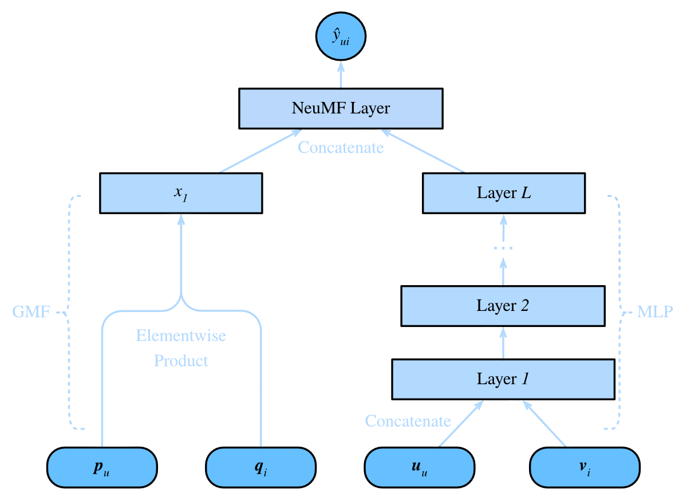

# **Neural Collaborative Filtering**

In this post we'll cover some of the basics of recommendation system approaches utilising neural networks. 

- **`Collaborative filtering`** (CF) is a recommendation generation method that relies on user-item interactions to make predictions about what a user might like based on the historical data of user interaction with the item. 

- We covered **`collaborative filtration`** using matrix factorisation is the [notebook](https://shtrausslearning.github.io/notebooks/course_recsys/recsys_matrix_decomposition). 

- Specifically we looked at methods such as **`SVD`** in order to generate the **`user`** and **`item`** matrices, these two matrices are then multiplied together to get the corresponding scores for each user, item pairing; a model-based approach. 

- **`Neural Collaborative Filtering`** (NCF) bears some similarity to CF whilst leveraging the benefits of deep learning techniques to enhance recommendation performance.

<!-- more -->

<div class="grid cards" markdown>

- :simple-google:{ .lg .middle }&nbsp; <b>[ML-1M Dataset](https://github.com/hexiangnan/neural_collaborative_filtering/tree/master/Data)</b>

- :fontawesome-regular-rectangle-list:{ .lg .middle }&nbsp; <b>[NeuMF Jupyter Notebook](https://shtrausslearning.github.io/notebooks/course_recsys/prob_neumf)</b>

</div>


## **Background**

### Aim

- Our aim is to create a neural network that will be able to generate recommendations for users, based on their previous interactions with a product. 
- We will be using a **dataset of movies** with which users have **explicitly** interacted, having set **ratings for movies**
- Ultimately, we aim to replicate the network proposed in [article](https://arxiv.org/pdf/1708.05031)

### Outline

Here's what we will be doing in this post:

- We'll be using the dataset **[ML-1M](https://grouplens.org/datasets/movielens/1m/)**, the dataset has been uploaded to **[Kaggle](https://www.kaggle.com/datasets/san1201/movielens1m)**
- We'll be coding the Neural Collaborative Filtering Model from the [article](https://arxiv.org/pdf/1708.05031) using PyTorch
- We'll also train the model(s) on the `training` dataset (positive samples) and we will need to create some negative samples as well (for the training set). To replicate the author results, we'll use the provided negative samples (for the test set)
- The problem will be formulated as a **Binary Classification** problem (similar to the [DSSM notebook](https://shtrausslearning.github.io/notebooks/course_recsys/dssm-towers)), **positive samples** (user has interacted with item) (label 1) and **negative samples** (user hasn't interacted) (label 0), so the model will learn to differentiate between interacted and not interacted, generating the embedding features, which will be used to generate scores.
- We'll be evaluating the models using common recommendation evaluation metrics **HR** and **NDCG**, on the `test` dataset 
- Finally we'll compare the results to the article results


## <b>Modeling Approaches</b>

### Problem definition

We will setup the the problem as a **binary classification** problem:

- We define **positive samples** for **`user`**, **`item`** combinations that exist, which implies that the user has rated the item (film in this case)
- **Negative samples** will need to be generated for **`user`**, **`item`** combinations which do not currently exist in the dataset 
- Merging these two subset, we aim to create a model that will be able to predict whether a user has watched the movie or not
- The `test` set is a continuation of `train`, containing only the latest watched item by the user, and 99 items the user didn't watch (negative sample)


### NeuMF model variations

The most important part is probably the neural network itself, lets examine what is contains. Based on the article, three different approaches are mentioned:

- **MLP** (Multilayer Perceptron)
- **GMF** (Generalised Matrix Factorisation)
- **NeuMF** (Combination of Both)

We can visualise all three models in one figure, comments are added below the figure.

<center>

</center>

<div class="grid cards" markdown>

- The left side of the figure show the **`GMF`** model. It only contains the embedding layers of both **`user`** & **`items`**, the element wise product is then taken for the user and item vectors and output is fed into the linear layer
- The right side of the figure shows the **`MLP`** model, it starts with the embedding layers for both the **`user`** & **`items`**, followed by the linear layers together with dropout/activation functions

</div>

The **NeuMF** model contains both of these parts. They need to be concatenated together before been fed into the output **`linear layer`** 

### Define network layers

So we have a general overiew of how the neural network should look like, next using PyTorch, we'll put it into realisation. The model is essentially formed using two parts, **`embedding`** layers and **`Sequential`** segment.

<h4>Embedding Layers</h4>

First we need to define the **embedding layers**

- For layers which will connect with the Sequential MLP layers, we need to make sure the input size of the embedding layer matches the input of the Sequential layer
- For all layers we need to define **`user_num`** (number of users), **`item_num`** (number of items) and **`factor_num`** (number of factors)
- If we are using the **`MLP`** model, then we need to define how many layers will be used in the **`Sequential`** part of the model.

```python
self.embed_user_GMF = nn.Embedding(user_num, factor_num) # LHS embedding matrix of user
self.embed_item_GMF = nn.Embedding(item_num, factor_num) # LHS embedding matrix of items
self.embed_user_MLP = nn.Embedding(
		user_num, factor_num * (2 ** (num_layers - 1)))  # RHS embedding matrix of users to be connected to Sequential
self.embed_item_MLP = nn.Embedding(
		item_num, factor_num * (2 ** (num_layers - 1)))  # RHS embedding matrix of items to be connected to Sequential
```

<h4>Sequential Layers</h4>

We also need the **Sequential** part of the model:

- `input_size` for each layer is defined in a way that will allow us to setup multiple segments 
of the MLP section. 
- The MLP sequential section contains a **`dropout layer`**, a **`linear layer`** and a **`ReLU`** activation function.

```python        
MLP_modules = []
for i in range(num_layers):
	input_size = factor_num * (2 ** (num_layers - i))
	MLP_modules.append(nn.Dropout(p=self.dropout))
	MLP_modules.append(nn.Linear(input_size, input_size//2))
	MLP_modules.append(nn.ReLU())
self.MLP_layers = nn.Sequential(*MLP_modules)
```

<h4>Output layer</h4>

Finally we need to define the output linear layer. The 

```python
self.predict_layer = nn.Linear(predict_size, 1)
```

### Initialised layers

Having defined the layers of the neural network. Lets see how the layers will look after they have been initialised using a **`factor_num`** of 16.

=== "MLP"

	```python
	(embed_user_MLP): Embedding(6040, 64)
	(embed_item_MLP): Embedding(3706, 64)
	(MLP_layers): Sequential(
		(0): Dropout(p=0.0, inplace=False)
		(1): Linear(in_features=128, out_features=64, bias=True)
		(2): ReLU()
		(3): Dropout(p=0.0, inplace=False)
		(4): Linear(in_features=64, out_features=32, bias=True)
		(5): ReLU()
		(6): Dropout(p=0.0, inplace=False)
		(7): Linear(in_features=32, out_features=16, bias=True)
		(8): ReLU()
	)
	(predict_layer): Linear(in_features=16, out_features=1, bias=True)
	```

=== "GMF"

	```python
	NCF(
	(embed_user_GMF): Embedding(6040, 16)
	(embed_item_GMF): Embedding(3706, 16)
	(predict_layer): Linear(in_features=16, out_features=1, bias=True)
	)
	```

=== "NeuMF"

	```python
	NCF(
	(embed_user_GMF): Embedding(6040, 16)
	(embed_item_GMF): Embedding(3706, 16)
	(embed_user_MLP): Embedding(6040, 64)
	(embed_item_MLP): Embedding(3706, 64)
	(MLP_layers): Sequential(
		(0): Dropout(p=0.0, inplace=False)
		(1): Linear(in_features=128, out_features=64, bias=True)
		(2): ReLU()
		(3): Dropout(p=0.0, inplace=False)
		(4): Linear(in_features=64, out_features=32, bias=True)
		(5): ReLU()
		(6): Dropout(p=0.0, inplace=False)
		(7): Linear(in_features=32, out_features=16, bias=True)
		(8): ReLU()
	)
	(predict_layer): Linear(in_features=16, out_features=1, bias=True)
	)
	```

### Forward method

Now lets define what will be part of the **`forward pass operation`**

- The forward pass operation contains a logical selection condition based on the model that is chosen
- The only part not yet shown is the concatenation of the two segments **`GMF`** and **`MLP`**, it is defined by the following line


```python
concat = torch.cat((output_GMF, output_MLP), -1)
```

And the **`forward method`** itself:

```python
def forward(self, user, item):

	# if not MLP (GMF/NeuMF)
	if not self.model == 'MLP':
		embed_user_GMF = self.embed_user_GMF(user)
		embed_item_GMF = self.embed_item_GMF(item)
		output_GMF = embed_user_GMF * embed_item_GMF

	# if not GMF (MLP/NeuMF)
	if not self.model == 'GMF':
		embed_user_MLP = self.embed_user_MLP(user)
		embed_item_MLP = self.embed_item_MLP(item)
		interaction = torch.cat((embed_user_MLP, embed_item_MLP), -1)
		output_MLP = self.MLP_layers(interaction)

	# concatinate matrices
	if self.model == 'GMF':
		concat = output_GMF
	elif self.model == 'MLP':
		concat = output_MLP
	else:
		concat = torch.cat((output_GMF, output_MLP), -1)

	prediction = self.predict_layer(concat)
	return prediction.view(-1)
```


## <b>The Dataset</b>


### Load dataset

As mentioned we will be using the [ML-1M](https://grouplens.org/datasets/movielens/1m/) dataset, the dataset contains thee main columns, user, item and its set rating.

- The data has been normalised, meaning the user and item values correspond to a mapped value, which differs from the original dataset.
- In the snippet below we load the **`training`** data, which is in the form of `user_id`, **`item_id`**, these are our **`positive samples`** (we know the user has interacted with the item)
- The data is then converted into a sparse matrix of size (user_num, item_num). For each user/item combination that exists we set a 1 and where it doesn't 0, effectively just creating a matrix which specifies whether the user has interacted with the item or not. This matrix will be used in the torch dataset when creating `negative samples`
- The **`test`** dataset has some extra steps; the dataset we are reading contains one positive sample and 99 negative samples, giving us 100 samples per user
- As mentioned before, the test set will be used for metric evaluation (**`hr`** & **`ndcg`**)

```python
def load_all():
    
	# load training dataset
	train_data = pd.read_csv(
		config.train_rating, 
		sep='\t', header=None, names=['user', 'item'], 
		usecols=[0, 1], dtype={0: np.int32, 1: np.int32})

	user_num = train_data['user'].max() + 1
	item_num = train_data['item'].max() + 1

	train_data = train_data.values.tolist()

	# load ratings as a sparse matrix
	train_mat = sp.dok_matrix((user_num, item_num), dtype=np.float32)
	for x in train_data:
		train_mat[x[0], x[1]] = 1.0

	# load test dataset
	test_data = []
	with open(config.test_negative, 'r') as fd:
		line = fd.readline()
		while line != None and line != '':
			arr = line.split('\t')
			u = eval(arr[0])[0]
			test_data.append([u, eval(arr[0])[1]])
			for i in arr[1:]:
				test_data.append([u, int(i)])
			line = fd.readline()
```  

### Create torch dataset

Since we are using **`PyTorch`**, we need to create a torch compatible **`dataset`** & **`data loader`**

- The torch dataset is where the features to be fed into the model are actually generated
- The class **`NFCData`** inputs the user, item pairs data, from **`load_all`**. These pairs are set positive labels, **`1`** 
- In addition to these positive pairs we generate a specific number of negative samples **`num_ng`** for each user. 
- These negative samples make it into the data frame on the condition:
	- A number is generated between 1 and the maximum item number
	- If the combination (**`user`**,**`item`**) exists in the positive samples, we generate another number as above. These negative samples will have labels **`0`**. 


- So we have a dataset of **`positive samples`** (user has watched) and **`negative samples`** (user hasn't watched) 
- Finally we add the special method **`__getitem__`**, which is used to get the data, when needed tracing the model.


```python
class NCFData(data.Dataset):
	
	def __init__(self, features, 
				num_item, train_mat=None, num_ng=0, is_training=None):
		super(NCFData, self).__init__()
		
		self.features_ps = features
		self.num_item = num_item
		self.train_mat = train_mat
		self.num_ng = num_ng
		self.is_training = is_training
		
		# default label for both train/test
		# replaced if train
		self.labels = [0 for _ in range(len(features))]

	
	def ng_sample(self):
		
		'''
		
		Adjust input data (features & label)
		
		'''
		
		assert self.is_training, 'no need to sampling when testing'

		self.features_ng = []
		for x in self.features_ps:
			u = x[0]
			for t in range(self.num_ng):
				j = np.random.randint(self.num_item)
				while (u, j) in self.train_mat:
					j = np.random.randint(self.num_item)
				self.features_ng.append([u, j])

		labels_ps = [1 for _ in range(len(self.features_ps))]
		labels_ng = [0 for _ in range(len(self.features_ng))]

		self.features_fill = self.features_ps + self.features_ng
		self.labels_fill = labels_ps + labels_ng

	def __len__(self):
		return (self.num_ng + 1) * len(self.labels)

	def __getitem__(self, idx):
		
		'''
		
		Get item (user,item,label)
		
		'''
		
		features = self.features_fill if self.is_training \
					else self.features_ps
		labels = self.labels_fill if self.is_training \
					else self.labels

		user = features[idx][0]
		item = features[idx][1]
		label = labels[idx]
		return user, item ,label
```

## <b>Model Preparation</b>

### Global parameters

- We will be using a factor number of 32 dimensions
- And 4 negative samples **`num_ng`** are added per positive sample (maximum) for the training dataset
- The test dataset contains 99 negative samples already generated for us, so we define **`test_num_ng`** to 99
- 20 iterations should be enough to get a picture of how well the models perform 
- The selected model needs to be explicitly defined in **`Config`** as an input parameter

The other parameters are defined as following:

```python
@dataclass
class Config:
    
    model : str
    batch_size : int = 256  # training group size 
    factor_num : int = 32   # number of dimensions for user,item matrix
    num_layers : int = 3    # number of MLP layer groups
    test_num_ng : int = 99
    num_ng : int = 4         # number of negative samples for each user 
    dropout : float = 0.0    # dropout percentage in MLP
    lr : float = 0.001       # model learning rate
    epochs : int = 20        # number of iterations 
    top_k = 10               # top k recommendations 

config = Config(model='GMF')
```

### Evaluation model parameters

During training, the model outputs **`logits`** (prediction). The loss function inputs these logits and binary **`labels`** (1/0) into the loss evaluation.

```python
prediction = model(user, item)
loss = loss_function(prediction, label)
```

We also need to define how we will interpret the model performance. Two metrics will be monitored **`hr`** and **`ndcg`**. The function **`metrics`** calculates these metrics; once the predictions are made for the batch (100 items) for each user, the positive sample is selected, and we also have our list of predictions recommendations from both of these we can determine these two metrics. 

```python
# hitrate 
def hit(gt_item, pred_items):
	if gt_item in pred_items:
		return 1
	return 0

# ndcg 
def ndcg(gt_item, pred_items):    
	if gt_item in pred_items:
		index = pred_items.index(gt_item)
		return np.reciprocal(np.log2(index+2))
	return 0

def metrics(model, test_loader, top_k):
    
	HR, NDCG = [], []
	for user, item, label in test_loader:
        
		user = user.cuda()
		item = item.cuda()

		predictions = model(user, item)
		_, indices = torch.topk(predictions, top_k)
		recommends = torch.take(
				item, indices).cpu().numpy().tolist()
		gt_item = item[0].item() # get positive sample only
        
		hitval = hit(gt_item, recommends)
		ngcgval = ndcg(gt_item, recommends)
    
		HR.append(hitval)
		NDCG.append(ngcgval)

	return np.mean(HR), np.mean(NDCG)
```

### Model settings

Our labels contain two classes, so we'll use **`BCE`**. Effectively, we are doing binary classification. As for the optimiser, **`Adam`** will be used. A learning rate of 0.001 is used in all models.

```python
model = NCF(user_num, 
            item_num, 
            config.factor_num, 
            config.num_layers, 
			config.dropout, 
            config.model)

model.cuda()
loss_function = nn.BCEWithLogitsLoss()
optimizer = optim.Adam(model.parameters(), lr=config.lr)
```


## <b>Training Loop</b>


The training and evaluation loop is quite straightforward; we loop through all batches, for a predetermined number of iterations, evaluating the loss function and updating the model hyper parameters. Only then we evaluate the desired user metrics on the test set. One thing to note is that each iteration negative samples are generated for training. 

```python
count, best_hr = 0, 0
for epoch in range(config.epochs):
	model.train() 
	start_time = time.time()
	train_loader.dataset.ng_sample() # generate negative samples

	for user, item, label in train_loader:
		user = user.cuda()
		item = item.cuda()
		label = label.float().cuda()

		model.zero_grad()
		prediction = model(user, item)
		loss = loss_function(prediction, label)
		loss.backward()
		optimizer.step()
		count += 1

	model.eval()
	HR, NDCG = metrics(model, test_loader, config.top_k)

	elapsed_time = time.time() - start_time
	print("The time elapse of epoch {:03d}".format(epoch) + " is: " + 
			time.strftime("%H: %M: %S", time.gmtime(elapsed_time)))
	print("HR: {:.3f}\tNDCG: {:.3f}".format(np.mean(HR), np.mean(NDCG)))

	if HR > best_hr:
		best_hr, best_ndcg, best_epoch = HR, NDCG, epoch
		if config.out:
			if not os.path.exists(config.model_path):
				os.mkdir(config.model_path)
			torch.save(model, 
				'{}{}.pth'.format(config.model_path, config.model))

print("End. Best epoch {:03d}: HR = {:.3f}, NDCG = {:.3f}".format(
									best_epoch, best_hr, best_ndcg))
```

## <b>Results</b>


Finally let's compare the results of the three approaches. You can run your own code using the provided [notebook](https://shtrausslearning.github.io/notebooks/kaggle/neumf) and [dataset](https://github.com/hexiangnan/neural_collaborative_filtering/tree/master/Data)

### Training results

**MLP**

```
...
The time elapse of epoch 018 is: 00: 01: 55 HR: 0.678	NDCG: 0.414
The time elapse of epoch 019 is: 00: 01: 53 HR: 0.669	NDCG: 0.408
End. Best epoch 013: HR = 0.696, NDCG = 0.420
```

**GMF**

```
...
The time elapse of epoch 018 is: 00: 01: 42 HR: 0.703	NDCG: 0.424
The time elapse of epoch 019 is: 00: 01: 41 HR: 0.703	NDCG: 0.426
End. Best epoch 016: HR = 0.709, NDCG = 0.427
```

**NeuMF**

```
...
The time elapse of epoch 018 is: 00: 01: 59 HR: 0.681	NDCG: 0.414
The time elapse of epoch 019 is: 00: 01: 59 HR: 0.676	NDCG: 0.407
End. Best epoch 005: HR = 0.702, NDCG = 0.425
```

### Compare results

Both **`GMF`** and **`NeuMF`** have quite similar results, showing better metric performance than **`MLP`**. This probably implies that **`GMF`** alone is a good model, utilising the sequential layers in our model doesn't really change the result too much. Nevertheless a slight metric improvement was achieved using **`NeuMF`**. 

**Original author metric results**

Models | MovieLens HR@10 | MovieLens NDCG@10 | Pinterest HR@10 | Pinterest NDCG@10
------ | --------------- | ----------------- | --------------- | -----------------
MLP    | 0.696 | 0.420 | - | -
GMF    | 0.709 | 0.427 | - | -
NeuMF (without pre-training) | 0.702 | 0.425 | - | -
NeuMF (with pre-training)	 | - | - | - | -

The authors of the paper show that one of the largest benefits of using a neural approach is the reutilisation of embedding matrices. Utilising the [original authors code](https://github.com/hexiangnan/neural_collaborative_filtering) a substantial improvement was possible as shown below:

**Our model metric results**

Models | MovieLens HR@10 | MovieLens NDCG@10 | Pinterest HR@10 | Pinterest NDCG@10
------ | --------------- | ----------------- | --------------- | -----------------
MLP    | 0.692 | 0.425 | 0.868 | 0.542
GMF    | - | - | - | -
NeuMF (without pre-training) | 0.701 | 0.425 | 0.870 | 0.549
NeuMF (with pre-training)	 | 0.726 | 0.445 | 0.879 | 0.555

If we look at the metrics, we can observe that the model has both good relevant item prediction capability (**`hitrate`**) and its order of prediction/ranking (**`ndcg`**) on the entire dataset of unseen data. 
