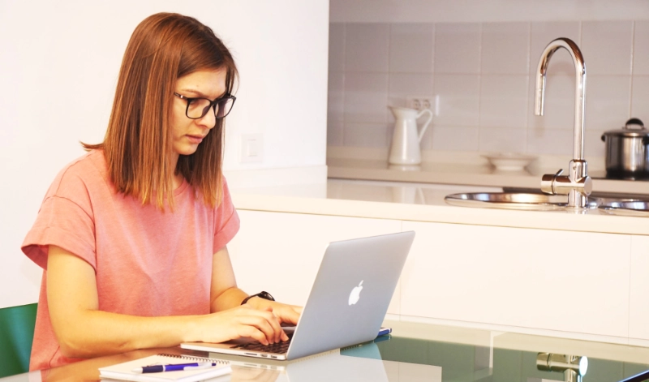

# My first 112 hours of Remote work

{ .blogcover }

I started a new job around seven months ago with everything that comes with it.

New people, new habits, new executives and the most exciting part of all, my new title is User Experience Designer. I have been longing to get to it and I finally did.

There were a couple of things I had to get used to at my new position. The first and very important, integrate in a development team that has not had a designer for a very long time. I had to learn a lot about the project we are developing, who is doing what, who to talk to when I have a specific question, etc…

<!-- more -->

When people go to work in an office, there usually is no habit of documenting everything, every decision that was taken, reasons why, etc … and this place was no different. There was some documentation, but it was definitely not enough for me to understand it all.

I decided to stay patient (everybody that knows me, knows that this is the hardest part), but eventually, I got used to the process, morning stand ups, retrospectives, sprint planifications and everything else. Although, this was all new for me, from the experience I previously had, I felt like in my own waters there.

A couple of months later when I felt that I knew my way around and got a little more confident in my new position, I made the first request for Work From Home in the company’s calendar. I got almost an immediate response: “OK”. I said: “Wait a minute, is that all that it takes? I will definitely do it again.” After that he day came and I took my laptop, connected my home screen to it and started working from my home desk.

> Well, I don’t really remember what I did that day, but I remember the feeling of a dream just getting a big fat green checkmark.

You see, around four years ago, I was working on a project of developing a base theme for twelve different websites, using a local server for development and another one for production. The themes had the same base structure, but had some differences, so all of this had to be managed, developed and maintained and I had the best document ever to guide me how to do it. Everything that was changed manually and to watch for when updates were coming and so on. I got a little carried away here, but my point is, around this time, I started thinking that something basic is wrong there and after a little while I came to the conclusion that what I was actually doing was crossing half an island (60km back and forth) to go to the office and connect to a server, maintain myself busy and then get on a car again, and head home. Around that time, I had a little boy, he was a little over 2 years old, and it was very interesting seeing him discovering simple things. So, I made a simple count and the two hours I am spending on the road everyday are taking ten hours per week from me seeing this little boy growing.

Well, nothing is that simple, but the fact is, there is no sense of me being present in an office, if I am going to be much happier staying a couple of days a week and work from home. It saves energy in the morning, saves gasoline and, frankly, two hours of my day. It made me look for opportunities, but again around 2015, there were some remote companies, but nothing like what we have nowadays. There a couple of sites where you can go to, register and start experiencing on your own, see if you actually like it. There was nothing there when I started thinking about it. There were some lucky people posting how cool it is to work remotely and don’t depend on a physical environment. I don’t remember exactly when, but sure enough, Automattic closed their office and it got a lot of press around the world, I remember thinking to myself that day: “just how lucky these people are!”. I went on doing my job, crossing the island and waiting for something new and interesting to appear. Well, it’s been some time, but it is actually happening now.

Remote work is way more attractive for me and I hope more companies will realise that and help their people stay happier and more productive, enjoying the work and their lives.

I am very grateful for my current position, where I can ask for a remote day and just get it. It comes very helpful when my son has a cold and need to stay around to give him medicine. Although, he is not so little now, I still enjoy his presence a lot and I am very happy to have him around while I am actually at work, resolving my everyday jira tasks.
