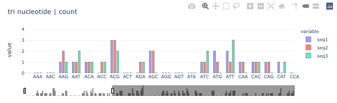
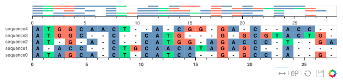

<center>
{ width="450" }
{ width="450" }
</center>

Bioinformatics is a fascinating field that allows us to explore the intricate workings of living organisms and make groundbreaking discoveries. By combining biology, computer science, and statistics, bioinformatics offers a unique perspective on the natural world and provides us with tools to solve complex problems. Naturally, it is a field that has me interested

### :material-label-variant-outline: **Biopython | Bioinformatics Basics**

!!! tip "Biopython | Bioinformatics Basics"

     [](https://www.kaggle.com/code/shtrausslearning/biopython-bioinformatics-basics)

     In this project I look at exploring the basics of the python module **[biopython](https://biopython.org)**. We look at how to define biological sequences using `Seq`, which allows us to work with basic **DNA** and **protein** sequence information. The library also allows us to work with more advanced sequence information using `SeqRecord` which allows us to include **annotations** and **features** found in the sequence. The notebook is more of an introduction to into various bioinformatics operations that can be done via **biopython**

     ```
     locus tag: ['YP_pPCP01'], database ref: ['GeneID:2767718'], strand: 1, location: [86:1109](+)
     locus tag: ['YP_pPCP02'], database ref: ['GeneID:2767716'], strand: 1, location: [1105:1888](+)
     locus tag: ['YP_pPCP03'], database ref: ['GeneID:2767717'], strand: 1, location: [2924:3119](+)
     locus tag: ['YP_pPCP04'], database ref: ['GeneID:2767720'], strand: 1, location: [3485:3857](+)
     locus tag: ['YP_pPCP05'], database ref: ['GeneID:2767712'], strand: 1, location: [4342:4780](+)
     locus tag: ['YP_pPCP06'], database ref: ['GeneID:2767721'], strand: -1, location: [4814:5888](-)
     locus tag: ['YP_pPCP07'], database ref: ['GeneID:2767719'], strand: 1, location: [6004:6421](+)
     locus tag: ['YP_pPCP08'], database ref: ['GeneID:2767715'], strand: 1, location: [6663:7602](+)
     locus tag: ['YP_pPCP09'], database ref: ['GeneID:2767713'], strand: -1, location: [7788:8088](-)
     locus tag: ['YP_pPCP10'], database ref: ['GeneID:2767714'], strand: -1, location: [8087:8360](-)
     ```

### :material-label-variant-outline: **Bioconductor | Bioinformatics Basics**

!!! tip "Bioconductor | Bioinformatics Basics"

     [](https://www.kaggle.com/code/shtrausslearning/bioconductor-bioinformatics-basics)

     In this project we look at exploring the basics of bioinformatics using **[bioconductor](https://www.bioconductor.org)** `Biostrings`, which allows us to work with **biological sequences** and `msa`, which can be used for **sequence alignment**

     ```
     AAStringSet object of length 10:
          width seq                                              names               
      [1]   340 MVTFETVMEIKILHKQGMSSRAI...NFDKHPLHHPLSIYDSFCRGVA gi|45478712|ref|N...
      [2]   260 MMMELQHQRLMALAGQLQLESLI...KGESYRLRQKRKAGVIAEANPE gi|45478713|ref|N...
      [3]    64 MNKQQQTALNMARFIRSQSLILL...ELAEELQNSIQARFEAESETGT gi|45478714|ref|N...
      [4]   123 MSKKRRPQKRPRRRRFFHRLRPP...TNPPFSPTTAPYPVTIVLSPTR gi|45478715|ref|N...
      [5]   145 MGGGMISKLFCLALIFLSSSGLA...SGNFIVVKEIKKSIPGCTVYYH gi|45478716|ref|N...
      [6]   357 MSDTMVVNGSGGVPAFLFSGSTL...MSDRRKREGALVQKDIDSGLLK gi|45478717|ref|N...
      [7]   138 MKFHFCDLNHSYKNQEGKIRSRK...YLSGKKPEGVEPREGQEREDLP gi|45478718|ref|N...
      [8]   312 MKKSSIVATIITILSGSANAASS...GGDAAGISNKNYTVTAGLQYRF gi|45478719|ref|N...
      [9]    99 MRTLDEVIASRSPESQTRIKEMA...AMGGKLSLDVELPTGRRVAFHV gi|45478720|ref|N...
     [10]    90 MADLKKLQVYGPELPRPYADTVK...YEKLVRIAEDEFTAHLNTLESK gi|45478721|ref|N...
     ```

### :material-label-variant-outline: **Biological Sequence Operations**

!!! tip "Biological Sequence Operations"

     [](https://www.kaggle.com/code/shtrausslearning/biological-sequence-operations)

     In this project we look to create python classes which allow us to work with biological sequences. Similar to the classes `Seq` & `SeqRecord` in **[biopython](https://biopython.org)**  The implemented classes form the basis of future library additions,  however with various additional operation options. The library allows to read and work with both **FASTA** and **genbank** formats. Do some basic exploratory data analysis of sequences & annotate different parts of the sequence. The created classes have been implemented in **[biopylib](https://github.com/shtrausslearning/biopylib)** library

     


### :material-label-variant-outline: **Biological Sequence Alignment**

!!! tip "Biological Sequence Alignment"

     [](https://www.kaggle.com/code/shtrausslearning/biological-sequence-alignment)

     **Biological sequence alignment** is an important problem in bioinformatics for a number of reasons, for example for understanding genetic variation: By aligning biological sequences, such as DNA or protein sequences, researchers can identify similarities and differences between different organisms or within the same organism. This helps in understanding genetic variation, evolution, and relationships between species. In this project, we create a biological sequence alignment compatible class for **pairwise** & **multiple** sequence (**global** and **local**) sequence alignment, in similar fashion to how we created the biological sequence operation related classes in **[biological-sequence-operations](https://www.kaggle.com/code/shtrausslearning/biological-sequence-operations)**. The created classes have been implemented in **[biopylib](https://github.com/shtrausslearning/biopylib)** library

     

### :material-label-variant-outline: **Gene Classification**

!!! tip "Gene Classification"

      [](https://shtrausslearning.github.io/blog/2023/10/21/gene-classification.html)

     In this project, we look at how to work with **biological sequence** data, by venturing into a machine learning classification problem in which we will be classifying between seven different genes groups common to three different species (human,chimpanzee & dog) such as **Ion Channels** & **Transcription Factors**. Each DNA segment has already been labelled for us, so all we need to do is data preprocessing, similar to how we would do it in a NLP problem, however we'll be utilising a specific to bioinformatics encoding process which works well for DNA based data. Utilising classical machine learning methods to train our model, we'll train our model on **human** data and see how well our model generalises on **dog** and **chimpanzee** data as well.

---

Any questions or comments about the above post can be addressed on the :fontawesome-brands-telegram:{ .telegram } **[mldsai-info channel](https://t.me/mldsai_info)** or to me directly :fontawesome-brands-telegram:{ .telegram } **[shtrauss2](https://t.me/shtrauss2)**, on :fontawesome-brands-github:{ .github } **[shtrausslearning](https://github.com/shtrausslearning)** or :fontawesome-brands-kaggle:{ .kaggle} **[shtrausslearning](https://kaggle.com/shtrausslearning)**