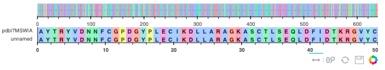

<center>
{ width="450" }
{ width="450" }
</center>

Bioinformatics is a fascinating field that allows us to explore the intricate workings of living organisms and make groundbreaking discoveries. By combining biology, computer science, and statistics, bioinformatics offers a unique perspective on the natural world and provides us with tools to solve complex problems. Naturally, it is a field that has me interested :)

Here you will find a collection of some of the bioinformatics projects I've worked on, if you have any questions, please contact me  <sub><a href="https://t.me/mldsai_info"></a></sub> 

### :material-label-variant-outline: **Biopython | Bioinformatics Basics**

In this project I look at exploring the basics of the python module **[biopython](https://biopython.org)**. We look at how to define biological sequences using `Seq`, which allows us to work with basic **DNA** and **protein** sequence information. The library also allows us to work with more advanced sequence information using `SeqRecord` which allows us to include **annotations** and **features** found in the sequence.

```
locus tag: ['YP_pPCP01'], database ref: ['GeneID:2767718'], strand: 1, location: [86:1109](+)
locus tag: ['YP_pPCP02'], database ref: ['GeneID:2767716'], strand: 1, location: [1105:1888](+)
locus tag: ['YP_pPCP03'], database ref: ['GeneID:2767717'], strand: 1, location: [2924:3119](+)
locus tag: ['YP_pPCP04'], database ref: ['GeneID:2767720'], strand: 1, location: [3485:3857](+)
locus tag: ['YP_pPCP05'], database ref: ['GeneID:2767712'], strand: 1, location: [4342:4780](+)
locus tag: ['YP_pPCP06'], database ref: ['GeneID:2767721'], strand: -1, location: [4814:5888](-)
locus tag: ['YP_pPCP07'], database ref: ['GeneID:2767719'], strand: 1, location: [6004:6421](+)
locus tag: ['YP_pPCP08'], database ref: ['GeneID:2767715'], strand: 1, location: [6663:7602](+)
locus tag: ['YP_pPCP09'], database ref: ['GeneID:2767713'], strand: -1, location: [7788:8088](-)
locus tag: ['YP_pPCP10'], database ref: ['GeneID:2767714'], strand: -1, location: [8087:8360](-)
```

### :material-label-variant-outline: **Biopython | Bioconductor Basics**

In this project we look at exploring the basics of bioinformatics using **[bioconductor](https://www.bioconductor.org)** `Biostrings` and ``

```
AAStringSet object of length 10:
     width seq                                              names               
 [1]   340 MVTFETVMEIKILHKQGMSSRAI...NFDKHPLHHPLSIYDSFCRGVA gi|45478712|ref|N...
 [2]   260 MMMELQHQRLMALAGQLQLESLI...KGESYRLRQKRKAGVIAEANPE gi|45478713|ref|N...
 [3]    64 MNKQQQTALNMARFIRSQSLILL...ELAEELQNSIQARFEAESETGT gi|45478714|ref|N...
 [4]   123 MSKKRRPQKRPRRRRFFHRLRPP...TNPPFSPTTAPYPVTIVLSPTR gi|45478715|ref|N...
 [5]   145 MGGGMISKLFCLALIFLSSSGLA...SGNFIVVKEIKKSIPGCTVYYH gi|45478716|ref|N...
 [6]   357 MSDTMVVNGSGGVPAFLFSGSTL...MSDRRKREGALVQKDIDSGLLK gi|45478717|ref|N...
 [7]   138 MKFHFCDLNHSYKNQEGKIRSRK...YLSGKKPEGVEPREGQEREDLP gi|45478718|ref|N...
 [8]   312 MKKSSIVATIITILSGSANAASS...GGDAAGISNKNYTVTAGLQYRF gi|45478719|ref|N...
 [9]    99 MRTLDEVIASRSPESQTRIKEMA...AMGGKLSLDVELPTGRRVAFHV gi|45478720|ref|N...
[10]    90 MADLKKLQVYGPELPRPYADTVK...YEKLVRIAEDEFTAHLNTLESK gi|45478721|ref|N...
```

### :material-label-variant-outline: **Biological Sequence Operations**

In this project we look to create python classes which allow us to work with biological sequences. Similar to the classes `Seq` & `SeqRecord` in **[biopython](https://biopython.org)**, however with various additional operation options.




### :material-label-variant-outline: **Biopython | Bioconductor Basics**

