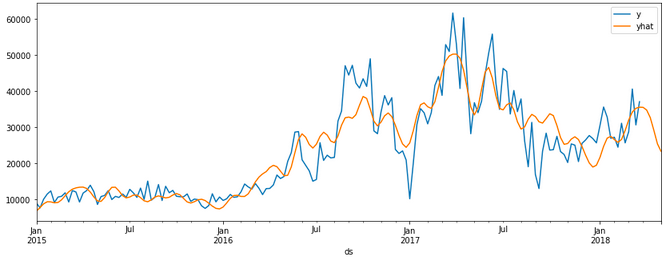
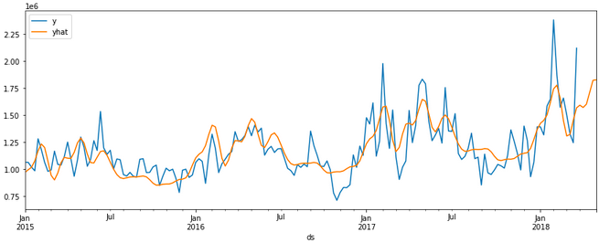

# Utilising Prophet with PySpark

In this notebook, we look at how to use a popular machine learning library `prophet` with `pyspark`. `pyspark` itself does not contain such an additive regression model, however we can utilise user defined functions (`UDF`), which allows us to use different functionality that is not available in `pyspark`.


<!-- more -->


## <b>Background</b>

### <b><span style='color:#be61c7;text-align:center'>❯❯ </span>Prophet</b> 

`Prophet` is a time series forecasting model. It is based on an additive regression model that takes into account trends, seasonality, and holidays. `Prophet` also allows for the inclusion of external regressors and can handle missing data and outliers. It uses Bayesian inference to estimate the parameters of the model and provides uncertainty intervals for the forecasts. 

### <b><span style='color:#be61c7;text-align:center'>❯❯ </span>UDF</b> 

Pandas `UDFs` (User-Defined Functions) allow you to apply a Python function that operates on pandas data frames to Spark data frames. This allows you to leverage the power of pandas, which is a popular data manipulation library in Python, in your PySpark applications. Pandas `UDFs` can take one or more input columns and return one or more output columns, which can be of any data type supported by Spark. With Pandas `UDFs`, you can perform complex data manipulations that are not possible using built-in Spark SQL functions.

### <b><span style='color:#be61c7;text-align:center'>❯❯ </span>Avocado Price Prediction</b> 

Avocado price prediction is the process of using machine learning algorithms to forecast the future prices of avocados based on historical data and other relevant factors such as weather patterns, consumer demand, and supply chain disruptions. This can help stakeholders in the avocado industry make informed decisions about when and where to sell their avocados, as well as how much to charge for them. Avocado price prediction can also provide insights into the factors that affect avocado sales and help optimize the industry's efficiency and profitability.

### <b><span style='color:#be61c7;text-align:center'>❯❯ </span>Objective</b> 

Having done some posts on `pyspark`, it seems like a very intuitive library to use

## <b>The Dataset</b>

It is a well known fact that Millenials LOVE Avocado Toast. It's also a well known fact that all Millenials live in their parents basements.Clearly, they aren't buying home because they are buying too much Avocado Toast! But maybe there's hope… if a Millenial could find a city with cheap avocados, they could live out the Millenial American Dream.

The dataset can be found on **[Kaggle](https://www.kaggle.com/datasets/neuromusic/avocado-prices)** & its original source found **[here](https://hassavocadoboard.com/)**

### <b><span style='color:#be61c7;text-align:center'>❯❯ </span>Loading data</b> 

To load the data, we start a spark session on local

```python
! pip install pyspark

from pyspark.sql import SparkSession
import pyspark.sql.functions as f
import pandas as pd

# Start spark session
spark = SparkSession.builder\
                    .master("local")\
                    .appName("prophet")\
                    .getOrCreate()
```

To read the data, we'll use the `session.read.csv`, together with `inferSchema` method and look at the table schematics using `printSchema()` method to automatically assign types to table columns

```python
# read csv
sales = spark.read.csv('/kaggle/input/avocado-prices/avocado.csv',header=True,inferSchema=True)
sales.printSchema()
```

```
root
 |-- _c0: integer (nullable = true)
 |-- Date: date (nullable = true)
 |-- AveragePrice: double (nullable = true)
 |-- Total Volume: double (nullable = true)
 |-- 4046: double (nullable = true)
 |-- 4225: double (nullable = true)
 |-- 4770: double (nullable = true)
 |-- Total Bags: double (nullable = true)
 |-- Small Bags: double (nullable = true)
 |-- Large Bags: double (nullable = true)
 |-- XLarge Bags: double (nullable = true)
 |-- type: string (nullable = true)
 |-- year: integer (nullable = true)
 |-- region: string (nullable = true)
```

## <b>Exploring Data</b>

Having loaded our data, we sure can do some data exploration, first lets take a peek at our dataset, we'll use `select`,`orderBy` & `show` methods

```python
sales.select('Date','type','Total Volume','region')\
     .orderBy('Date')\
     .show(5)
```
```
+----------+------------+------------+----------------+
|      Date|        type|Total Volume|          region|
+----------+------------+------------+----------------+
|2015-01-04|conventional|   116253.44|BuffaloRochester|
|2015-01-04|conventional|   158638.04|        Columbus|
|2015-01-04|conventional|   5777334.9|      California|
|2015-01-04|conventional|   435021.49|         Atlanta|
|2015-01-04|conventional|   166006.29|       Charlotte|
+----------+------------+------------+----------------+
```

The `Date` unique values can be called and checked, we have weekly data for different regions

```python
sales.select(col('Date')).distinct().orderBy('Date').show(5)
```

```
+----------+
|      Date|
+----------+
|2015-01-04|
|2015-01-11|
|2015-01-18|
|2015-01-25|
|2015-02-01|
+----------+
only showing top 5 rows
```

We will be using `Total Volume` as our target variable we'll be predicting. We also can note that we have different types `type` of avocados (organic and conventional)

```python
sales.select(col('type')).distinct().show()
```

```
+------------+
|        type|
+------------+
|     organic|
|conventional|
+------------+
```

So what we'll be doing is creating a model to predict the sales for both of these types, which is something we'll need to incorporate into our `UDF`

We can also check the `region` limits for `Total Volume`, we can do this by using `agg` method with the `groupby` dataframe type (`pyspark.sql.group.GroupedData`):

```python
# min and maximum of sale volume
sales.groupby('region').agg(f.max('Total Volume')).show()  # get max of column
sales.groupby('region').agg(f.min('Total Volume')).show()  # get min of column
```

```
+------------------+-----------------+
|            region|max(Total Volume)|
+------------------+-----------------+
|     PhoenixTucson|       2200550.27|
|       GrandRapids|        408921.57|
|     SouthCarolina|        706098.15|
|           TotalUS|    6.250564652E7|
|  WestTexNewMexico|       1637554.42|
|        Louisville|        169828.77|
|      Philadelphia|         819224.3|
|        Sacramento|         862337.1|
|     DallasFtWorth|       1885401.44|
|      Indianapolis|        335442.41|
|          LasVegas|        680234.93|
|         Nashville|        391780.25|
|        GreatLakes|       7094764.73|
|           Detroit|        880540.45|
|            Albany|        216738.47|
|          Portland|       1189151.17|
|  CincinnatiDayton|        538518.77|
|          SanDiego|        917660.79|
|             Boise|        136377.55|
|HarrisburgScranton|        395673.05|
+------------------+-----------------+
only showing top 20 rows

+------------------+-----------------+
|            region|min(Total Volume)|
+------------------+-----------------+
|     PhoenixTucson|          4881.79|
|       GrandRapids|           683.76|
|     SouthCarolina|           2304.3|
|           TotalUS|        501814.87|
|  WestTexNewMexico|          4582.72|
|        Louisville|           862.59|
|      Philadelphia|           1699.0|
|        Sacramento|          3562.52|
|     DallasFtWorth|          6568.67|
|      Indianapolis|           964.25|
|          LasVegas|           2988.4|
|         Nashville|          2892.29|
|        GreatLakes|         56569.37|
|           Detroit|          4973.92|
|            Albany|            774.2|
|          Portland|          7136.88|
|  CincinnatiDayton|          6349.77|
|          SanDiego|          5564.87|
|             Boise|           562.64|
|HarrisburgScranton|           971.81|
+------------------+-----------------+
only showing top 20 rows
```

We can note that we have data for not only the different `regions`, but also for the entire country `TotalUS`. Also interesting to note is that the difference in `max` and `min` values is quite high.

Let's find the locations (`region`) with the highest `total volumes` 

```python
from pyspark.sql.functions import desc,col

by_volume = sales.orderBy(desc("Total Volume"))\
                 .where(col('region') != 'TotalUS')
by_volume.show(5)
```

```
+---+----------+------------+-------------+----------+----------+---------+----------+----------+----------+-----------+------------+----+----------+
|_c0|      Date|AveragePrice| Total Volume|      4046|      4225|     4770|Total Bags|Small Bags|Large Bags|XLarge Bags|        type|year|    region|
+---+----------+------------+-------------+----------+----------+---------+----------+----------+----------+-----------+------------+----+----------+
| 47|2017-02-05|        0.66|1.127474911E7|4377537.67|2558039.85|193764.89| 4145406.7|2508731.79|1627453.06|    9221.85|conventional|2017|      West|
| 47|2017-02-05|        0.67|1.121359629E7|3986429.59|3550403.07|214137.93| 3462625.7|3403581.49|   7838.83|   51205.38|conventional|2017|California|
|  7|2018-02-04|         0.8|1.089467777E7|4473811.63|4097591.67|146357.78|2176916.69|2072477.62|  34196.27|    70242.8|conventional|2018|California|
|  7|2018-02-04|        0.83|1.056505641E7|3121272.58|3294335.87|142553.21|4006894.75|1151399.33|2838239.39|   17256.03|conventional|2018|      West|
| 46|2016-02-07|         0.7|1.036169817E7|2930343.28|3950852.38| 424389.6|3056112.91|2693843.02| 344774.59|    17495.3|conventional|2016|California|
+---+----------+------------+-------------+----------+----------+---------+----------+----------+----------+-----------+------------+----+----------+
only showing top 5 rows
```

We can note that `California` & `West` regions have had the highest values for `Total Volume` on 2017-02-05

Its also interest to note the difference in `Total Volume` for both types of avocado, so lets check that, lets just check the difference in `max` values

```python
by_volume.groupby('type').agg(f.max('Total Volume')).show()
```

```
+------------+-----------------+
|        type|max(Total Volume)|
+------------+-----------------+
|     organic|        793464.77|
|conventional|    1.127474911E7|
+------------+-----------------+
```

So we can note that tehre is a significant diffence in `Total Volume`, let's also check when this actually occured:

```python
by_volume.filter(f.col('Total Volume') == 1.127474911E7).show()
by_volume.filter(f.col('Total Volume') == 793464.77).show()

```

```
+---+----------+------------+-------------+----------+----------+---------+----------+----------+----------+-----------+------------+----+------+
|_c0|      Date|AveragePrice| Total Volume|      4046|      4225|     4770|Total Bags|Small Bags|Large Bags|XLarge Bags|        type|year|region|
+---+----------+------------+-------------+----------+----------+---------+----------+----------+----------+-----------+------------+----+------+
| 47|2017-02-05|        0.66|1.127474911E7|4377537.67|2558039.85|193764.89| 4145406.7|2508731.79|1627453.06|    9221.85|conventional|2017|  West|
+---+----------+------------+-------------+----------+----------+---------+----------+----------+----------+-----------+------------+----+------+
```

```
+---+----------+------------+------------+--------+---------+-----+----------+----------+----------+-----------+-------+----+---------+
|_c0|      Date|AveragePrice|Total Volume|    4046|     4225| 4770|Total Bags|Small Bags|Large Bags|XLarge Bags|   type|year|   region|
+---+----------+------------+------------+--------+---------+-----+----------+----------+----------+-----------+-------+----+---------+
|  5|2018-02-18|        1.39|   793464.77|150620.0|425616.86|874.9| 216353.01| 197949.51|   18403.5|        0.0|organic|2018|Northeast|
+---+----------+------------+------------+--------+---------+-----+----------+----------+----------+-----------+-------+----+---------+
```

Let's also check how many regions there actually are:

```python
sales.select('region').distinct().count()
```

```
54
```

Which is interesting as there are only 50 states in the US, so perhaps `west` is a summation for all states on the west coast, lets check if there is also an east coast

```python
sales.groupBy('region').count().show(100)
```

```
+-------------------+-----+
|             region|count|
+-------------------+-----+
|      PhoenixTucson|  338|
|        GrandRapids|  338|
|      SouthCarolina|  338|
|            TotalUS|  338|
|   WestTexNewMexico|  335|
|         Louisville|  338|
|       Philadelphia|  338|
|         Sacramento|  338|
|      DallasFtWorth|  338|
|       Indianapolis|  338|
|           LasVegas|  338|
|          Nashville|  338|
|         GreatLakes|  338|
|            Detroit|  338|
|             Albany|  338|
|           Portland|  338|
|   CincinnatiDayton|  338|
|           SanDiego|  338|
|              Boise|  338|
| HarrisburgScranton|  338|
|            StLouis|  338|
|   NewOrleansMobile|  338|
|           Columbus|  338|
|         Pittsburgh|  338|
|  MiamiFtLauderdale|  338|
|       SouthCentral|  338|
|            Chicago|  338|
|   BuffaloRochester|  338|
|              Tampa|  338|
|          Southeast|  338|
|             Plains|  338|
|            Atlanta|  338|
|BaltimoreWashington|  338|
|            Seattle|  338|
|       SanFrancisco|  338|
|HartfordSpringfield|  338|
|            Spokane|  338|
| NorthernNewEngland|  338|
|            Roanoke|  338|
|         LosAngeles|  338|
|            Houston|  338|
|       Jacksonville|  338|
|  RaleighGreensboro|  338|
|               West|  338|
|            NewYork|  338|
|           Syracuse|  338|
|         California|  338|
|            Orlando|  338|
|          Charlotte|  338|
|           Midsouth|  338|
|             Denver|  338|
|             Boston|  338|
|          Northeast|  338|
|    RichmondNorfolk|  338|
+-------------------+-----+
```

So as the name suggests, its a grouping that doesn't actually correspond to states, but rather are some general zones, mostly city specific regions, however we also have `Northeast`, `West`,`Midsouth` & `SouthCentral` regions.

Let's check how many values we have for each `region`

```python
# value counts
sales.groupBy('region').count().orderBy('count', ascending=True).show()
```

```
+------------------+-----+
|            region|count|
+------------------+-----+
|  WestTexNewMexico|  335|
|     PhoenixTucson|  338|
|       GrandRapids|  338|
|     SouthCarolina|  338|
|           TotalUS|  338|
|        Louisville|  338|
|      Philadelphia|  338|
|        Sacramento|  338|
|     DallasFtWorth|  338|
|      Indianapolis|  338|
|          LasVegas|  338|
|         Nashville|  338|
|        GreatLakes|  338|
|           Detroit|  338|
|            Albany|  338|
|          Portland|  338|
|  CincinnatiDayton|  338|
|          SanDiego|  338|
|             Boise|  338|
|HarrisburgScranton|  338|
+------------------+-----+
only showing top 20 rows
```

Looks like we mostly have 338 historical data points for each region, except for `WestTexNewMexico`. Let's check how the `Houston` region has been performing.

```python
# select only a subset of data
sales.filter(f.col('region') == 'Houston').show()
``` 

```
+---+----------+------------+------------+---------+---------+---------+----------+----------+----------+-----------+------------+----+-------+
|_c0|      Date|AveragePrice|Total Volume|     4046|     4225|     4770|Total Bags|Small Bags|Large Bags|XLarge Bags|        type|year| region|
+---+----------+------------+------------+---------+---------+---------+----------+----------+----------+-----------+------------+----+-------+
|  0|2015-12-27|        0.78|   944506.54|389773.22|288003.62|126150.81| 140578.89|  73711.94|  36493.62|   30373.33|conventional|2015|Houston|
|  1|2015-12-20|        0.75|   922355.67|382444.22|278067.11|127372.19| 134472.15|  72198.16|  31520.66|   30753.33|conventional|2015|Houston|
|  2|2015-12-13|        0.73|   998752.95| 412187.8|386865.21| 81450.04|  118249.9|  69011.01|  48622.22|     616.67|conventional|2015|Houston|
|  3|2015-12-06|        0.74|   989676.85|368528.91| 490805.0|  7041.19| 123301.75|  61020.31|  62281.44|        0.0|conventional|2015|Houston|
|  4|2015-11-29|        0.79|   783225.98|391616.95|289533.68|  4334.89|  97740.46|  67880.28|  29860.18|        0.0|conventional|2015|Houston|
|  5|2015-11-22|        0.73|   913002.96|402191.51|391110.76|  6924.43| 112776.26|  70785.25|  41991.01|        0.0|conventional|2015|Houston|
|  6|2015-11-15|        0.72|   998801.78|530464.33|332541.11|   4611.0| 131185.34|  62414.66|  68770.68|        0.0|conventional|2015|Houston|
|  7|2015-11-08|        0.75|   983909.85|427828.16|411365.91| 20404.29| 124311.49|  56573.89|   67737.6|        0.0|conventional|2015|Houston|
|  8|2015-11-01|        0.77|  1007805.74| 395945.0|365506.02|111263.81| 135090.91|  56198.27|  78892.64|        0.0|conventional|2015|Houston|
|  9|2015-10-25|        0.88|   933623.58|437329.85|313129.29| 81274.85| 101889.59|  57577.21|   44260.6|      51.78|conventional|2015|Houston|
| 10|2015-10-18|         0.9|   847813.12| 436132.2|242842.91| 80895.03|  87942.98|  59835.83|  28107.15|        0.0|conventional|2015|Houston|
| 11|2015-10-11|        0.79|  1036269.51|410949.18|385629.69|126765.96| 112924.68|  62638.13|  50286.55|        0.0|conventional|2015|Houston|
| 12|2015-10-04|        0.82|  1019283.99|411727.49|435388.05| 43558.15|  128610.3|   59751.0|   68859.3|        0.0|conventional|2015|Houston|
| 13|2015-09-27|        0.86|   968988.09|383218.43| 458982.9|  16780.9| 110005.86|  61098.51|  48907.35|        0.0|conventional|2015|Houston|
| 14|2015-09-20|        0.83|   967228.05|417701.88|445473.03|   6959.5|  97093.64|  55198.32|  41895.32|        0.0|conventional|2015|Houston|
| 15|2015-09-13|        0.89|  1095790.27|421533.83|540499.39|  5559.36| 128197.69|  55636.91|  72560.78|        0.0|conventional|2015|Houston|
| 16|2015-09-06|        0.89|  1090493.39|460377.08|495487.54|   6230.7| 128398.07|  63724.96|  64673.11|        0.0|conventional|2015|Houston|
| 17|2015-08-30|        0.88|   926124.93| 559048.7|260761.33|  4514.17| 101800.73|   72264.6|  29536.13|        0.0|conventional|2015|Houston|
| 18|2015-08-23|        0.89|   933166.17|509472.17| 321616.5|  4323.68|  97753.82|  62733.47|  35020.35|        0.0|conventional|2015|Houston|
| 19|2015-08-16|        0.92|   968899.09|565965.79|297434.65|  3479.25|  102019.4|  65764.02|  36255.38|        0.0|conventional|2015|Houston|
+---+----------+------------+------------+---------+---------+---------+----------+----------+----------+-----------+------------+----+-------+
```

## <b>Preparing data for modeling</b>

Since we don't have any missing data points for this region, let's use it for our model example, let's define a subset `houston_df`

```python
# select houson 
houston_df = sales.filter(f.col('region')=='Houston')
```

Let's select only the relevant features

```python
houston_df = houston_df.groupBy(['Region','type','Date']).agg(f.sum('Total Volume').alias('y'))
houston_df.show(5)
```

```
+-------+------------+----------+----------+
| Region|        type|      Date|         y|
+-------+------------+----------+----------+
|Houston|conventional|2016-03-06|1091432.18|
|Houston|conventional|2017-02-05|1977923.65|
|Houston|conventional|2018-02-04|2381742.59|
|Houston|     organic|2015-05-24|  12358.51|
|Houston|     organic|2017-07-23|  40100.89|
+-------+------------+----------+----------+
only showing top 5 rows
```

```
# change column datatype
houston_df = houston_df.withColumn('y',f.round('y',2))
houston_df = houston_df.withColumn('ds',f.to_date('Date'))
houston_df_final = houston_df.select(['Region','type','ds','y'])
houston_df_final.show(4)
```
```
+-------+------------+----------+----------+
| Region|        type|        ds|         y|
+-------+------------+----------+----------+
|Houston|conventional|2016-03-06|1091432.18|
|Houston|conventional|2017-02-05|1977923.65|
|Houston|conventional|2018-02-04|2381742.59|
|Houston|     organic|2015-05-24|  12358.51|
+-------+------------+----------+----------+
only showing top 4 rows
```

### <b><span style='color:#be61c7;text-align:center'>❯❯ </span>Defining Scheme</b> 

Let's prepare the scheme for the outputs of our `UDF`

```python
import pyspark.sql.types  as ty

schema = ty.StructType([
                     ty.StructField('Region', ty.StringType()),     # our main features
                     ty.StructField('type', ty. StringType()),      # 
                     ty.StructField('ds', ty.TimestampType()),      # 
                     ty.StructField('y', ty.FloatType()),           #
                     ty.StructField('yhat', ty.DoubleType()),
                     ty.StructField('yhat_upper', ty.DoubleType()),
                     ty.StructField('yhat_lower', ty.DoubleType()),
                     ]) 
```

### <b><span style='color:#be61c7;text-align:center'>❯❯ </span>UDF</b> 

```python
from prophet import Prophet
from pyspark.sql.functions import pandas_udf, PandasUDFType

@pandas_udf(schema, PandasUDFType.GROUPED_MAP)
def apply_model(store_pd):
    
    store_pd.show()
    
  # instantiate the model and set parameters
    model = Prophet(
      interval_width=0.1,
      growth='linear',
      daily_seasonality=False,
      weekly_seasonality=True,
      yearly_seasonality=True,
      seasonality_mode='multiplicative'
    )

    # fit the model to historical data
    model.fit(store_pd)

    # Create a data frame that lists 90 dates starting from Jan 1 2018
    future = model.make_future_dataframe(
      periods=6,
      freq='w',
      include_history=True)

    # Out of sample prediction
    future = model.predict(future)

    # Create a data frame that contains store, item, y, and yhat
    f_pd = future[['ds', 'yhat', 'yhat_upper', 'yhat_lower']].copy()
    st_pd = store_pd[['ds', 'Region','y']].copy()
    f_pd.loc[:,'ds'] = pd.to_datetime(f_pd['ds'])
    st_pd.loc[:,'ds'] = pd.to_datetime(st_pd['ds'])
    result_pd = f_pd.join(st_pd.set_index('ds'), on='ds', how='left')

    result_pd.loc[:,'Region'] = store_pd['Region'].iloc[0]
    result_pd.loc[:,'type'] = store_pd['type'].iloc[0]

    return result_pd[['Region','type', 'ds', 'y', 'yhat',
                    'yhat_upper', 'yhat_lower']]
```

### <b><span style='color:#be61c7;text-align:center'>❯❯ </span>Modeling</b> 

```python
results = houston_df_final.groupby(['Region','type']).apply(apply_model)
results.show()
```

```
+-------+------------+-------------------+----------+------------------+------------------+------------------+
| Region|        type|                 ds|         y|              yhat|        yhat_upper|        yhat_lower|
+-------+------------+-------------------+----------+------------------+------------------+------------------+
|Houston|conventional|2015-01-04 00:00:00| 1062990.6| 967605.2625150415| 987966.9732773455| 952305.7433327858|
|Houston|conventional|2015-01-11 00:00:00| 1062071.6| 993363.6182296885| 995012.7884165086| 964197.9475039787|
|Houston|conventional|2015-01-18 00:00:00| 1017854.2| 1015966.900950469|1025256.0703683371| 986191.4013155274|
|Houston|conventional|2015-01-25 00:00:00| 983910.94| 1074995.886186154|1101222.7673731335| 1062121.771442082|
|Houston|conventional|2015-02-01 00:00:00| 1280364.0|1167900.5325763628| 1188681.132535528|  1145180.90581613|
|Houston|conventional|2015-02-08 00:00:00| 1180723.0|1232065.4408061658|1239550.0307806057|1198043.2132719166|
|Houston|conventional|2015-02-15 00:00:00| 1062387.8|1199450.2180199602|1223060.5212891083|1176312.1838248386|
|Houston|conventional|2015-02-22 00:00:00| 978807.75|1073369.2242733259|1080957.9300315154|1040938.8331911729|
|Houston|conventional|2015-03-01 00:00:00| 991328.44| 941094.8884144317| 959840.4691880762| 919962.6290055071|
|Houston|conventional|2015-03-08 00:00:00| 1166055.9| 898815.9800298921| 918134.9334112646| 880629.0129257607|
|Houston|conventional|2015-03-15 00:00:00|1043172.75| 962628.9504384592| 984672.2940272797|  941114.615399528|
|Houston|conventional|2015-03-22 00:00:00|1036663.75|1059573.4445409325|1079371.1160897035|1042058.3879815078|
|Houston|conventional|2015-03-29 00:00:00| 1116225.2|1108114.6730682629| 1128250.035336084| 1084141.715137374|
|Houston|conventional|2015-04-05 00:00:00| 1249645.2|1100408.8290516583| 1116313.220982885| 1080221.717887945|
|Houston|conventional|2015-04-12 00:00:00| 1096075.0|1098549.7905255936|1117497.0118921385|1076220.1122365214|
|Houston|conventional|2015-04-19 00:00:00|  933033.2| 1153840.801604051|1185673.7940084708|1142908.6811052496|
|Houston|conventional|2015-04-26 00:00:00| 1082231.9|1242221.1196405245| 1269836.200588267|1229695.3593816601|
|Houston|conventional|2015-05-03 00:00:00| 1296308.0|1287101.4463574803|1309988.6590584682| 1264268.574431952|
|Houston|conventional|2015-05-10 00:00:00| 1201673.1|1241601.8571321142|1263813.3510391738|1222570.1340492044|
|Houston|conventional|2015-05-17 00:00:00|1025659.56| 1139019.362908239|1164737.2354728119|1124616.7852877746|
+-------+------------+-------------------+----------+------------------+------------------+------------------+
only showing top 20 rows
```

```python
import pyspark.pandas as ps
organic_data = results.filter(f.col('type')=='organic').pandas_api()
organic_data = organic_data.set_index(['ds'])
Conventional_data = results.filter(f.col('type')=='conventional').pandas_api()
Conventional_data = Conventional_data.set_index(['ds'])
```

### <b><span style='color:#be61c7;text-align:center'>❯❯ </span>Visualisation</b> 

Let's visualise the `organic` subset model

```python
organic_data[['y','yhat']].plot.line(backend='matplotlib',figsize=(14,5))
```



And now the `convensional` subset model

```python
Conventional_data[['y','yhat']].plot.line(backend='matplotlib',figsize=(14,5))
```




**Thank you for reading!**

Any questions or comments about the above post can be addressed on the :fontawesome-brands-telegram:{ .telegram } **[mldsai-info channel](https://t.me/mldsai_info)** or to me directly :fontawesome-brands-telegram:{ .telegram } **[shtrauss2](https://t.me/shtrauss2)**, on :fontawesome-brands-github:{ .github } **[shtrausslearning](https://github.com/shtrausslearning)** or :fontawesome-brands-kaggle:{ .kaggle} **[shtrausslearning](https://kaggle.com/shtrausslearning)**