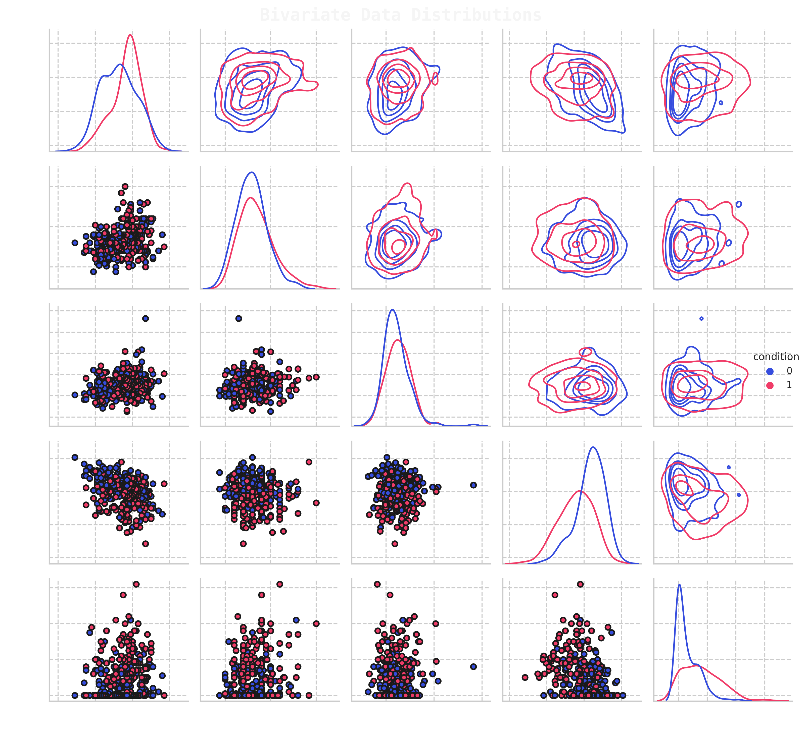

{ width="450" }
{ width="450" }

Here you will find a collection of some of the data science projects I've worked on (mostly Kaggle), if you have any questions, contact me   

## :fontawesome-solid-language:{ .language } <b>Natural Language Processing</b> 

### <b>❯❯ Banking Consumer Complaint Analysis</b>

In this study, we aim to create an **automated ticket classification model** for incoming text based complaints, which is a **multiclass classification problem**. Such a model is useful for a company in order to automate the process of sorting financial product reviews & subsequently pass the review to an experient in the relevant field. We explore traditional ML methods, which utilise hidden-state BERT embedding for features, as well as fine-tune DistilBert for our classification problem & compare the two approaches

### <b>❯❯ Twitter Emotion Classification</b>

>In this study, we fine-tune a transformer model so it can classify the `sentiment` of user tweets for 6 different emotions (multiclass classification). We first create a baseline by utilising traditional ML methods that use extracted `BERT` embeddings for features, then we will turn to a more complex transformer encoder, `DistilBert` & `fine-tune` its model weights for our classification problem

## :fontawesome-solid-person-digging:{ .person-digging } <b>Internships</b> 

### <b>❯❯ Customer Transaction Predictive Analytics</b>

> Part of the **[Data@ANZ](https://www.theforage.com/virtual-internships/prototype/ZLJCsrpkHo9pZBJNY/ANZ-Virtual-Internship)** Internship program. The aim of the study is to analyse customer transactions & find their annual income. Based on the deduced data, we needed to create a model that will be able to predict their annual income. Two approaches were investigates, transaction based (all transactions) & customer aggregative (customer's transaction).

## :fontawesome-solid-users-rectangle:{ .users-rectangle } <b>Classification</b> 

### <b>❯❯ Heart Disease Classification</b>

In this study, we explore different feature engineering approaches for classifying patients with heart disease and conduct grid searches for the two hyperparemeters in order to find the best hyperparameter configuration. We utilise an sklearn based custom Regressor model **([model found here](https://github.com/shtrausslearning/Data-Science-Portfolio/blob/main/Heart%20Disease%20Classification/ml-models/src/mlmodels/gpr_bclassifier.py))**, which we turned in a classifier by simply setting the threshold to 0.5. We also utilised an ensemble of different model in order to improve the model accuracy

### <b>❯❯ Ovarian Phase Classification in Felids</b>

>In this study, we investigate feline reproductology data, conducting an exploratory data analysis of experimental measurements of **estradiol** and **progesterone** levels and attempt to find the relation between different hormone levels during different phases of pregnancy. We  then use the available data to create machine learning models that are able to predict at which stage of an estrous cycle a feline is at the time of testing for different measurement methods, which is a **multiclass classification problem**.

### <b>❯❯ Identifying Antibiotic Resistant Bacteria</b>

In this study, we investigate data associated with **antibiotic resistance** for different `bacteria`, conducting an explotatory data analysis & creating resistance models for different antibiotics, based on unitig (part of DNA) data which convey the presence or absence of a particular nucleotide sequence in the Bacteria's DNA. We train a model(s) that is able to distinguish whether the bacteria is **resistant** to a particular antibiotic or **not resistant**

### <b>❯❯ Lower Back Pain Symptoms Modeling</b>

In this study we investigate patient back pain [biomedical data](https://doi.org/10.24432/C5K89B) obtained from a medical resident in Lyon. We create a classification model which is able to determine the difference between **normal patients** and patients who have either **disk hernia** or **spondylolisthesis**, which is a binary classification problem. We utilise PyTorch in order to create a neural network, which utilises both **dropout** and **batch normalisation** layers.

## :fontawesome-solid-person-falling:{ .person-falling } <b>Physics Modeling</b> 

### <b>❯❯ CFD Trade-Off Study Visualisation | Response Model</b>

In this study, we do an exploratory data analysis of a CFD optimisation study, having extracted table data for different variables in a simulation, we aim to find the most optimal design using different visualisation techniques. The data is then utilised to create a response model for `L/D` (predict L/D based on other parameters), we investigate which machine learning models work the best for this problem

### <b>❯❯ Gaussian Processes | Airfoil Noise Modeling</b>

In this study, we do an exploratory data analysis of [experimental measurement data](https://doi.org/10.24432/C5VW2C) associated with NACA0012 airfoil noise measurements. We outline the dependencies of parameter and setting variation and its influence on SPL noise level. The data is then used to create a machine learning model, which is able to predict the sound pressure level (SPL) for different combinations of airfoil design parameters.

## :fontawesome-solid-chart-simple:{ .chart-simple } <b>Exploratory Data Analysis</b> 

### <b>❯❯ Australian Geospatial Analysis</b>

In this study, we provide a brief overview on what type of geospatial library tools we can use to visualise & analyse map geospatial data, such as **Choropleth**, **Hexbin**, **Scatter** and **Heatmaps**. In particular, we explore Australian based geospatial maps & visualisation data. We look at problems such as **unemployment rates** for different states and demographic. Analyse **housing median** values, house **sale locations** for different suburbs as well as use [kriging interpolation model](https://github.com/shtrausslearning/mllibs/blob/main/src/mlmodels/kriging_regressor.py) to **estimate temperatures** at locations for which we don't have data.

## <b>Recommendation Systems</b> 

### <b>❯❯ edX Course Recommendations</b> 

In this study, we create an **NLP based recommendation system** which informs a user about possible courses they make like, based on a couse they have jusy added. We will utilise [scrapped edX](https://www.kaggle.com/datasets/khusheekapoor/edx-courses-dataset-2021) course description data , clean the text data and then convert document into vector form using two different approaches BoW based **TF-IDF** and **word2vec**, then calculate the **consine similarity**, from which we will be able to extract a list of courses which are most similar and so can be recommended.

---

**Thank you for reading!**

Any questions or comments about the above post can be addressed on the :fontawesome-brands-telegram:{ .telegram } **[mldsai-info channel](https://t.me/mldsai_info)** or to me directly :fontawesome-brands-telegram:{ .telegram } **[shtrauss2](https://t.me/shtrauss2)**, on :fontawesome-brands-github:{ .github } **[shtrausslearning](https://github.com/shtrausslearning)** or :fontawesome-brands-kaggle:{ .kaggle} **[shtrausslearning](https://kaggle.com/shtrausslearning)**

