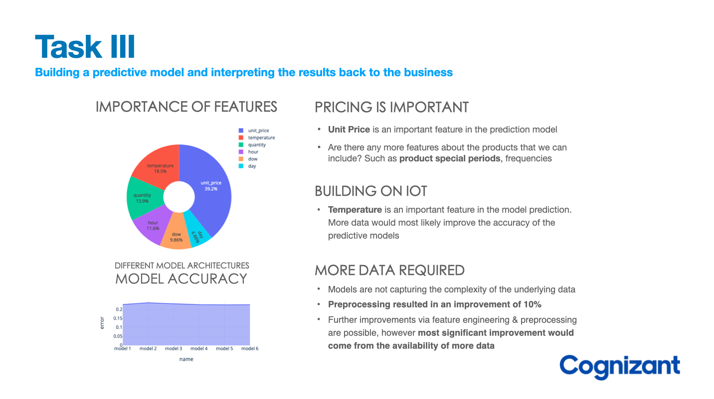

**Machine learning** offers businesses a range of benefits, including predictive analytics to **forecast future trends** and outcomes, **customer segmentation** to tailor marketing strategies, and **personalized recommendations** to enhance customer satisfaction. Additionally, machine learning can help detect fraudulent activities, automate repetitive tasks, and streamline business processes, leading to increased efficiency and cost savings. Natural language processing can also be used to automate customer service interactions and analyze customer feedback. Overall, machine learning can improve decision-making, increase efficiency, and give businesses a competitive advantage in the market.

### <b>:octicons-bookmark-fill-24:  Modeling of product stock levels</b>

**Groceries** are highly perishable items. If you **overstock**, you are wasting money on excessive storage and waste, but if you **understock**, then you risk losing customers. The client wants to know how to better stock the items that they sell. In this project, we aim to help Gala Groceries, who have approached Cognizant to help them with **optimising product supply demand**. To fullfil the requirement of the client, we create machine learning models that **predict the levels of stock in the store** using **customer transactions** and **IoT sensor data**, using various preprocessing methods, a series of machine learning modeling cyles is completed, improving the model using various methods of data cleaning, transformation and hyperparameter optimisations. We also explore how well different models perform and give feedback to the client about what most significantly affects the stock levels.

---

**Thank you for reading!**

Any questions or comments about the posts below can be addressed to the :fontawesome-brands-telegram:{ .telegram } **[mldsai-info channel](https://t.me/mldsai_info)** or to me directly :fontawesome-brands-telegram:{ .telegram } **[shtrauss2](https://t.me/shtrauss2)**, on :fontawesome-brands-github:{ .github } **[shtrausslearning](https://github.com/shtrausslearning)** or :fontawesome-brands-kaggle:{ .kaggle} **[shtrausslearning](https://kaggle.com/shtrausslearning)**

