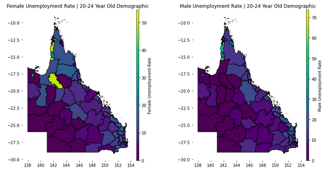

### <b>:octicons-bookmark-fill-24:  Australian Geospatial Analysis</b>

In this study, we provide a brief overview on what type of geospatial library tools we can use to visualise & analyse map geospatial data, such as **Choropleth**, **Hexbin**, **Scatter** and **Heatmaps**. In particular, we explore Australian based geospatial maps & visualisation data. We look at problems such as **unemployment rates** for different states and demographic. Analyse **housing median** values, house **sale locations** for different suburbs as well as use [kriging interpolation model](https://github.com/shtrausslearning/mllibs/blob/main/src/mlmodels/kriging_regressor.py) to **estimate temperatures** at locations for which we don't have data.

---

Any questions or comments about the above post can be addressed on the :fontawesome-brands-telegram:{ .telegram } **[mldsai-info channel](https://t.me/mldsai_info)** or to me directly :fontawesome-brands-telegram:{ .telegram } **[shtrauss2](https://t.me/shtrauss2)**, on :fontawesome-brands-github:{ .github } **[shtrausslearning](https://github.com/shtrausslearning)** or :fontawesome-brands-kaggle:{ .kaggle} **[shtrausslearning](https://kaggle.com/shtrausslearning)**

