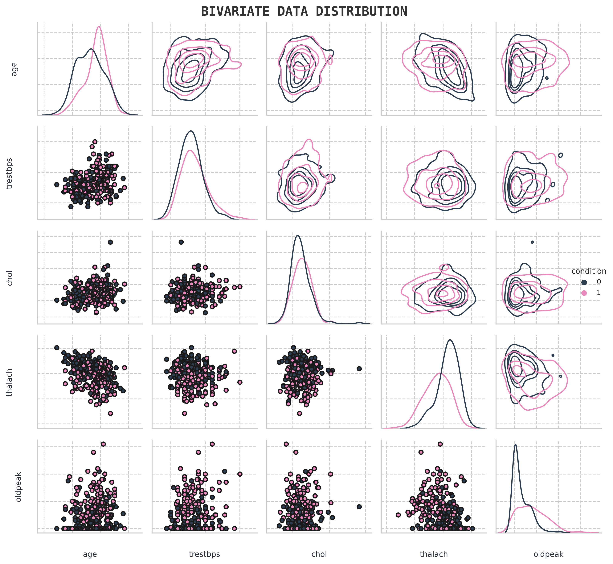

{ width="450" }
{ width="450" }

## :fontawesome-regular-hospital: <b>Health</b> 

Health is an important topic in machine learning because it has the potential to significantly improve healthcare outcomes. Machine learning algorithms can be used to analyze large amounts of medical data and identify patterns that may not be immediately apparent to human analysts. This can help doctors and researchers make more accurate diagnoses, develop more effective treatments, and even predict and prevent certain diseases.

### :material-label-variant-outline: <b>Identifying Antibiotic Resistant Bacteria</b>

In this study, we investigate data associated with **antibiotic resistance** for different `bacteria`, conducting an explotatory data analysis & creating resistance models for different antibiotics, based on unitig (part of DNA) data which convey the presence or absence of a particular nucleotide sequence in the Bacteria's DNA. We train a model(s) that is able to distinguish whether the bacteria is **resistant** to a particular antibiotic or **not resistant**

### :material-label-variant-outline: <b>Lower Back Pain Symptoms Modeling</b>

In this study we investigate patient back pain [biomedical data](https://doi.org/10.24432/C5K89B) obtained from a medical resident in Lyon. We create a classification model which is able to determine the difference between **normal patients** and patients who have either **disk hernia** or **spondylolisthesis**, which is a binary classification problem. We utilise PyTorch in order to create a neural network, which utilises both **dropout** and **batch normalisation** layers.

### :material-label-variant-outline: <b>Ovarian Phase Classification in Felids</b>

In this study, we investigate feline reproductology data, conducting an exploratory data analysis of experimental measurements of **estradiol** and **progesterone** levels and attempt to find the relation between different hormone levels during different phases of pregnancy. We  then use the available data to create machine learning models that are able to predict at which stage of an estrous cycle a feline is at the time of testing for different measurement methods, which is a **multiclass classification problem**.

### :material-label-variant-outline: <b>Heart Disease Classification</b>

In this study, we explore different feature engineering approaches for classifying patients with heart disease and conduct grid searches for the two hyperparemeters in order to find the best hyperparameter configuration. We utilise an sklearn based custom Regressor model **([model found here](https://github.com/shtrausslearning/Data-Science-Portfolio/blob/main/Heart%20Disease%20Classification/ml-models/src/mlmodels/gpr_bclassifier.py))**, which we turned in a classifier by simply setting the threshold to 0.5. We also utilised an ensemble of different model in order to improve the model accuracy

