## Natural Language Processing

<h3> <b>Banking Consumer Complaint Analysis</b></h3>

 

In this study, we aim to create an **automated ticket classification model** for incoming text based complaints, which is a **multiclass classification problem**. Such a model is useful for a company in order to automate the process of sorting financial product reviews & subsequently pass the review to an experient in the relevant field. We explore traditional ML methods, which utilise hidden-state BERT embedding for features, as well as fine-tune **DistilBert** for our classification problem & compare the two approaches

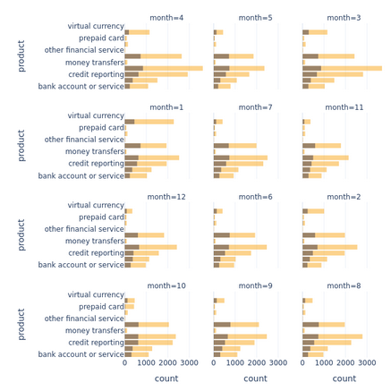{ width="300" } 
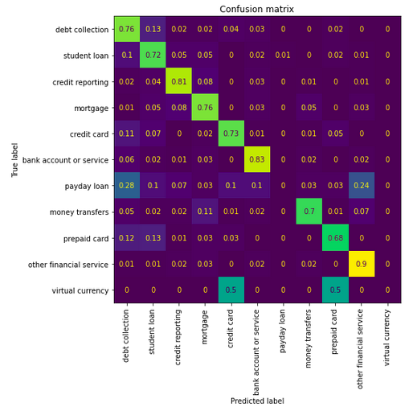{ width="300" }

<h3> <b>News sentiment based trading strategy</b></h3>

In this project, we'll apply **NLP** to financial stock movement prediction. Using **NLP**, we can ask ourselves questions such as, how positive or negative a **news article** (related to financial markets is). It provides a way to monitor **financial market sentiments** by utilising any text based source so we can determine whether the text based source posted on specific day has a positive or negative sentiment score. By combining **historic market data** with **news sources related to financial markets**, we can create a trading strategy that utilises NLP. The whole project revolved around generating accurate **sentiment labels** that would correlate to **event returns**

Based on historic data, we can calculate the **return** of a specific event, however one of challenges to utilise NLP for such application are the **target labels** and the **ground truths** would be set as the even return direction. We first need to create a model that is able to accurately define the sentiment of the **news source**, to do this we try a couple of different approaches: 

- The first method, we **manually define labels** and evaluate the performance of the model. The manual approach utilised three strategies combined into one (percentage value extraction, **TextBlob** & Beat/Misses). For encoding, we utilised static **spacy word embeddings** & investigated how the dimensionality of the vectors affected the model accuracy.
- We also utilised an expertly labeled dataset & tested the resulting model on the dataset, however there wasn't a too significant increase in accuracy.

The best performance boost came from the utilisation of Deep Learning **LSTM** with a trainable **embedding laber** architecture, which showed much better generalisation performance than classical machine learning models, including **ensemble methods**

The last approach we tried as **VADER**, which allows us to utilise a **custom lexicon**, which we can change to something more related: **[**financial markets**](https://www.sciencedirect.com/science/article/abs/pii/S0167923616300240)**. It was interesting to note that the VADER approach resulted in a high postive correlation to **event return**

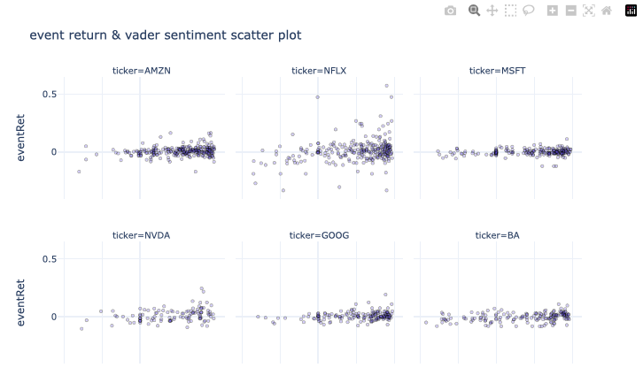

<h3> <b>Twitter Emotion Classification</b></h3>

In this study, we fine-tune a transformer model so it can classify the **sentiment** of user tweets for **6 different emotions** (multiclass classification). We first create a baseline by utilising traditional ML methods, which for features use extracted **BERT** embeddings for each sentence. Once we have our baseline model, we then turn to more complex transformer models, **DistilBert** & **fine-tune** its model weights for our classification problem

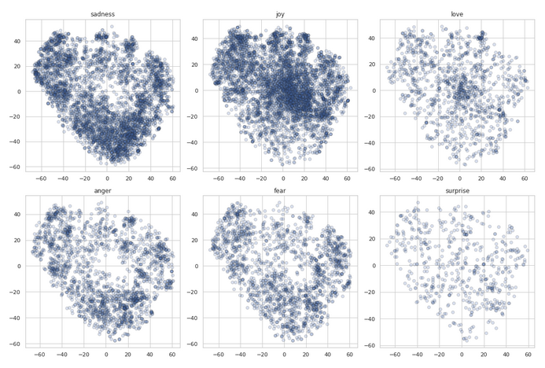

<h3> <b>edX Course Recommendations</b></h3>

 

In this study, we create an **NLP based recommendation system** which informs a user about possible courses they make like, based on a couse they have jusy added. We will utilise **[scrapped edX](https://www.kaggle.com/datasets/khusheekapoor/edx-courses-dataset-2021)** course description data, clean the text data and then convert document into vector form using two different approaches BoW based **TF-IDF** and **word2vec**, then calculate the **consine similarity**, from which we will be able to extract a list of courses which are most similar and so can be recommended.

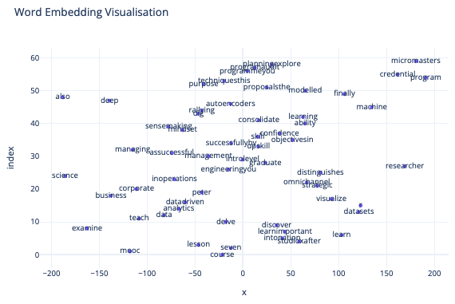

<h3> <b>Creating a Transformer Attention Encoder</b></h3>

 

In this study, we look at some of the basics of a **transformer** architecture model, the **encoder**, by writing and utilising custom **pytorch** classes. Encoder simply put: Converts a **series tokens** into a **series of embedding vectors** (hidden state) & consists of **multiple layers** (**blocks**) constructed together 

The **encoder structure**:

- Composed of **multiple encoder layers (blocks)** stacked next to each other (similar to CNN layer stacks)
- Each encoder block contains **multi-head self attention** & **fully connected feed forward layer** (for each input embedding)

Purpose of the Encoder:

- Input tokens are encoded & modified into a form that **stores some contextual information** in the sequence

The basis of the encoder can be utilised for a number of different applications, as is common in **HuggingFace**, we'll create a simple tail end classification class, so the model can be utilised for **classification**.

<h3> <b>:octicons-bookmark-fill-24:  Banking User Review Analysis & Modeling</b></h3>

<h4>Parsing Dataset</h4>

 

In this study we look at the **parsing/scraping** side of data. Its no secret that a lot text important information is stored on websites, as a result, for us to utilise this data in our of analyses and modeling, we need a way to extract this information, this process is referred to website parsing. For our study we need to extract customer user reviews from **[irecommend](https://irecommend.ru/content/sberbank?new=50)**. We'll be parsing a common **banking coorporation** that offers a variety of services so the reviews aren't too specific to a particular product. Having parsed our dataset, we'll follow up this with a rather basic **exploratory data analysis** based on **ngram** word combinations, so we can very quickly understand the content of the entire corpus.

<h4>Banking Product Review Sentiment Modeling</h4>

Once we have parsed and created our dataset, we look at creating a **sentiment model** based on traditional NLP machine learning approaches. We will be using the parsed dataset about **bank service** reviews, which consists of ratings as well as recommend/don't recommend type labels. We'll be using **TF-IDF** & **Word2Vec** methods to encode text data & use typical shallow and deep tree based enseble models. Once we have found the best performing approaches, we'll be doing a brute force based **GridSearchCV** hyperparameter optimisation in order to tune our model. After selecting the best model, we'll make some conclusions about our predicts & make some future work comments.

<h3> <b>mllibs</b></h3>

{ width="400" }
{ width="400" }

**mllibs** is a project aimed to automate various processes using text commands. Development of such helper modules are motivated by the fact that everyones understanding of coding & subject matter (ML in this case) may be different. Often we see people create functions and classes to simplify the process of **code automation** (which is good practice)
Likewise, NLP based interpreters follow this trend as well, except, in this case our only inputs for activating certain code is natural language. Using python, we can interpret natural language in the form of string type data, using natural langauge interpreters
mllibs aims to provide an automated way to do machine learning using **natural language**

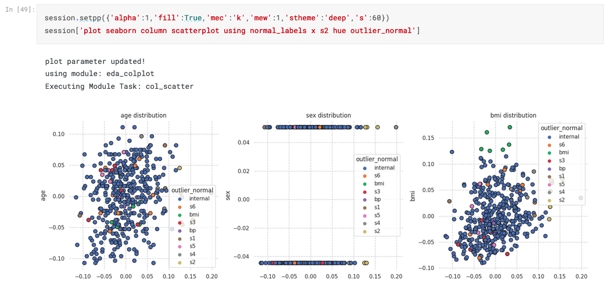
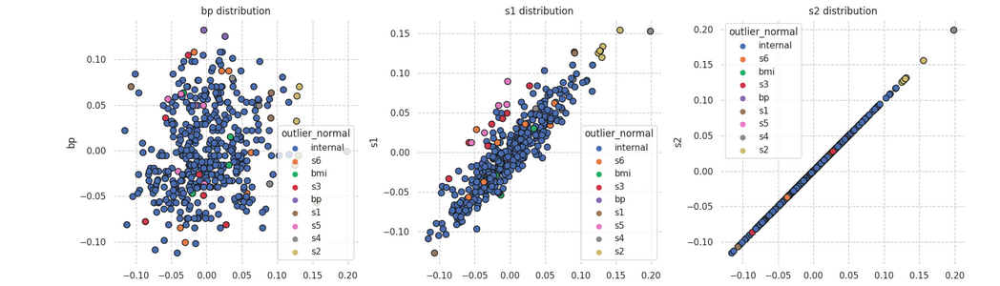
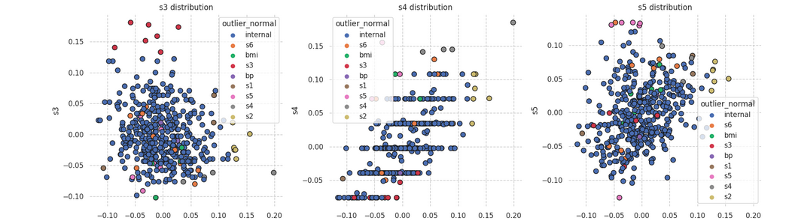
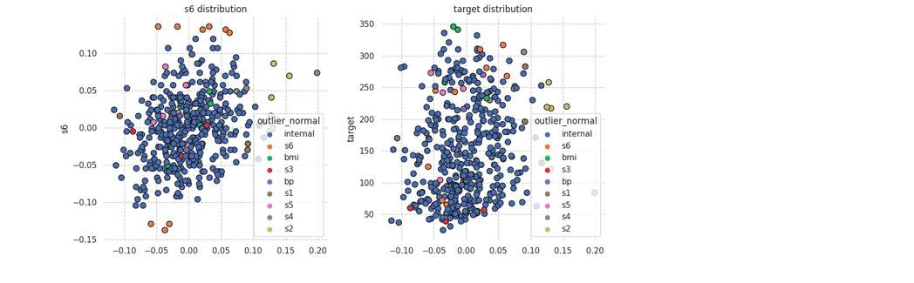

<h3> <b>OTUS NLP Course Work</b></h3>

{ width="400" }
{ width="400" }

 

Natural language course related work on a variety of **Natural Language Processing** topics

<h4><b>NER with preset tools (re,natasha)</b></h4>

 

=== "eng"

	In this notebook, we look at how to utilise the **natasha** & **re** libraries to do predefined **NER**  tagging. **natasha** comes with already predefined set of classification labels, whilst **re** can be used to identify capitalised words using regular expressions. These tools, together with lemmatisers from `pymorphy2` allow us to very easily utilise ready instruments for named entity recognition in documents without any model training.

=== "rus"

	В этом проекте мы воспользуемся готовым инструментов для распознования именованных сущностей natasha. Библиоека работает только с русским языком. В русском часто всречаются и именованные сущности с латинскими буквами, поэтому воспользуемся регулярными выражением и лематизацией для того чтобы дополнить результаты **NER** c **natasha**

<h4><b>Training a NER model with GRU</b></h4>

 

=== "eng"

	**Training NER model using GRU**

	In this project, we train a neural network **NER** model based on **GRU** architecture, which can recognise named entities using **BIO tags** based on car user review data. Unlike the previous notebook, the concept of **NER** is used a little more abstractly, we are interested in any markups for word(s) that we create in the text, not just names. For markups we use tags that describe the quality of the car (eg. appearance, comfort, costs, etc.). The model learns to classify tokens in the text that belong to one of the tag classes. Recognition of such labels is convenient for quick understanding of the content of the review.

=== "rus"

	**Создаем Модель Распознования Именованных Сущностей**

	В этом проекте мы обучаем нейросетевую **NER** модель на основе **GRU**, которая может распозновать именнованные сущности используя **BIO разметку** на отзывах пользователей автомобилей. В отличий от предыдущего ноута понятие NER используется немного более абстрактно, нас интересует любые разметки которые мы разметим в тексте, а не только имена и тд. В качестве разметок используем тэги которые описывают качество автомобиля (eg. appearance, comfort, costs, и тд.). Модель учится классифицировать в тексте токены которые относятся к одному из тэговых классов. Распознование таких меток удобно для быстого понимания содержания отзыва. 

<h4><b>Sentiment Analysis of Kazakh News</b></h4>

 [](https://github.com/shtrausslearning/otus_nlp_course/blob/main/3_%D0%9A%D0%BB%D0%B0%D1%81%D1%81%D0%B8%D1%87%D0%B5%D1%81%D0%BA%D0%B8%D0%B5%20%D0%BC%D0%B5%D1%82%D0%BE%D0%B4%D1%8B%20NLP/9_%D0%9F%D1%80%D0%B5%D0%B4%D0%BE%D0%B1%D1%80%D0%B0%D0%B1%D0%BE%D1%82%D0%BA%D0%B0%20%D0%B4%D0%B0%D0%BD%D0%BD%D1%8B%D1%85%20%D0%B8%20%D0%BF%D0%BE%D0%BD%D1%8F%D1%82%D0%B8%D0%B5%20%D0%B2%D0%B5%D0%BA%D1%82%D0%BE%D1%80%D0%BD%D1%8B%D1%85%20%D0%BF%D1%80%D0%B5%D0%B4%D1%81%D1%82%D0%B0%D0%B2%D0%BB%D0%B5%D0%BD%D0%B8%D0%B9%20%D1%81%D0%BB%D0%BE%D0%B2/khazah-news-sentiment.ipynb)

=== "eng"

	In this project we create create a model for sentiment analysis using classical NLP + machine learning approaches that utilise standard baseline approaches such as **`TF-IDF`** and **`BoW`** together with **`RandomForestClassifier`** and standard **`train_test_split`** to train and evaluate the generalisation performance of the model using **`f1_score`** metric since we end up having slightly disbalanced sentiment classes.

=== "rus"

	В этом проэкте мы строим модели классического машинного обучения для предсказывания **анализа тональности** Казахских новостей, посмотрим какой подход векторизации текста покажет лучше результат на тестовой выборке. Для предобработки текстовых данных воспользуемся Re, токенизируем с помощью WordPunctTokenizer, удаляем стоп слов из **`nltk`** (и добавляем дополнительные), приводим слова в базовую форму используя **`pymorphy2`**. Для энкодинг текста воспользуемся методами **BoW** и **TF-IDF** из sklearn (сравниваем оба подхода). Для ограничения размерности матрицы векторного представления используем max_features = 1000. Для классификатора воспользуемся случайным лесом (**`RandomForestClassifier`**), для гиперпараметров построим 500 решающих деревьев, другие параметры по умолчанию. Для проверки обобщаюшию способность модели воспользуемся методом **`train_test_split`**, тренируем модель на 80% данных, на остальных валидируем, для оценки модели используем **`f1_score`** с опции macro, для понимания как влияет дисбаланс классов 

<h4><b>Fine Tuning BERT for Multilabel Toxic Comment Classification</b></h4>

  

=== "eng"

	In this project we will be creating a **multilabel model** for toxic comment classification using transfomer architecture **BERT**. This main difference between multilabel and multiclass classification is that we are treating this as a binary classification problem, but checking for multiple labels for whether the text belongs to the class or not.

=== "rus"

	В этом ноуте мы применим подход **fine-tune** для трансформерной модели **BERT**. Данная задача является задачей multilabel text classification (**много меточная классификация**). Модели предстоит классифицировать текст в одну или несколько категории из списка (например фильм может быть классифицирован в одну или несколько жанров)

<h4> :octicons-bookmark-16: <b>Fine Tuning BERT for Linguistic Acceptability</b></h4>

  

=== "eng"
	
	In this project we will be fine-tuning a transformer model for the **language acceptability problem (CoLa)** problem. The **CoLa** dataset itself is a benchmark dataset for evaluating natural language understanding models. CoLa stands for "Corpus of Linguistic Acceptability" and consists of sentences from various sources, such as news articles and fiction, that have been labeled as either grammatically correct or incorrect. The dataset is commonly used to evaluate models' ability to understand and interpret the grammatical structure of sentences. For this task we'll be utilising the **bert-base-uncased** model and utilise **huggingface's** convenient downstream task task adaptation variation for **binary classification** using **BertForSequenceClassification** 

=== "rus"

	Сегодня мы разберем как использовать языковую модель из библиотеки huggingface PyTorch и научимся его файнтьюнить для задачи классификации предложений. **CoLa** (Корпус лингвистической приемлемости), это набор данных-бенчмарк для оценки моделей понимания естественного языка. Он  состоит из предложений из различных источников, таких как новостные статьи и художественной литературы, которые были помечены как **грамматически правильные** или **неправильные**. Набор данных часто используется для оценки способности моделей понимать и интерпретировать грамматическую структуру предложений. Для этой задачи мы воспользуемся базовой моделей **BERT (bert-base-uncased)** с библиотекой **huggingface**, что даст нам возможность быстро адаптировать модель для бирарной классификации с **BertForSequenceClassification** 

<h3> <b>Customer Service Dialogue System for GrabrFi</b></h3>

 

As part of the final project of the **[nlp course](https://otus.ru/lessons/nlp/)**, the aim of the project was to create a dialogue system for a banking service business **GrabrFi**, focusing on combining various NLP methods that can be utilised in chatbots. Combining a **Telegram** structure that utilises **TF-IDF** with **cosine_similarity**, **multiclass classification** based approach, **Question Answering** (BERT), **generative** (DialoGPT). The task of answering user questions and queries was split up into different subgroups found in the **[help section](https://help.grabrfi.com)** so that each model would be in charge of its own section, as a result of experimenting with different method activation thresholds, a dialogue system that utilised all of the above methods was created, and all methods were able to work together. This allowed for an understanding of the different approaches that can be utilised in the creation of a dialogue system. 

[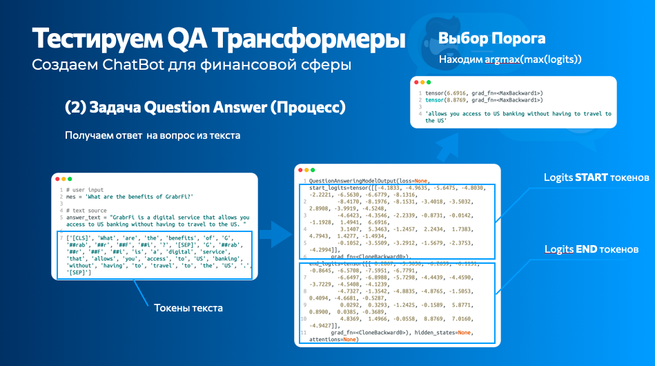](pdf/chatbot_grabrfi.pdf)

<h3> <b>NLP related blog posts</b></h3>

I also post additional NLP content on my blog: **[NLP projects](https://shtrausslearning.github.io/blog/category/nlp/)**

!!! tip "Named Entity Recognition with Huggingface Trainer"

	 

	In a **[previous post](https://shtrausslearning.github.io/posts/huggingface_NER/)** we looked at how we can utilise Huggingface together with PyTorch in order to create a NER tagging classifier. We did this by loading a preset encoder model & defined our own tail end model for our NER classification task. This required us to utilise Torch`, ie create more lower end code, which isn't the most beginner friendly, especially if you don't know Torch. In this post, we'll look at utilising only Huggingface, which simplifies the **training** & **inference** steps quite a lot. We'll be using the **trainer** & **pipeline** methods of the Huggingface library and will use a dataset used in **[mllibs](https://pypi.org/project/mllibs/)**, which includes tags for different words that can be identified as keywords to finding data source tokens, plot parameter tokens and function input parameter tokens.

!!! tip "Named Entity Recognition for Sentence Splitting"

	 

	In the last post, we talked about how to use **NER** for tagging named entities using transformers. In this sections, we'll try something a little more simpler, utilising traditional encoding & ML methods. One advantage of using such models is the cost of training. We'll also look at a less common example for **NER** tagging, which I've implemented in my project **[mllibs](https://github.com/shtrausslearning/mllibs)**

!!! tip "Named Entity Recognition with Torch Loop"

	 

	In this notebook, we'll take a look at how we can utilise `HuggingFace` to easily load and use `BERT` for token classification. Whilst we are loading both the base model & tokeniser from `HuggingFace`, we'll be using a custom `Torch` training loop and tail model customisation. The approach isn't the most straightforward but it is one way we can do it. We'll be utilising `Massive` dataset by Amazon and fine-tune the transformer encoder `BERT`

## Business

<h3> <b>Prediction of stock levels of products</b></h3>

## Financial

<h3> <b>Customer Transaction Predictive Analytics</b></h3>

 

Part of the **[Data@ANZ](https://www.theforage.com/virtual-internships/prototype/ZLJCsrpkHo9pZBJNY/ANZ-Virtual-Internship)** Internship program. The aim of this study was to analyse ANZ customer **banking transactions**, visualise trends that exist in the data, investigate **spending habits** of customers & subsequently determine the **annual income** of each customer, based on **debit/credit** transactions. From all available customer & transaction data, the next challenge was to create a machine learning model that would estimate this target variable (annual income), which would be used on new customers. Based on the deduced data, we created several regression models that were able to predict annual income with relatively high accuracy. Due to the limitation of available data, two approaches were investigates, transaction based (**all transactions**) & customer aggregative (**customer's transaction**) & subsequently their differences were studied.

<h3> <b>Building an Asset Trading Strategy</b></h3>

 

A major drawback of crypocurrency trading is the **volatility of the market**. The currency trades can occur 24/7 & tracking crypto position can be an impossible task to manage without automation. Automated Machine Learning trading algorithms can assist in managing this task, in order to predict the market's movement. 

The problem of predicting a **buy (value=1)** or **sell (value=0)** signal for a trading strategy is defined in the **binary classification** framework. The buy or sell signal are decided on the basis of a comparison of short term vs. long term price. Data harvesting (just data collection here) & **feature engineering** are relevant factors in time series model improvement. It's interesting to investigate whether traditionally stock orientated feature engineering modifications are relevant to digital assets, and if so which ones. Last but not least, **model generation efficiency** becomes much more significant when dealing with High Frequency Tick Data as each added feature can have a substatial impact on the turnaround time of a model, due to the amount of data & balancing model accuracy & model output turnaround time is definitely worth managing.

<h3> <b>Prediction of Stable Customer Funds</b></h3>

 
 

In this project, we aim to create machine learning models that will be able to **predict future customer funds**, based on historical trends. The **total customer assets** can vary significantly in time, and since banks are in the business of lending money, this is needed for more accurate fund allocation (optimise the allocation for lending) so they can be utilised for credit applications. We utilise **gradient boosting** models (CatBoost) & do some **feature engineering** in order to improve the models for short term predictions (3 month) and longer term predictions (6 months). Having created baseline models, we also optimise the model hyperparameters using **Optuna** for different prediction periods.

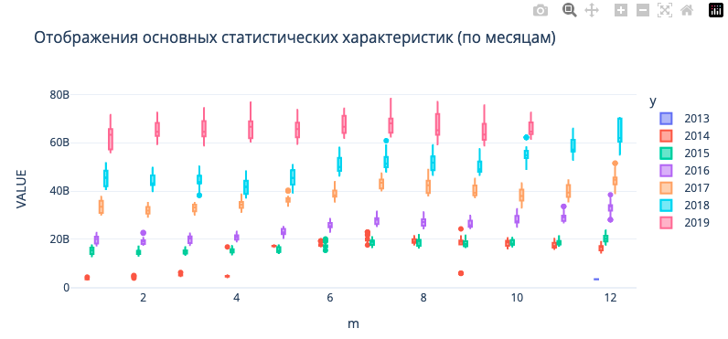

## Physics

<h3> <b>CFD Trade-Off Study Visualisation | Response Model</b></h3>

 

In this study, we do an **exploratory data analysis** of a **CFD optimisation study**, having extracted table data for different variables in a simulation, we aim to find the most optimal design using different visualisation techniques. The data is then utilised to create a response model for **L/D** (predict L/D based on other parameters), we investigate which machine learning models work the best for this problem

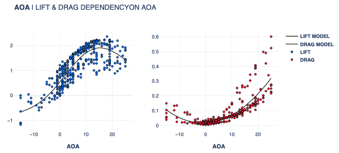
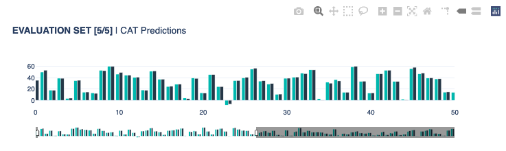

<h3> <b>Gaussian Processes | Airfoil Noise Modeling</b></h3>

In this study, we do an exploratory data analysis of [experimental measurement data](https://doi.org/10.24432/C5VW2C) associated with NACA0012 airfoil noise measurements. We outline the dependencies of parameter and setting variation and its influence on SPL noise level. The data is then used to create a machine learning model, which is able to predict the sound pressure level (SPL) for different combinations of airfoil design parameters.

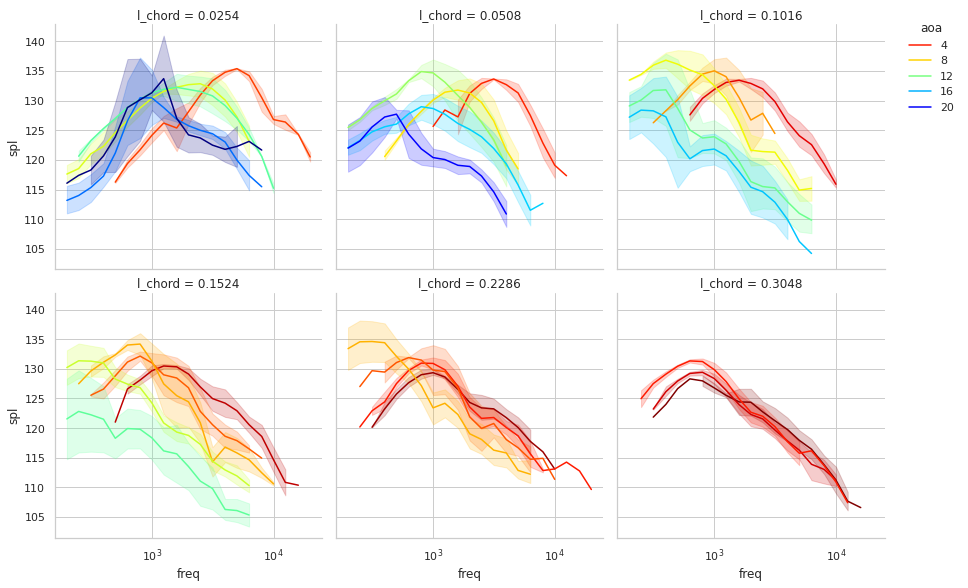

<h3> <b>Spectogram Broadband Model & Peak Identifier</b></h3>

 

Noise generally can be divided into **broadband noise** (general noise level) & **tonal noises** (peaks at specific frequency bins). They don't have precise definitions, but broadband noises can be abstractly defined as the general noise level in an environement coming from various locations, creating a broad frequency range noise relation to output noise level. Tonal noise sources tend be associated to very clearly distinguishible noise peaks at specific frequencies ( or over a small frequency range ). When we look at a spectogram, each bird specie tends to create quite a repetitive collection of freq vs time structures, usually across a specific frequency range, usually it's a combination of tonal peaks that make up an entire bird call. In this approach, the two terms are used even looser, since there is a time element to this model from the STFT, which can be useful in a variety of scenarios. The **tonal peak frequency identification approach** relies on the assumption that the more data is fed into the system, the more precise the result should get, as occasional secondary birds & other noises should eventually start to show more dissipative distribution in the entire subset that is analysed.

Looping over all desired audio files of a subset of interest to us (a particular primary label subset):

- First, we load an audio recording that we wish to convert to desired to be used as inputs for CNN models.
- The audio is then split into segments that will define the spectogram time domain limits. Usually we would start with the entire frequency range [0,12.5kHz] and split the recording into a 5 second chunks, creating a time & frequency domain relation.
- For reference, we find the maximum dB value in the entire frequency range, this model will define the peaks of the tonal noises and will always be the maximum.
- The spectogram is then divided into time bins, cfg.model_bins & for each time bin, the maximum value for each frequency is determined.
- A model (**kriging**) for each time bin is created and a simple enemble of all time segments is constructed, this should always create a model that is lower in dB level than the global peak model mentioned earlier. There are certain cases where this is not the case, usually an indicator that there exist an anomaly in the structure of the curve (as shown in the example below).
- The peaks of the model are then found using scipy's find_peaks module, stored into a global list & the Counter module counts all list entries.
- The results are subsequently plotted for each pixel value. The corresponding frequency values can be extracted using the function pxtohz.

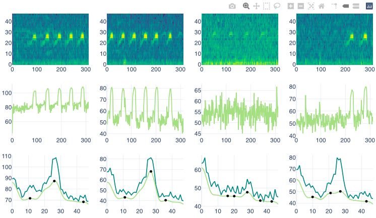

## Biology

<h3> <b>Identifying Antibiotic Resistant Bacteria</b></h3>

 

In this study, we investigate data associated with **antibiotic resistance** for different `bacteria`, conducting an **explotatory data analysis** (looking at geospatial relations & sankey diagrams) & train antibiotic resistance models for different types antibiotics, based on **unitig (part of DNA)** data (which convey the presence or absence of a particular nucleotide sequence) in the Bacteria's DNA. We train a model(s) that is able to distinguish whether the bacteria is **resistant** to a particular antibiotic or **not resistant** and determine which unitigs are the most influential in the model's prediction.

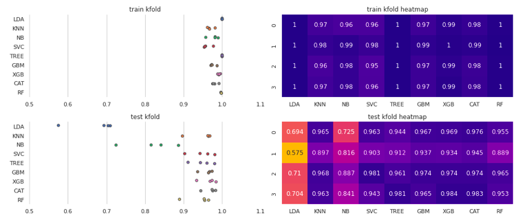

<h3> <b>Hummingbird Classification | Keras CNN Models</b></h3>

 

In this project, we aimed to create an **automated hummindbird recognition** deep learning model. In our quest to create an automated approach, we can be left with a collection or under or over exposed images that will create difficulties for the model to distinguish between different classes correctly. For this reason we tried different **image augmentation** techniques & and different combinations of them and found combinations that would generalise well in a variety of ambient lighting conditions. We also trained a basic **convolution** type model & **fine tuned** different SOA (such as **ResNet**) models in order to utilise already preexisting model features. 

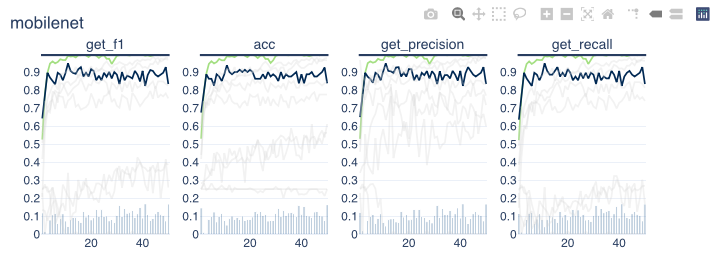
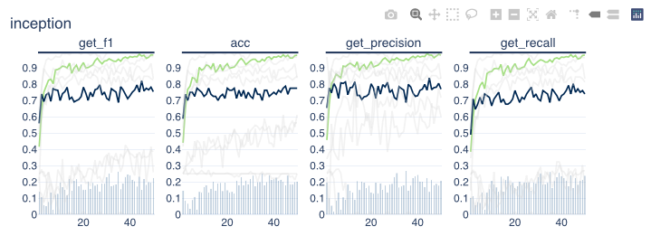

<h3> <b>Transcription Factor Binding Location Prediction</b></h3>

 

The process of converting a **nucleotide sequence** into an **amino acid chain** containing proteins is not a very straightforward process, the complex process is not straightforward to not easy to understand. What we can do is attempt to utilise **deep learning** in order to model a relation for our **biological phenomenon** associated with the above biological process. Our model model will attempt to predict **segments in the DNA** at which a so called **transcription factor** will attach itself, the problem is treated as a **binary classification problem**. The model itself contains **1D convolution blocks** & is very simple in its structure. To improve the model accuracy, we try a couple of things: **sample weighting**, **dropout** effects, all of which have a prositive effect on the generalisation performance.

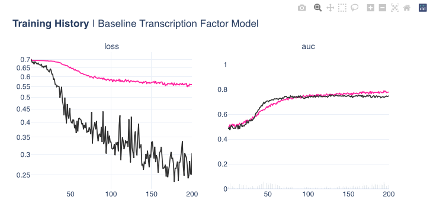

<h3> <b>Histopathic Cancer Detection</b></h3>

 

In this project, we dive into the world of **computer vision**. Microscopic evaluation of histopathalogic stained tissue & its subsequent digitalisation is now a more feasible due to the advances in slide scanning technology, as well a reduction in digital storage cost in recent years. There are certain advantages that come with such **digitalised pathology**; including remote diagnosis, instant archival access & simplified procedure of consultations with expert pathologists. **Digitalised Analysis based on Deep Learning** has shown potential benefits as a potential diagnosis tool & strategy. Assessment of the extent of cancer spread by histopathological analysis of sentinel axillary lymph nodes (SLNs) is an essential part of breast cancer staging process. The aim of this study was to investigate the potential of using PyTorch Deep Learning module for the **detection of metastases in SLN slides** and compare them with the predefined pathologist diagnosis.

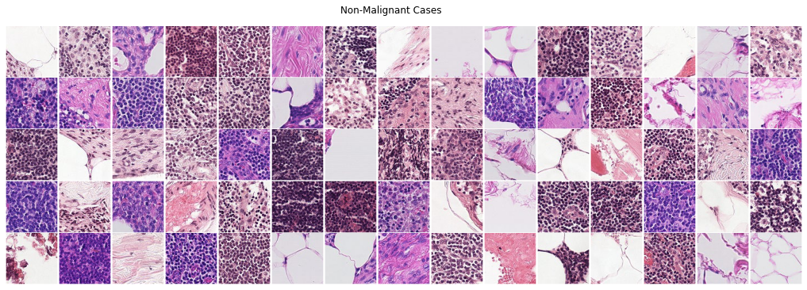

## Health

<h3> <b>Lower Back Pain Symptoms Modeling</b></h3>

 

In this study we investigate patient back pain **[biomedical data](https://doi.org/10.24432/C5K89B)** obtained from a medical resident in Lyon. We create a classification model which is able to determine the difference between **normal patients** and patients who have either **disk hernia** or **spondylolisthesis**, which is a binary classification problem. We utilise **PyTorch** and created a **custom dataset class** to load the tabular CSV data & load the data into batches using **data loaders**. A rather simple **neural network structure** that utilises standard **generalisation strategies** such as **dropout** and **batch normalisation** was assembled & the model was trained and tested in the validation dataset.

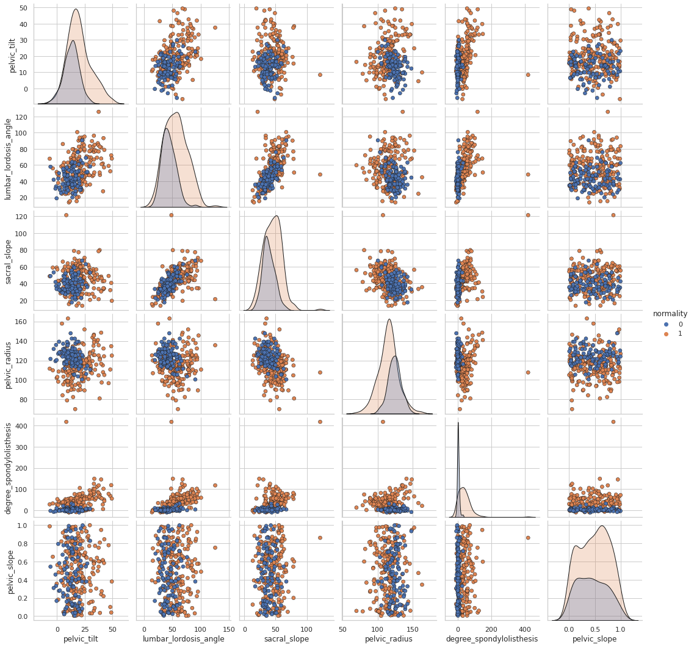

<h3> <b>Ovarian Phase Classification in Felids</b></h3>

 
 

In this study, we investigate **feline reproductology data**, conducting an **exploratory data analysis** of experimental measurements of **estradiol** and **progesterone** levels and attempt to find the relation between different hormone levels during different phases of pregnancy. We  then use the available data to create machine learning models that are able to predict at which stage of an estrous cycle a feline is at the time of testing for different measurement methods, which is a **multiclass classification problem**.

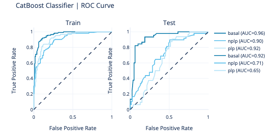

<h3> <b>Heart Disease Classification</b></h3>

 
 

In this study, we explore different **feature engineering** approaches, we group features into different combinations based on their subgroup types and attempt to find the best combination for classifying patients with heart disease. Having found the best feature combinations, we utilise brute force grid searches for hyperparameter optimisation in order to find the best performing model.

We utilise an sklearn compatible custom Regressor model **([model found here](https://github.com/shtrausslearning/Data-Science-Portfolio/blob/main/Heart%20Disease%20Classification/ml-models/src/mlmodels/gpr_bclassifier.py))** based on **Kriging**, which we turned in a classifier by simply setting the threshold to 0.5 (basically the **prediction** method in sklearn models). We also tried different ensembles of different models in order to improve the model accuracy even further.

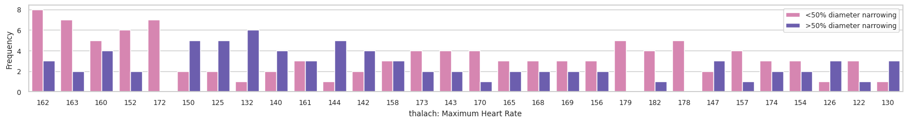
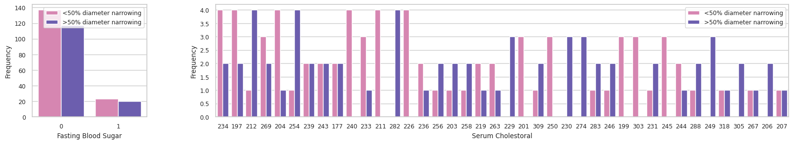

## Geospatial

<h3> <b>Australian Geospatial Analysis</b></h3>

In this study, we provide a brief overview on what type of geospatial library tools we can use to visualise & analyse map geospatial data, such as **Choropleth**, **Hexbin**, **Scatter** and **Heatmaps**. In particular, we explore Australian based geospatial maps & visualisation data. We look at problems such as **unemployment rates** for different states and demographic. Analyse **housing median** values, house **sale locations** for different suburbs as well as use [kriging interpolation model](https://github.com/shtrausslearning/mllibs/blob/main/src/mlmodels/kriging_regressor.py) to **estimate temperatures** at locations for which we don't have data.

---

**Thank you for reading!**

Any questions or comments about the above post can be addressed on the :fontawesome-brands-telegram:{ .telegram } **[mldsai-info channel](https://t.me/mldsai_info)** or to me directly :fontawesome-brands-telegram:{ .telegram } **[shtrauss2](https://t.me/shtrauss2)**, on :fontawesome-brands-github:{ .github } **[shtrausslearning](https://github.com/shtrausslearning)** or :fontawesome-brands-kaggle:{ .kaggle} **[shtrausslearning](https://kaggle.com/shtrausslearning)**

