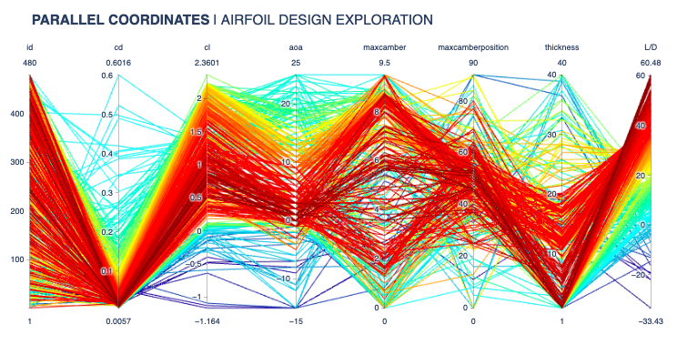
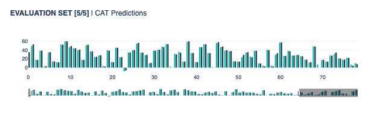

## :material-checkbox-multiple-marked-circle-outline: <b>Science</b> 

Machine learning is important in the field of science because it can help scientists analyse large amounts of data and identify patterns that may not be immediately apparent. This can lead to new discoveries and insights in various scientific fields, such as physics, chemistry, biology, and astronomy. Machine learning algorithms can also help scientists make more accurate predictions and simulations, which can aid in the development of new technologies and treatments.

### :material-label-variant-outline: <b>CFD Trade-Off Study Visualisation | Response Model</b>

In this study, we do an exploratory data analysis of a CFD optimisation study, having extracted table data for different variables in a simulation, we aim to find the most optimal design using different visualisation techniques. The data is then utilised to create a response model for `L/D` (predict L/D based on other parameters), we investigate which machine learning models work the best for this problem

### :material-label-variant-outline: <b>Gaussian Processes | Airfoil Noise Modeling</b>

In this study, we do an exploratory data analysis of [experimental measurement data](https://doi.org/10.24432/C5VW2C) associated with NACA0012 airfoil noise measurements. We outline the dependencies of parameter and setting variation and its influence on SPL noise level. The data is then used to create a machine learning model, which is able to predict the sound pressure level (SPL) for different combinations of airfoil design parameters.

---

Any questions or comments about the above post can be addressed on the :fontawesome-brands-telegram:{ .telegram } **[mldsai-info channel](https://t.me/mldsai_info)** or to me directly :fontawesome-brands-telegram:{ .telegram } **[shtrauss2](https://t.me/shtrauss2)**, on :fontawesome-brands-github:{ .github } **[shtrausslearning](https://github.com/shtrausslearning)** or :fontawesome-brands-kaggle:{ .kaggle} **[shtrausslearning](https://kaggle.com/shtrausslearning)**

