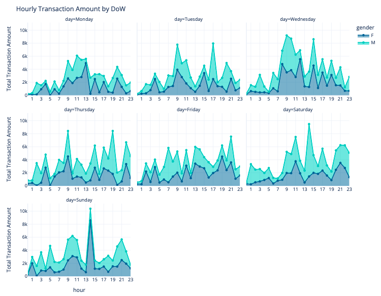
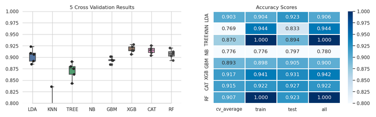
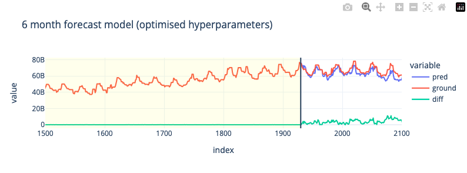

**Machine learning** plays a significant role in **finance** by helping to analyse large volumes of financial data, identify patterns and trends, make predictions, and automate decision-making processes. It can be used for tasks such as **risk management**, **fraud detection**, **algorithmic trading**, **credit scoring**, **customer segmentation**, and personalized **investment recommendations**. Machine learning algorithms can process and analyze data much faster and more accurately than humans, enabling financial institutions to make better-informed decisions and improve their overall performance.

  - ## :material-book-check:{ .hover-icon-bounce .success-hover title="Jan,2024" } **Customer Transaction Predictive Analytics** 

	 

	Part of the **[Data@ANZ](https://www.theforage.com/virtual-internships/prototype/ZLJCsrpkHo9pZBJNY/ANZ-Virtual-Internship)** Internship program. The aim of this study was to analyse ANZ customer **banking transactions**, visualise trends that exist in the data, investigate **spending habits** of customers & subsequently determine the **annual income** of each customer, based on **debit/credit** transactions. From all available customer & transaction data, the next challenge was to create a machine learning model that would estimate this target variable (annual income), which would be used on new customers. Based on the deduced data, we created several regression models that were able to predict annual income with relatively high accuracy. Due to the limitation of available data, two approaches were investigates, transaction based (**all transactions**) & customer aggregative (**customer's transaction**) & subsequently their differences were studied.

	 

	

	{ .base-border-radius }
	

  - ## :material-book-check:{ .hover-icon-bounce .success-hover title="Jan,2024" } **Building an Asset Trading Strategy** 

  	 

	A major drawback of crypocurrency trading is the **volatility of the market**. The currency trades can occur 24/7 & tracking crypto position can be an impossible task to manage without automation. Automated Machine Learning trading algorithms can assist in managing this task, in order to predict the market's movement. 

	The problem of predicting a **buy (value=1)** or **sell (value=0)** signal for a trading strategy is defined in the **binary classification** framework. The buy or sell signal are decided on the basis of a comparison of short term vs. long term price. Data harvesting (just data collection here) & **feature engineering** are relevant factors in time series model improvement. It's interesting to investigate whether traditionally stock orientated feature engineering modifications are relevant to digital assets, and if so which ones. Last but not least, **model generation efficiency** becomes much more significant when dealing with High Frequency Tick Data as each added feature can have a substatial impact on the turnaround time of a model, due to the amount of data & balancing model accuracy & model output turnaround time is definitely worth managing.

	 

	

	{ .base-border-radius }
	

  - ## :material-book-check:{ .hover-icon-bounce .success-hover title="Jan,2024" } **Prediction of Stable Customer Funds** 

	 

    In this project, we aim to create machine learning models that will be able to **predict future customer funds**, based on historical trends. The **total customer assets** can vary significantly in time, and since banks are in the business of lending money, this is needed for more accurate fund allocation (optimise the allocation for lending) so they can be utilised for credit applications. We utilise **gradient boosting** models (CatBoost) & do some **feature engineering** in order to improve the models for short term predictions (3 month) and longer term predictions (6 months). Having created baseline models, we also optimise the model hyperparameters using **Optuna** for different prediction periods.

     

	

	{ .base-border-radius }
	

**Thank you for reading!**

Any questions or comments about the posts below can be addressed to the :fontawesome-brands-telegram:{ .telegram } **[mldsai-info channel](https://t.me/mldsai_info)** or to me directly :fontawesome-brands-telegram:{ .telegram } **[shtrauss2](https://t.me/shtrauss2)**, on :fontawesome-brands-github:{ .github } **[shtrausslearning](https://github.com/shtrausslearning)** or :fontawesome-brands-kaggle:{ .kaggle} **[shtrausslearning](https://kaggle.com/shtrausslearning)**

[:octicons-repo-16: Other Projects](others.md){ .md-button .md-button--primary .slim-button }

