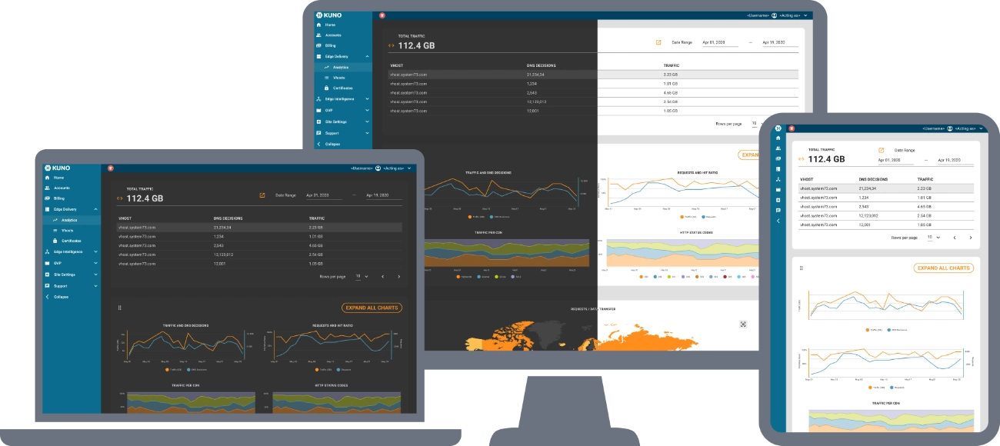
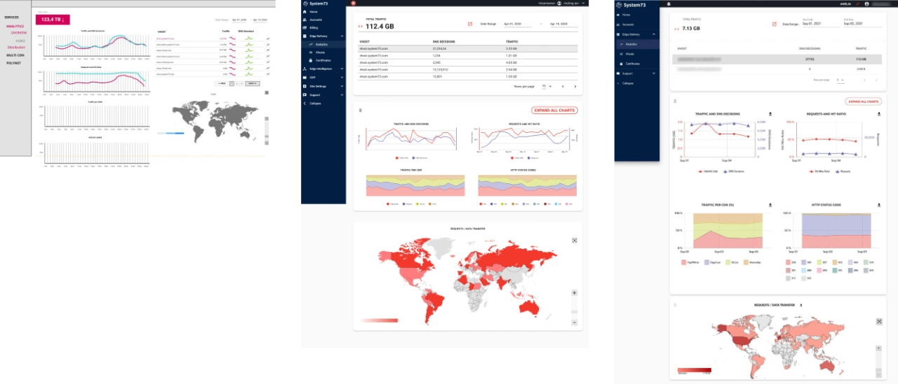
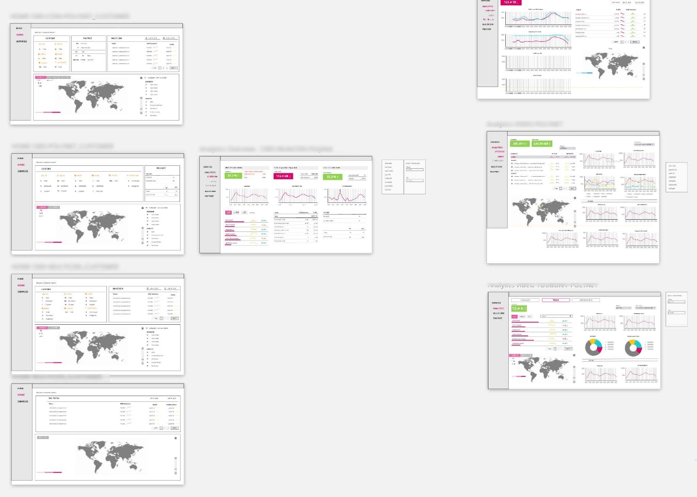
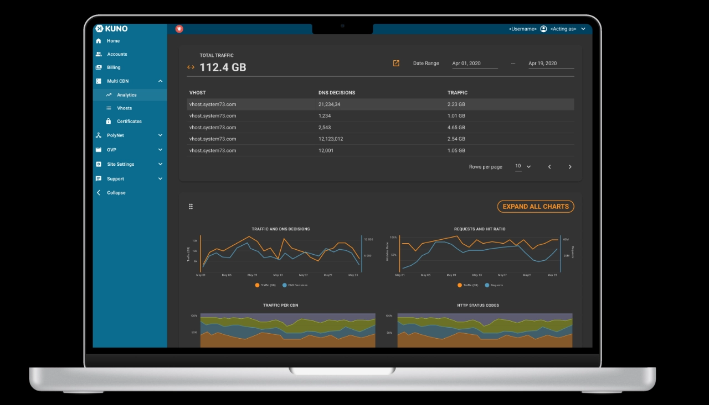
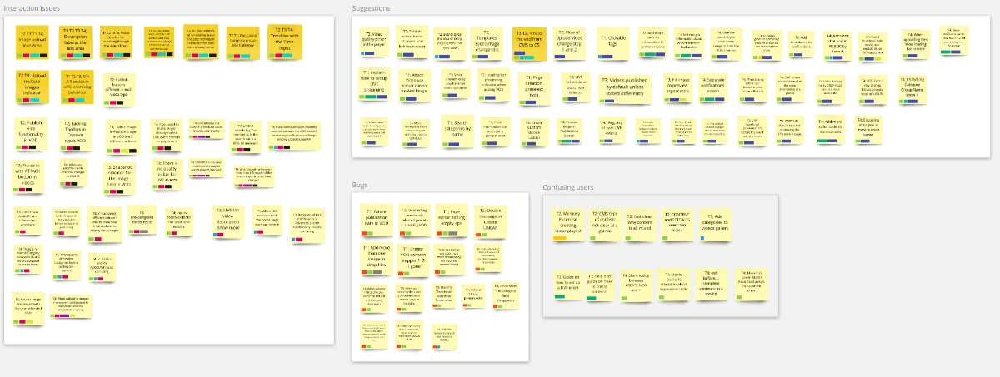
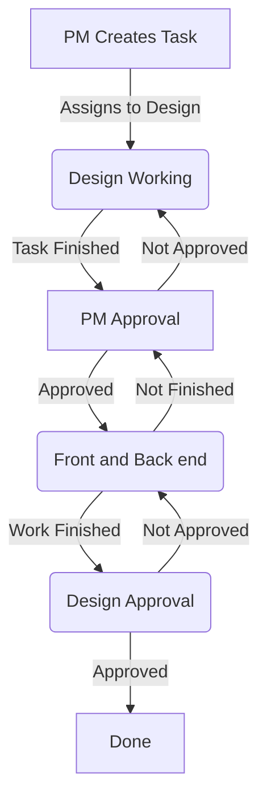

# KUNO

<figure markdown>
  
  <figcaption>Online Video Platform</figcaption>
</figure>

## Project Summary

-   :material-badge-account:{ .middle .iconSummary }  __Client__

    ---

    **System73**  
    Powering Porfitable Streaming

-   :material-calendar-expand-horizontal:{ .middle .iconSummary }  __Timeline__

    ---

    Mar-2019 <--> Jun 2022  
    (3 yrs 4 mos)

-   :material-face-woman-shimmer:{ .middle .iconSummary }  __Role__

    ---

    Product Designer

-   :material-bullseye-arrow:{ .middle .iconSummary }  __Achievements__

    ---

    - 20+ new features
    - Clickable prototype - Adobe Xd
    - Process definitions for development
    - Fun retrospectives planning

## User Story

> **We want**  to enhance our recently established Online Video Platform, **so that** our content creators from our two online tv channels to seamlessly **upload and manage** three different types of video content. 

Additionally, we seek to establish a well-defined workflow for the various stages - *"design, development, stakeholders"* - with the aim of enhancing collaboration and ensuring predictability in deliverables.

## Goals

1. Enhance the existing interface (the platform is built on Vuetify 2).
2. Introduce the Feature Definition Development Flow.
3. Define and Test Clear User Tasks.
4. Maintain a comprehensive Clickable Prototype.
5. Establish a User's Help Center.
6. Assist with internal documentation.

## Feature Definition Flow

In a single designer team, surrounded by developers, the role of design often lacks clarity. The individual tasked with this responsibility may encounter challenges in dealing with team members who may not fully comprehend the purpose of design.

The ultimate objective of the feature definition flow is to reach a point where one can anticipate approximately 80%-95% of what is expected to happen and how it will unfold, leaving only a minimal percentage to simple coincidence. 

Wireframe -------> Prototype -------> Reality

How might we accomplish that? 

In this project, we followed these steps. However, it is crucial to tailor them to the specific teamwork dynamics within the company, considering how teams communicate, collaborate, and ensure alignment toward a shared project goal.

### PRD - Product Requirements Document

During multidisciplinary meetings, verbal discussions without visual aids such as a whiteboard (or its virtual equivalent) can lead to different interpretations by participants. While this divergence is understandable, addressing it is key. 

How might we anticipate this? 

One effective approach is to create a concise, one-page Product Requirements Document (PRD) that explicitly outlines what we commit to deliver. This document encapsulates the entire feature scope and the estimated phases required for completion, aligning them with the development team's planning cycles.

Once the definition meeting concludes, and all participants have endorsed the pre-requirements and commitments, there is no room for "You said" or "I said" discussions – everything is documented and accessible to everyone.

This serves as a robust guide that can be flexibly adapted to meet the specific needs of the team --> [:material-open-in-new:{.middle} Atlassian PRD](https://www.atlassian.com/agile/product-management/requirements){ target="_blank" .content-link}

### Wireframing

Before diving into design work, it's essential for designers to grasp project requirements. Rather than creating multiple versions of the same concept, gathering insights from various team members can save time, especially considering potential technical limitations. This initial step is crucial. 

In my experience, involving individuals from different departments improves the process. Not everyone attends every meeting, and incorporating diverse perspectives ensures everyone feels included in decision-making. This fosters a personalized connection for each team member with the project, creating a mutually beneficial scenario.

### Prototype

Prototypes play a crucial role in the design process as they offer a tangible sense of a product, something static screens cannot achieve. Before the advent of Sketch, web design was commonly done in Photoshop, a powerful yet expensive tool with a steep learning curve and no interactivity.

With the emergence of Sketch, other alternatives like Adobe XD surfaced. Adobe XD, from its inception, catered to both MacOS and Windows designers, offering an interactive prototype mode that evolved from simple click-throughs to more sophisticated interactions. Clicking a button to navigate to a new screen provides clients and stakeholders with a unique "feel" of the product.

Prototypes are essential for problem-solving, showcasing new features, and communicating designs to developers. An interactive prototype goes beyond a static image, offering a more immersive experience. During this stage, ideas can be explored, tested, and validated, allowing for the identification and resolution of potential issues before actual development.

Here, you can see a single-screen prototype in Figma. :material-arrow-down:

[:material-open-in-new:{.middle}View Figma Reduced Prototype](https://www.figma.com/file/alDXlktB2GDEDV66ajWORQ/System73?type=design&node-id=50%3A10206&mode=design&t=t5F1wc1RMnn5v2kh-1){ target="_blank" .content-link}

### Test

No matter how positive you feel about the progress of your project, it inevitably has flaws. The sooner these flaws are identified, the better, as addressing them early on reduces the workload for developers.

Regardless of one's confidence in design skills, users seldom interact with products as intended. 

If you doubt this, consider the impact of this viral video: 

[:material-open-in-new:{.middle} The original Square Hole video](https://www.youtube.com/shorts/7haqnQvrYfI){ target="_blank" .content-link }

I had a similar experience with the Online Video Platform. After conducting tests, a substantial list of flaws began accumulating, and we had to address them in the subsequent *sprints*

Here is one of the Affinity boards that we generated: 

{ "target=_blank" .content-link}

### Developers Handover

We realized that having a constantly changing design file, with ongoing modifications from the design team alongside the addition of new functionalities by the development team, led to shifting requirements and general confusion.

To address this, we implemented a practice of closing versions for design. This meant that once a feature was approved for development, it was assigned a fixed version number, and no changes were allowed until it was developed.

Managing this was not straightforward due to limitations in design software, but we successfully controlled a significant portion of it. This approach spared everyone from the frustration of dealing with unexpected changes.

Specifications were documented in the Jira tickets for development, establishing a continuous line of communication between FrontEnd and Design throughout the process of developing new features. 
 
### Validation

We implemented an interlocked circle of approval to remove emotion and personal opinions from the development process. 

This straightforward process effectively eliminated personal relationships from the work, streamlined PM's agendas, and ensured that each team member completed their respective tasks. 

### Documentation

#### Help Center

Having introduced over 20 features, we observed a lack of user awareness regarding available functionalities and how to perform simple tasks with these features. To address this, we developed the Help Center – a comprehensive guide showcasing all platform features. While the Online Video Platform is no longer available, a substantial portion of the Help Center remains accessible.

#### Internal Documentation

Given the complexity of some features, we created internal documentation to facilitate the onboarding of new team members. This documentation aimed to provide in-depth knowledge about the platform, enabling new additions to the team to quickly grasp essential information.

### Final Deploy

After completing the aforementioned steps, we reached the Final Deploy stage, where the new features became available to users. Although this marks the typical endpoint, in the realm of software, it is merely the beginning of potential challenges. Service failures, user complaints, and infrastructure issues can arise. With a proficient team, this stage is managed as effectively as the preceding ones. 

### Maintainence 

This is the actual conclusion of the journey. It occurs when we are confident that the feature functions as intended, users are no longer perplexed by it, and minimal effort is required to keep it operational.

