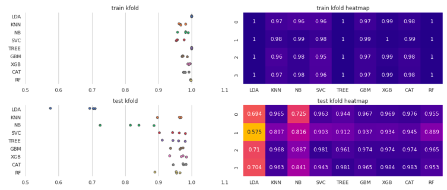
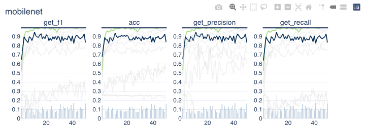
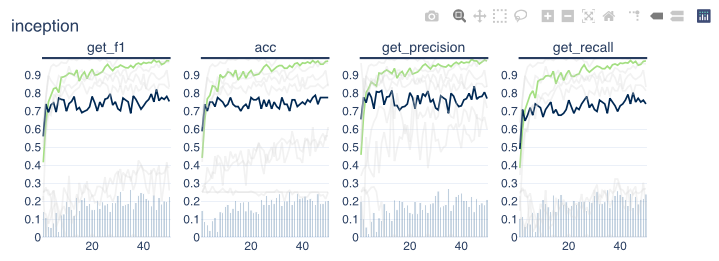
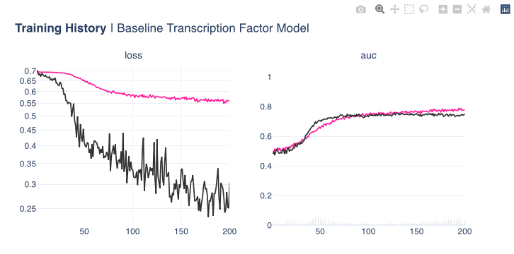

**Machine learning** plays a big part in biology due to its ability to analyze and make sense of large and complex biological datasets. Here are a few reasons why machine learning is important in biology:

1. Data analysis: Biology generates vast amounts of data, such as genomic sequences, protein structures, and gene expression profiles. Machine learning algorithms can process and analyze these datasets to identify patterns, relationships, and insights that may not be apparent to human researchers.

2. Predictive modeling: Machine learning can be used to build predictive models in biology. For example, it can predict protein structures, drug-target interactions, or disease outcomes based on genetic or clinical data. These models help researchers understand biological processes, develop new drugs, and diagnose diseases more accurately.

3. Image analysis: Machine learning techniques, such as deep learning, have revolutionized image analysis in biology. They can automatically detect and classify features in images, such as cells, tissues, or organisms. This is particularly useful in fields like microscopy, pathology, and genetics.

and of course many more...

### <b>:octicons-bookmark-fill-24:  Identifying Antibiotic Resistant Bacteria</b>

 

In this study, we investigate data associated with **antibiotic resistance** for different `bacteria`, conducting an **explotatory data analysis** (looking at geospatial relations & sankey diagrams) & train antibiotic resistance models for different types antibiotics, based on **unitig (part of DNA)** data (which convey the presence or absence of a particular nucleotide sequence) in the Bacteria's DNA. We train a model(s) that is able to distinguish whether the bacteria is **resistant** to a particular antibiotic or **not resistant** and determine which unitigs are the most influential in the model's prediction.

### <b>:octicons-bookmark-fill-24:  Hummingbird Classification | Keras CNN Models</b>

 

In this project, we aimed to create an **automated hummindbird recognition** deep learning model. In our quest to create an automated approach, we can be left with a collection or under or over exposed images that will create difficulties for the model to distinguish between different classes correctly. For this reason we tried different **image augmentation** techniques & and different combinations of them and found combinations that would generalise well in a variety of ambient lighting conditions. We also trained a basic **convolution** type model & **fine tuned** different SOA (such as **ResNet**) models in order to utilise already preexisting model features. 

### <b>:octicons-bookmark-fill-24:  Transcription Factor Binding Location Prediction</b>

 

The process of converting a **nucleotide sequence** into an **amino acid chain** containing proteins is not a very straightforward process, the complex process is not straightforward to not easy to understand. What we can do is attempt to utilise **deep learning** in order to model a relation for our **biological phenomenon** associated with the above biological process. Our model model will attempt to predict **segments in the DNA** at which a so called **transcription factor** will attach itself, the problem is treated as a **binary classification problem**. The model itself contains **1D convolution blocks** & is very simple in its structure. To improve the model accuracy, we try a couple of things: **sample weighting**, **dropout** effects, all of which have a prositive effect on the generalisation performance.

### <b>:octicons-bookmark-fill-24:  Histopathic Cancer Detection</b>

 

In this project, we dive into the world of **computer vision**. Microscopic evaluation of histopathalogic stained tissue & its subsequent digitalisation is now a more feasible due to the advances in slide scanning technology, as well a reduction in digital storage cost in recent years. There are certain advantages that come with such **digitalised pathology**; including remote diagnosis, instant archival access & simplified procedure of consultations with expert pathologists. **Digitalised Analysis based on Deep Learning** has shown potential benefits as a potential diagnosis tool & strategy. Assessment of the extent of cancer spread by histopathological analysis of sentinel axillary lymph nodes (SLNs) is an essential part of breast cancer staging process. The aim of this study was to investigate the potential of using PyTorch Deep Learning module for the **detection of metastases in SLN slides** and compare them with the predefined pathologist diagnosis.

---

Any questions or comments about the above post can be addressed on the :fontawesome-brands-telegram:{ .telegram } **[mldsai-info channel](https://t.me/mldsai_info)** or to me directly :fontawesome-brands-telegram:{ .telegram } **[shtrauss2](https://t.me/shtrauss2)**, on :fontawesome-brands-github:{ .github } **[shtrausslearning](https://github.com/shtrausslearning)** or :fontawesome-brands-kaggle:{ .kaggle} **[shtrausslearning](https://kaggle.com/shtrausslearning)**

